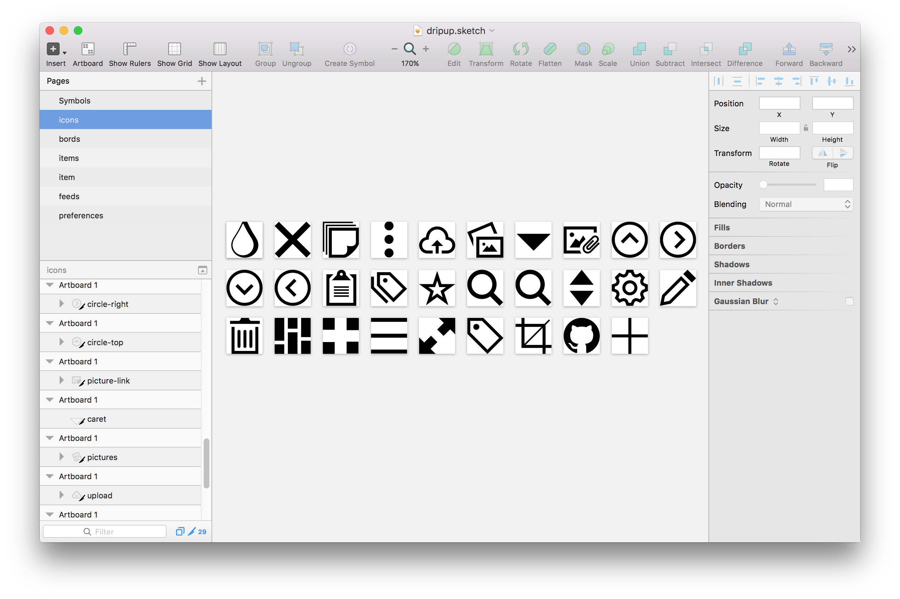

Sketch なり Illustrator なりで作成した SVG のアイコン群を、React のコンポーネントとして扱いたくなりました。アイコンの数が少なければ、SVG のコードを手動でコピペしてコンポーネント化すれば良さそうですが、3 個くらいからもう辛くなってきそうです。

SVG を外部ファイル化して読み込むことも考えましたが、CSS でのスタイル指定が面倒になることや、HTTP リクエスト数を抑えるという点を考慮すると、やはりコンポーネント化しておくのが無難な気がします。

ただ、そこへ労力を割くのは微妙な気がするので、ある程度自動でズバッと出来ないかなと試してみたら、[react-svg-converter](https://www.npmjs.com/package/react-svg-converter)を使うことで簡単に実現出来たので、その工程についてメモです。

## 前提



- 上記の様なアイコンセット(SVG ファイル)を React コンポーネント(JSX)化したい
- 書き出されるコンポーネントは Stateless Functions としたい
- ほぼ自動でやりたい

アイコンのコンポーネントに State は必要無さそうなので、Stateless Funcntions に出来るのが理想です。

## 下準備

適当な作業ディレクトリの中に、SVG ファイルの格納先、変換後のコンポーネントの出力先を準備しておきます。

```bash
$ mkdir svg jsx
```

`svg`ディレクトリの中へ変換する SVG ファイルを入れておきます。

ファイルの準備が出来たら、`npm init`してから[react-svg-converter](https://www.npmjs.com/package/react-svg-converter)をインストールします。

```bash
$ npm init
$ npm install --save-dev react-svg-converter
```

インストール後、同じディレクトリに`index.js`を作成して、SVG の書き出しに関する設定を書いていきます。

```javascript:index.js
const path = require('path');
const convert = require('react-svg-converter').default;

// `name`にはSVGファイル名をパスカルケースに変換した名前が入ります
// 例えば, `chevron-right` -> `ChevronRight` の様な感じ
const template = (name, svg) =>
  `export default function ${name}Icon(props) {
  return (
    ${svg}
  );
}
`;

const input = path.resolve(__dirname, 'svg/**/*.svg');
const output = path.resolve(__dirname, 'jsx');

// Stateless Functionsとして出力する場合は、4つ目の引数に`false`を指定
convert(input, output, template, false);
```

CLI からの出力も出来るみたいですが、コンポーネントのテンプレート指定ができなかったので、上記の様に API を使う感じにしてみました。  
あとは`package.json`の`scripts`に以下を追記。

```json:package.json
{
  "scripts": {
    "build": "node index.js"
  }
}
```

これで`build`を実行してみると`jsx`の中にコンポーネントが出力されます。

```bash
$ npm run build
```

```text:results
.
├── index.js
├── jsx #ここにjsファイルが出力されました
│   ├── CircleBottom.js
│   ├── ...
│   └── Upload.js
├── node_modules
├── package.json
└── svg
    ├── circle-bottom.svg
    ├── ...
    └── upload.svg
```

実際に書きだされたコンポーネントの中身を見てみると、引数に与えられた`props`を展開するだけの単純なコンポーネントとなりました。

```javascript
export default function CircleBottomIcon(props) {
  return (
    <svg width="30" height="30" viewBox="0 0 30 30" xmlns="http://www.w3.org/2000/svg" {...props}>
      <title>circle-bottom</title>
      <path
        d="M27.5 15c0 6.893-5.608 12.5-12.5 12.5-6.893 0-12.5-5.608-12.5-12.5C2.5 8.107 8.108 2.5 15 2.5c6.893 0 12.5 5.608 12.5 12.5zm2.5 0c0-8.284-6.716-15-15-15C6.716 0 0 6.716 0 15c0 8.284 6.716 15 15 15 8.284 0 15-6.716 15-15zm-15 2.5l-5.625-5.625-1.875 1.91L15 21.25l7.5-7.466-1.875-1.91L15 17.5z"
        fill-rule="evenodd"
      />
    </svg>
  );
}
```

SVG の最適化も一緒に行われているみたいなので、元の SVG ファイルに比べ、スッキリとしたコードに変換されています。

---

思ったよりも簡単に、かつ期待に沿う形で、ズバババっと SVG ファイルから React のコンポーネントへ一括変換することができました。

最初にあげた画像ではアイコンの数こそ少なかったですが、今後増えたり修正を加えた場合でも、今回用意したタスクを使いまわせるので捗りそうです。
