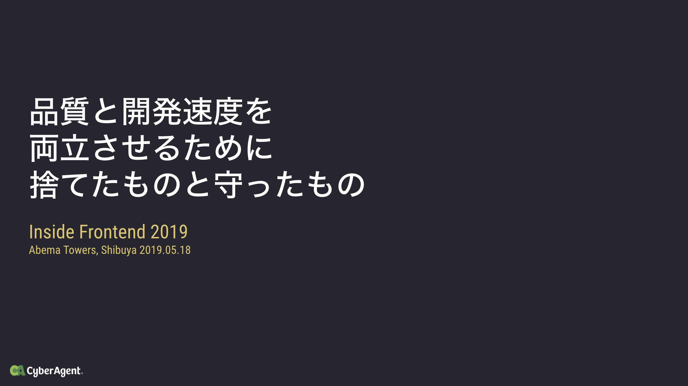
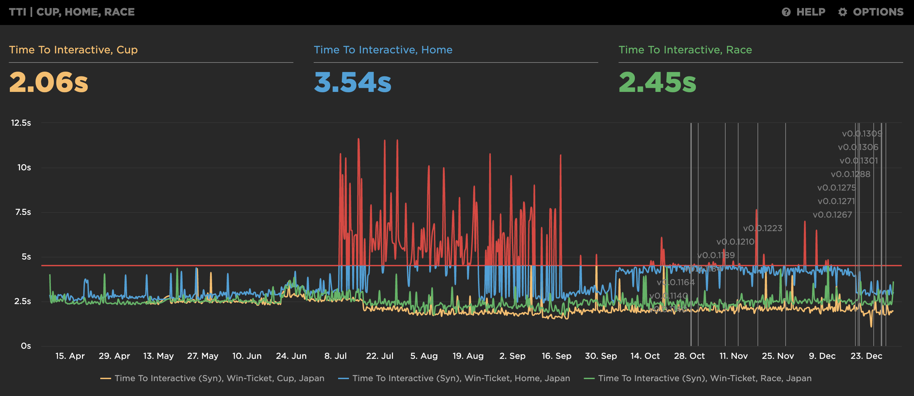
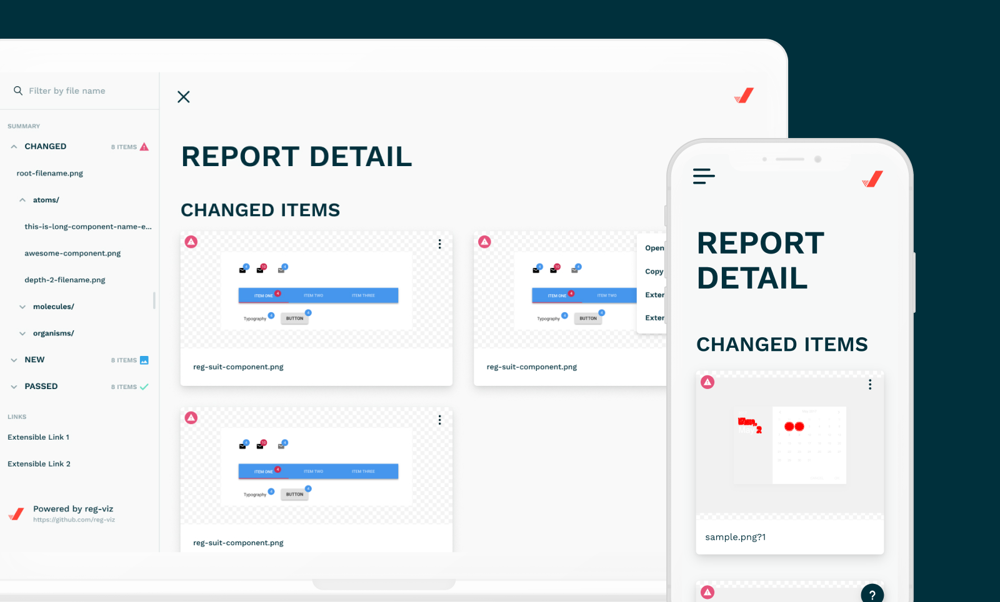

年末になったので、今年も 1 年を振り返ってみます。

https://blog.wadackel.me/2018/ref/

## 2019 年の振り返り

自分の中で印象的だったトピック毎に振り返ってみます。記載順序に日時の相関はなく、仕事〜プライベートみたいな流れで書いてみます。

## CyberAgent 2 年目

CyberAgent に入社してもう少しで 2 年が経ちます。今年は新卒やインターンの方のトレーナー / メンターを任せていただく機会が多かったです。トレーニングをすることで自分自身のことを俯瞰する機会にもなるので楽しくやれています。社内のあれこれには比較的慣れてきて目新しいものが徐々に減ってきているので、特に書くべきこともないかなぁと思います。ただ、社内で求められるものが変わってきていて、作れるのは当たり前、その先でどんな成果が出せている状態か、といったところを考える機会が増えました。来年はそこでうまく立ち回れるようにしたいです。

## WinTicket リリース

Web のメンバーとしてメインで作っていた [WinTicket](https://www.winticket.jp/) という競輪ライブ映像の視聴・ネット投票が可能なインターネット投票サービスが無事にリリースされました。

今年 5 月に Abema Towers で開催された [Inside Frontend](https://inside-frontend.com) で、WinTicket リリース当時の状況等について登壇しました。

https://docs.google.com/presentation/d/13QD86hxp0dB_xHkYcyLrFX1xNt0Vg4wsqIo8yeBQmFs/edit?usp=sharing

リリース後、多いときで月に 20 ~ 30 程度施策が入るようなスピード感で開発が進んでいるのですが、その中でもリリース当時から変わらずパフォーマンス / アクセシビリティの改善は継続的に実施してきました。

### パフォーマンスについて

上記、今年一年の重要視してきた指標の一つ TTI (Time To Interactive) の推移です。途中かなり壊滅的にパフォーマンスが劣化しましたが、大小改善を重ねることで最近ではリリース当時よりも一部改善できているのがわかります。リリース時点よりもページによっては表示要素がかなり増えていたりするのですが、それでもこの推移なら頑張れたかなと考えています。(Total Requests はうなぎのぼり)

途中パフォーマンスが劣化した一因となったのは A/B Testing の導入でした。どのようにして改善を図ったかは以下の記事でざっくりと紹介しました。

https://blog.wadackel.me/2019/optimize-ab-testing/

他の取り組みについては、需要がありそうなら記事や LT で紹介できればいいかなぁと思います。

### アクセシビリティについて

この取り組みは [@masuP9](https://twitter.com/masuP9) が主導してくれました。最近のことではありますが JIS X 8341-3:2016「附属書 JB（参考）試験方法」に基づいた試験を行った結果を以下のページに示しています。

https://www.winticket.jp/accessibility

満たしていない達成基準の事例と対応策についてまとめてあるので、開発陣としても、対外的にも具体的な取り組み内容が見えるものになっています。

ここらへんの話は追って @masuP9 から会社として発表があると思うので軽めに。

---

まだまだ至らないところも多くありますが、多くの人が多様な環境で快適なサービス利用ができるように引き続きチームとして取り組んでいきたいと考えています。

## reg-viz

プライベートでは比較的 reg-viz のリブランディングに関する作業をしていることが多かったです。関連記事は以下。

- [reg-cli の Report UI をリニューアルした - wadackel.me](https://blog.wadackel.me/2019/reg-suit-report-ui/)
- [reg-viz のリブランディングをした - wadackel.me](https://blog.wadackel.me/2019/reg-viz-rebranding/)

作業時、Figma をずっと使っていて Figma とも少し仲良くなることができたのは良かったです。

reg-cli の Report UI はかなり劇的に様変わりしました。そこで興味を持ってくれていた社内のチームにも導入の手助けになったこともありやってよかったなぁと感じました。身近な人からのフィードバックがあると嬉しいですね。

https://twitter.com/wasabeef_jp/status/1199218445503488001

改善案がいくつか溜まってきているので、そろそろ取り組みたいと考えています。

## 登壇 / LT

- [品質と開発速度を両立させるために捨てたものと守ったもの](https://docs.google.com/presentation/d/13QD86hxp0dB_xHkYcyLrFX1xNt0Vg4wsqIo8yeBQmFs/edit?usp=sharing)
  - 前述した Inside Frontend で登壇した際のスライド
- [#tc39_study](https://web-study.connpass.com/event/147538/)
  - TC39 の Stage 0 ~ 3 までの Proposal に関して LT を行う謎の勉強会
  - Block Params と Wavy Dot を取り扱って LT しました
    - [Block Params](https://wadackel.github.io/tc39_study_201910/block-params/)
    - [Wavy Dot](https://wadackel.github.io/tc39_study_201910/wavy-dot/)

あまり表立って発表をしていくタイプではないのですが、知り合いのエンジニアさんからレアキャラ扱いされることが増えたので、来年こそは少し勉強会に行く機会を増やした方がいいのかなぁと考えいたり、いなかったりします。

## OSS / GitHub

- [wadackel/vim-dogrun](https://github.com/wadackel/vim-dogrun)
  - Rust で実装した Neovim / Vim のカラースキーム、お気に入りです
  - [紫をベースにした Neovim / Vim 向けの colorscheme、dogrun を作った - wadackel.me](https://blog.wadackel.me/2019/vim-dogrun/)
- [wadackel/rs-td4](https://github.com/wadackel/rs-td4)
  - Rust で TD4 Emulator を実装してみたやつです
  - [Rust で書いた TD4 Emulator を WebAssembly で動かしてみた - wadackel.me](https://blog.wadackel.me/2019/rust-td4/)
- [reg-viz/reg-cli-report-ui](https://github.com/reg-viz/reg-cli-report-ui)
  - 前述した reg-cli の Report UI 用リポジトリ
  - reg-viz Organization のメンバーになったので気軽にリポジトリ作れるようになってありがたいです
- [cats-oss/scaffdog](https://github.com/cats-oss/scaffdog)
  - Markdown で記述したテンプレートを元に Scaffolding するツールです
  - [Markdown Driven な scaffolding ツールを作った - wadackel.me](https://blog.wadackel.me/2019/scaffdog/)
- [cats-oss/use-intersection](https://github.com/cats-oss/use-intersection)
  - IntersectionObserver をいい感じに扱う React Hooks を書いたりしてました
- [cats-oss/ts-proto-optimize](https://github.com/cats-oss/ts-proto-optimize)
  - 仕事で使ってる Protocol Buffers の TS 型定義を使いやすくするためのツール

今年はちょこちょこ [cats-oss](https://github.com/cats-oss) 側にリポジトリを置くことが多かったです。

## 結婚

12 月に結婚しました。まだ子供の予定はないので生活はほとんど変わり有りませんが、開発者として腰を据えて精進できればいいなぁと考えています。色々なところでお祝いいただけて嬉しい限りです。

## 犬

キャップという男の子が家族になりました。もうほんとにかわいい...。絶賛溺愛中です。

## 2020 年への抱負

今年はざっくりと箇条書きで。

- アクセシビリティの改善を進めるためのツール作成
  - 精度高い検証ができ、属人化しない手段を提供できると嬉しい
  - 仕事で取り組むかも
- Web Assembly を仕事で使う
  - 今年一年割と模索してたけど、導入する場所が中々見つけられずにいた
  - まずは勢いで使ってしまうか、社内ツールなどパブリックではないところで使ってしまうのがいいかも
- RISC-V Emulator
  - 完全に趣味ですがやってみたい
  - [RISC-V 原典 オープンアーキテクチャのススメ](https://www.amazon.co.jp/RISC-V%E5%8E%9F%E5%85%B8-%E3%82%AA%E3%83%BC%E3%83%97%E3%83%B3%E3%82%A2%E3%83%BC%E3%82%AD%E3%83%86%E3%82%AF%E3%83%81%E3%83%A3%E3%81%AE%E3%82%B9%E3%82%B9%E3%83%A1-%E3%83%87%E3%82%A4%E3%83%93%E3%83%83%E3%83%89%E3%83%BB%E3%83%91%E3%82%BF%E3%83%BC%E3%82%BD%E3%83%B3/dp/4822292819) 買ったので読む
- [作って理解する OS x86 系コンピュータを動かす理論と実装](https://www.amazon.co.jp/%E4%BD%9C%E3%81%A3%E3%81%A6%E7%90%86%E8%A7%A3%E3%81%99%E3%82%8BOS-x86%E7%B3%BB%E3%82%B3%E3%83%B3%E3%83%94%E3%83%A5%E3%83%BC%E3%82%BF%E3%82%92%E5%8B%95%E3%81%8B%E3%81%99%E7%90%86%E8%AB%96%E3%81%A8%E5%AE%9F%E8%A3%85-%E6%9E%97-%E9%AB%98%E5%8B%B2/dp/429710847X/ref=asc_df_429710847X/?tag=jpgo-22&linkCode=df0&hvadid=342438969336&hvpos=1o1&hvnetw=g&hvrand=4177352930308966266&hvpone=&hvptwo=&hvqmt=&hvdev=c&hvdvcmdl=&hvlocint=&hvlocphy=1009308&hvtargid=pla-822246098107&psc=1&th=1&psc=1) 買ったので読む (長い...)
- ちょっと外に出る機会を増やす
  - 脱レアキャラ

## おわりに

皆様良いお年を！
