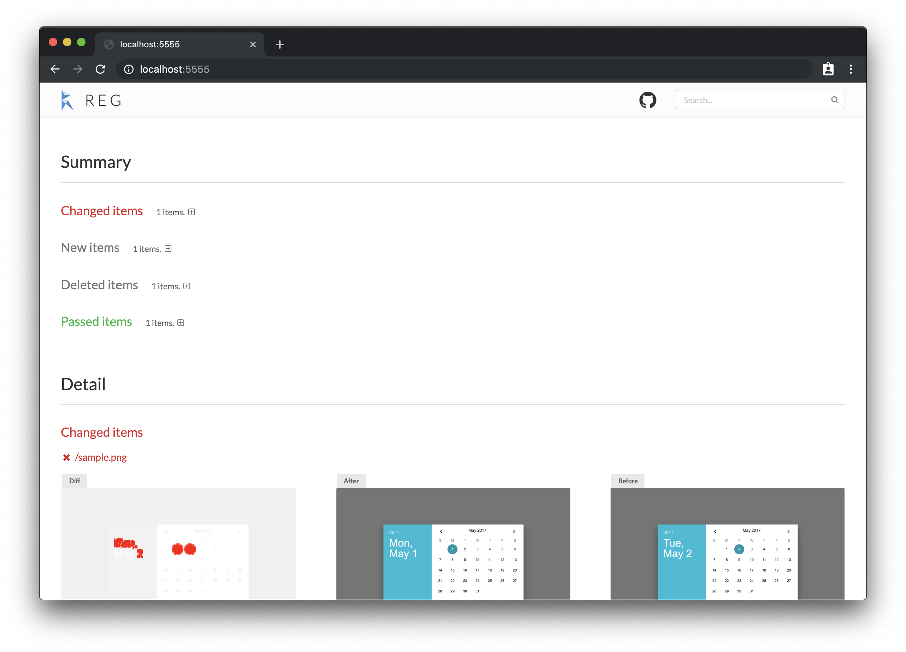
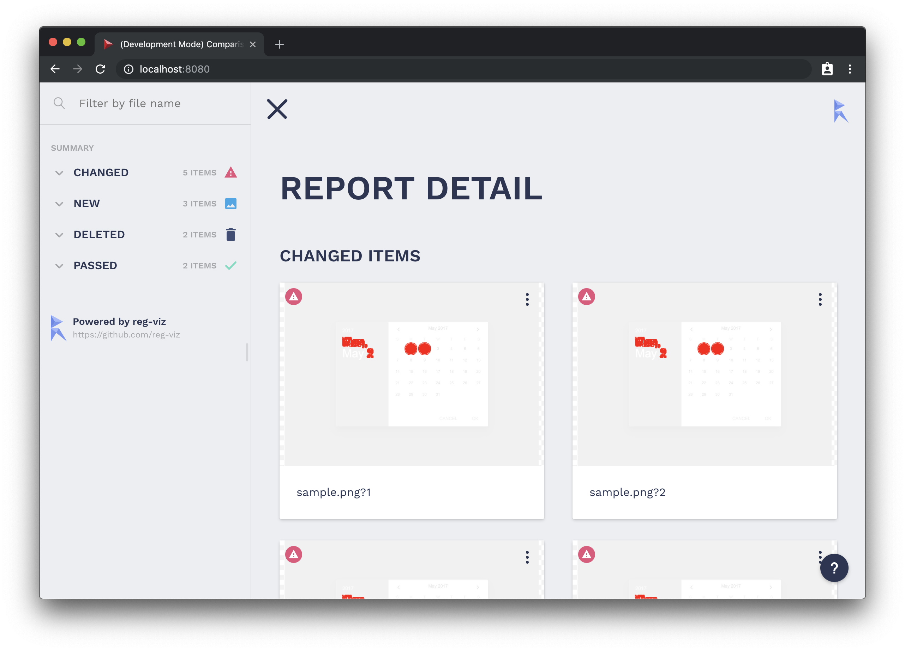
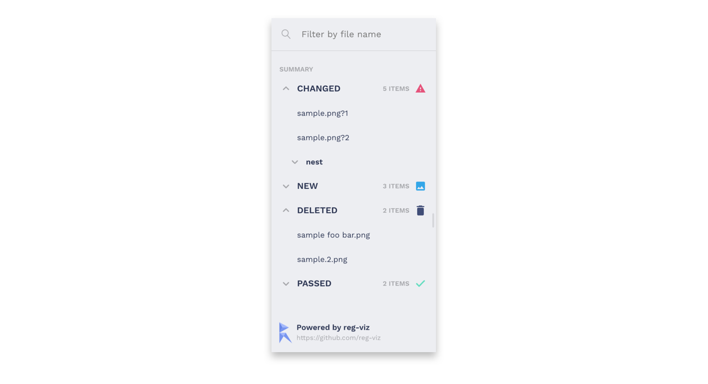
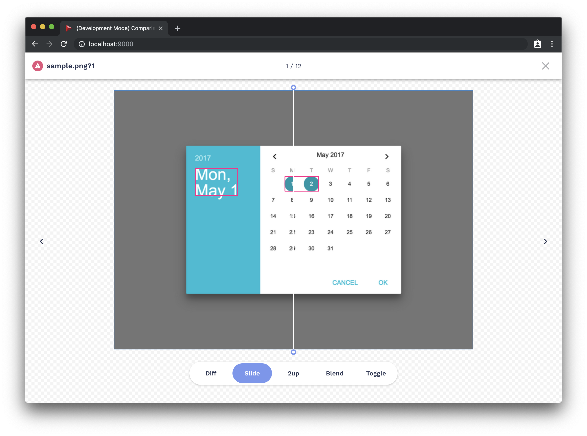
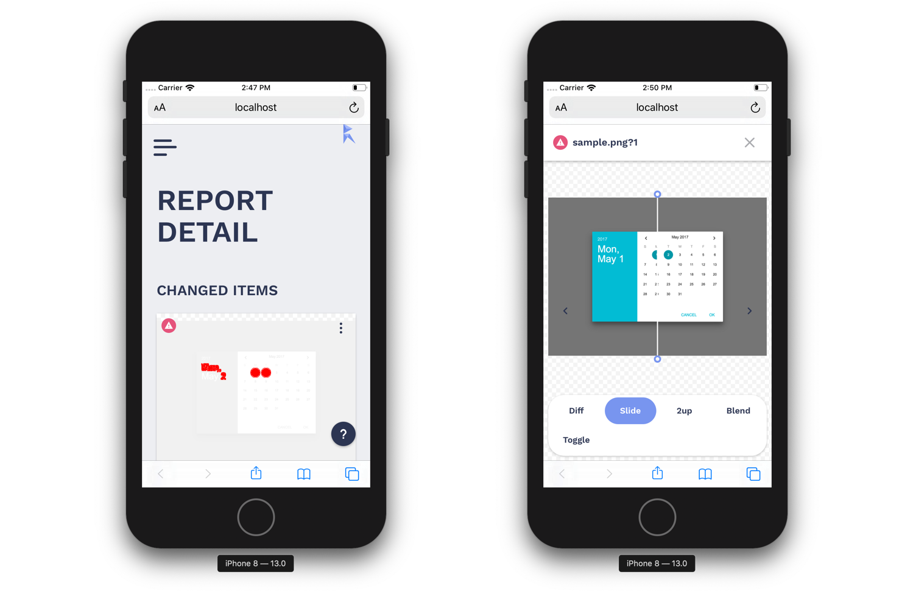
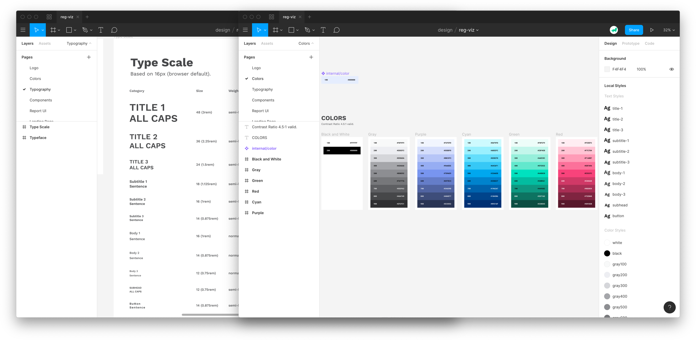

## はじめに

[reg-cli](https://github.com/reg-viz/reg-cli) は Visual Regression Testing のためのツールです。この reg-cli は [reg-suit](https://github.com/reg-viz/reg-suit) で使われています。reg-cli および reg-suit については以下の記事を参照ください。

- [コンポーネント/単体テスト単位での visual regression テストを行うためのツールを作った話し](https://qiita.com/bokuweb/items/bf9de229a3c91c01a480)
- [1 日 10 万枚の画像を検証するためにやったこと](https://qiita.com/Quramy/items/46d0b09ae4d8887b0941)
- [Storybook + zisui + reg-suit な visual testing を構築する](https://qiita.com/hey_cube/items/fbeab4302cfb617cf941)
- [Storybook と reg-suit で気軽にはじめる Visual Regression Testing](https://blog.wadackel.me/2018/storybook-chrome-screenshot-with-reg-viz/)

僕自身、仕事でもお世話になっている[^1] ツールなのですが、もっと見やすく、もっと使いやすくしたいなぁーと思っていたタイミングで、reg-suit の作者である [Quramy](https://twitter.com/quramy) さんと飯を食べに行く機会がありました。そこで是非リデザインさせて欲しい旨を相談し、快諾していただいた流れでデザインの作成と実装を担当しました。

他の趣味コードや仕事に作業を持っていかれて、はじめ話が上がってからは時間が空いてしまったのですが、最近やっと publish することができたので簡単に紹介します。

## Before & After

以前の UI とリニューアル後の UI です。

表示要素こそそれほど変わっていませんが、表示方法やぱっと見は比較的大きく変わったかと思います。

ちなみに UI 実装のリポジトリは以下。

> reg-viz/reg-cli-report-ui  
> https://github.com/reg-viz/reg-cli-report-ui

## 追加・変更した機能

見た目の変更はもちろん、これまでの機能は基本的には残しつつ、表示方法の変更、機能の追加を行っています。それについて個別で紹介します。

### サイドバー

サイズの可変に対応したサイドバーが新たに追加されています。Storybook やテキストエディタのファイラの様なツリー表示にも対応[^2] しています。

以前は画面右上にあったフィルタリング用の `<input />` も、サイドバー内に入れることで機能にまとまりができました。

### 一覧表示

これまでは一行に対して一つの差分表示 (1 アイテム) が基本でしたが、グリッド表示で Viewport によっては複数の差分を表示することができるようになりました。

検証対象が多い場合、1 スクロールで表示できる差分が増えたのは閲覧効率の向上が見込めるかなと考えています。(ちなみに業務プロジェクトでは検証対象が 1,000 件を超えているので個人的にはとても嬉しい)

### 詳細表示

一覧から各差分を選択すると、差分に関する詳細を確認することができます。この時、以下の方法で Before (Expected) と After (Actual) を確認することができます。

| 種別   | 概要                                           |
| :----- | :--------------------------------------------- |
| Diff   | reg-cli が生成した差分の Overview              |
| Slide  | Before と After をハンドルをスライドして比較   |
| 2up    | Before と After 2 つを並列に並べて比較         |
| Blend  | Before と After を透過させながらなめらかに比較 |
| Toggle | Before と After を切り替えながら比較           |

比較に関しては以前の機能をそのまま活かすかたちとなっています。

ただ詳細表示中に画面端に表示されている矢印のボタンか、キーボードショートカットを用いて前後の差分へ簡単に遷移することできるようになった点が新たに追加された機能です。

### レスポンシブ対応

差分を確認する際、ほとんどの場合 PC で見るのですが、外出中にレビューしたい時なんかのためにレスポンシブ対応を行っています。(_まだ最適ではないですが..._)

これまでの UI はスマホなどで見ても最適化されていた訳じゃなかったので、個人的には地味に嬉しい変更の一つです。

### 技術スタック

元の UI は Vue で書かれていたのですが、React + styled-components で書き換えました。特に強いこだわりがあったわけではないのですが、僕も他のメンバーの方も書き慣れているから、という感じです。まだ Stable ではない [styled-components の v5](https://medium.com/styled-components/announcing-styled-components-v5-beast-mode-389747abd987) のお試しが出来たので個人的には満足。

### これからの reg-viz

今回のリニューアル範囲は reg-cli の Report UI でした。その時、Typography や Colors も合わせて整理を行っていました。

reg-cli も reg-suit も [reg-viz](https://github.com/reg-viz) という Organization なのですが、今回の変更を先駆けとしてロゴの刷新、リブランディングを中心に少しずつ作業を進めていく想定です。

ここらへんはまた一通り落ち着いたらブログに書きたいなぁーというお気持ちです。

また、これらの変更をきっかけに「使ってみようかな」と思ってくれる人が増えたら嬉しいなぁと考えています。

## おわりに

僕は普段それほど OSS へコントリビュート方ではないのですが、いざやる時は大抵、コードの修正、機能追加だったりします。今回はそれらと異なる趣向の取り組みができて楽しかったです。比較的ドラスティックな変更だったにも関わらず、快く受けてくれた [Quramy](https://twitter.com/quramy) さん [bokuweb](https://twitter.com/bokuweb17) さんに感謝です。

[^1]: [INSIDE FRONTEND 2019 の登壇資料にて紹介しています](https://docs.google.com/presentation/d/13QD86hxp0dB_xHkYcyLrFX1xNt0Vg4wsqIo8yeBQmFs/edit?usp=sharing)

[^2]: ファイル名を `/` で区切ると自動的にツリー表示される。
