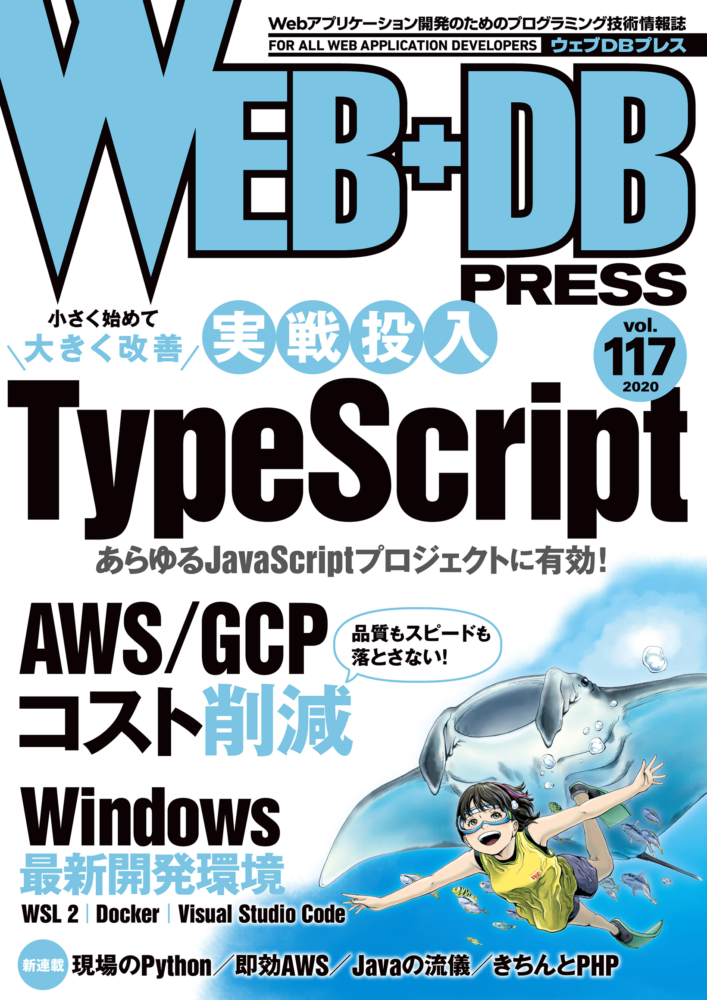
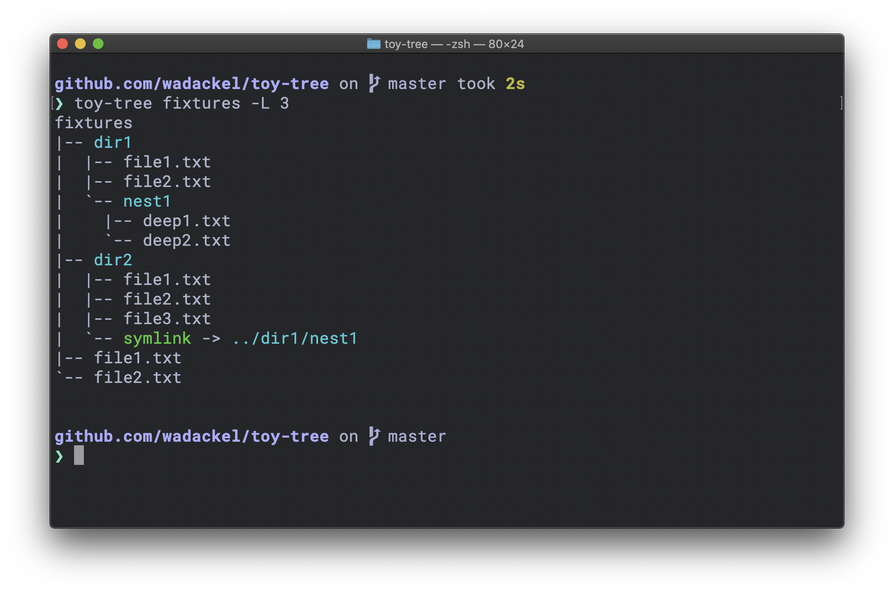

## はじめに

技術評論社さんが偶数月 24 日に発売している [WEB+DB PRESS](https://gihyo.jp/magazine/wdpress) に TypeScript の特集を寄稿しました。特集のタイトルは「小さく始めて，大きく改善 実戦投入 TypeScript」で、2020 年 6 月 24 日に発売されます。

タイトルから察せるとおり、これから TypeScript を学び始める方が想定読者となっています。

> [WEB+DB PRESS Vol.117](https://gihyo.jp/magazine/wdpress/archive/2020/vol117)

この記事では特集の紹介と、執筆の振り返りを書いてみたいと思います。

## 特集内容

3 つある特集の 1 つです。

### 概要、章構成

肝心の特集内容ですが、WEB+DB PRESS Vol.117 のページにある紹介文を引用します。

> TypeScript は，JavaScript に型が付いたプログラミング言語です。型の恩恵は絶大で，型をもとに，プログラムが不正な振る舞いをしないことを保証できます。また，エディタを通じた自動補完やリファクタリングが容易になります。
> 本特集の前半では，TypeScript の基礎を学びます。後半では，JavaScript で構築されたアプリケーションを TypeScript へと段階的に移行する過程を通して，実践的な使い方を身に付けます。

前半に TypeScript の基礎を学習し、後半にかけて TypeScript でサンプルのアプリケーションを作り上げていく、というのが大枠の構成です。詳細な章構成は以下のとおりです。

- 第 1 章：TypeScript 入門
  - 特徴，開発環境の構築，設定ファイルの基礎
- 第 2 章：押さえておきたい TypeScript の型システム
  - 基本的な型，関数，クラス，ジェネリクス
- 第 3 章：JavaScript で作る tree コマンド
  - 題材となるアプリケーションを準備する
- 第 4 章：TypeScript への段階的移行
  - 最低限の導入で，型の恩恵を受ける
- 第 5 章：より安全でメンテナンス性に優れたコードベースへ
  - 適切な型へのリファクタリングを行い，機能を追加する

後半 3 章はすべてアプリケーションの実装です。言語入門系の特集で半分以上を実践に振るのは、比較的珍しいかなと思いつつ希望を通すことができてよかったです。

2020 年現在、TypeScript を学習するためのリソースは公式サイトをはじめ、書籍やブログなど、多く存在します。そんな中で、この特集が提供できる価値とは何かなと自分なりに考えた結果、実際に手を動かしながら学び、より深い知識や経験を得るための最初の一歩を提供することにあると思いました。

TypeScript を学び始めたいけど、何から手を付けていけば悩むなぁーという方の一助になれれば幸いです。

### サンプルアプリケーション

特集内では `toy-tree` という `tree` コマンドの再発明的な CLI ツールを作っていきます。最終的には次のような出力を行うものになります。

リポジトリは以下で参照できます。

> wadackel/toy-tree  
> https://github.com/wadackel/toy-tree

実践を中心とした構成にしたい、と最初から構想はあったものの、具体的に何を作るかは結構悩みました...。最終的に CLI ツールにしたのは以下のような理由からです。

- Web サーバにしようかと思ったけど...
  - サーバに TypeScript 採用している人、それなりに他の言語が使えて、自らの力である程度学習が進みそう
  - Web フロントエンドも欲しくなるけど、扱う範囲が広がると内容が薄くなりそう
  - セキュリティ、パフォーマンス、うーん
- Web フロントエンドの開発にしようかと思ったけど...
  - React, Angular, Vue などのフレームワーク知識を持ち込みたくない
  - 逆にそうじゃない場合、業務との乖離が多少ありそう
- 他の用途だと少しマイナーかもなぁ
- CLI ツールなら...
  - ちょっとした業務ツール（便利ツール系）とかからでも採用しやすく、業務に取り込めそう
  - 個人的なスタートがここだった

という消去法感は否めないのですが、こんな理由から CLI ツールに至りました。

CLI ツールは最終の見栄えが少し地味かな、というのもあり（個人的に）出力がユニークだと感じた `tree` の再発明を題材としています。

---

ざっくりとですが、ここまでが特集の内容についてです。以降、執筆そのものについての振り返りです。

## 執筆の振り返り

ブログやドキュメント以外での執筆業ははじめてですごく新鮮でした。中でも自分の書いた文章が校正を通しどんどん整っていくさまは気持ちいいですね。本当に優秀な編集者の方々に支えられっぱなしでした。

COVID-19 の影響もあって、途中スケジュールがタイトになってしまう場面があったりしたのですが、全体を通すと期日に対して余裕を持ってで進めることができたのは本当によかったです。

### お金を払って読まれる文章

期日に対しては気持ち的に余裕があったのですが、「お金を払って読まれる文章」といったところにプレッシャーは感じました。ミスリードを引き起こす言い回しだったり、内容について、すぐに加筆修正等で対応できるメディア (ブログ) でしか文章を書いたことがなかったのも大きいです。 (今はとにかくマサカリが飛んでこないことを祈るばかりです...)

ただ、悪いところだけじゃなくて LT のように発表するときや、ブログを書く時と同様に、内容に対しての深堀りや気にしてなかった細かい点について調べることができたので、自身にとっても勉強になるところがありました。

書籍や連載を書いてる方たちは改めてすごいなと感じました。

## おわりに

TypeScript に興味ある、これから使っていきたい、という方に読んでいただき学習の参考になることができれば嬉しいです。

特集の内容をレビューしていただいた [@Quramy](https://twitter.com/Quramy) さん、ABEMA の開発陣、そして編集部の皆様ありがとうございました。
