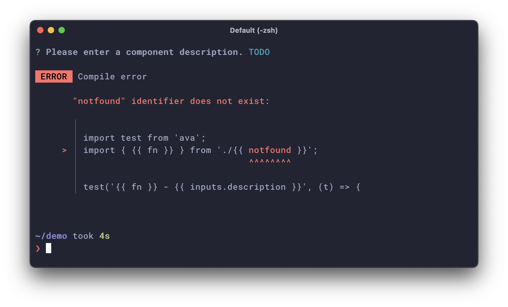

## はじめに

Markdown Driven な scaffolding ツール [scaffdog](https://github.com/cats-oss/scaffdog) の `v1.0.0` をリリースを行いました。scaffdog 公開当初、ブログでも紹介しました。

https://blog.wadackel.me/2019/scaffdog/

`v0` 系から破壊的変更があるアップデートを実施したので、移行方法と追加した機能についてブログにまとめます。scaffdog のリポジトリにも Migration Guide を記載しているため必要に応じて参照してください。

> [Migration Guide](https://github.com/cats-oss/scaffdog/blob/canary/MIGRATION.md#to-v1-from-v0)

## 追加機能

まずは `v1.0.0` に新しく追加された機能についてまとめます。

### 複数入力の対応

これまで scaffdog では単一の入力を `message` フィールドに指定した文言とともに対話的に入力を受け付けていました。

```markdown:hello.md
---
name: 'component'
message: 'Please enter a component name.'
root: 'src'
output: '**/*'
---
```

`v1.0.0` では `questions` フィールドに指定した定義に基づき、複数の入力を受け付けるようになりました。

```markdown:questionsの利用例
---
name: 'utility'
root: 'src'
output: '**/*'
questions:
  name: 'Please enter a filename.'
  variant:
    message: 'Please select a variant.'
    choices:
      - 'A'
      - 'B'
  description:
    message: 'Please enter a component description.'
    initial: 'TODO'
---
```


上記 gif 画像のとおり、`choices` フィールドを指定するとテキスト入力の代わりにリスト選択の prompt が採用されます。

また、オブジェクトのキーに対応した入力が、テンプレート内の変数 `inputs` からアクセス可能です。

````markdown:inputs.XXXで入力へアクセス可能
# `{{ inputs.name }}.txt`

```
name = {{ inputs.name }}
variant = {{ inputs.variant }}
description = {{ inputs.description }}
```
````

単一入力の制限がなくなったことで、要件に合わせて柔軟な利用ができるようになるかもしれません。

### 設定ファイル

`.scaffdog/config.js` を設定ファイルとして利用するようになりました。この設定ファイルは `v1.0.0` から必須となります。

以下、最低限の設定例です。

```javascript:.scaffdog/config.js
module.exports = {
  files: ['./*'], // Markdown ファイルの検索パターン
};
```

拡張子は不要で、Markdown のファイルのみマッチします。

#### グローバル変数の定義

設定ファイルの `variables` フィールドに、全テンプレートから参照できるグローバル変数が定義できます。

```javascript:.scaffdog/config.js
module.exports = {
  files: ['./*'],
  variables: {
    key1: 'value1',
    key2: 'value2',
    key3: 'value3',
  },
};
```

```markdown:テンプレートでの利用例
- {{ key1 }}
- {{ key2 }}
- {{ key3 }}
```

#### カスタムヘルパー関数の追加

`helpers` フィールドでカスタムヘルパー関数を追加できます。

```javascript:.scaffdog/config.js
module.exports = {
  files: ['./*'],
  helpers: [
    // オブジェクト形式
    {
      greet: (context, value) => `Hi ${value} !`,
    },

    // または Map への追加
    (registry) => {
      registry.set('bow', (context) => 'bow wow!!');
    },
  ],
};
```

### 変数定義

2 つの方法で変数が利用できるようになりました。

入力に対して複雑な処理を行い、その結果を何度か利用したいことがあるようなケースで有用です。

#### 1. ファイルスコープ

`Variables` という見出しレベル 1 のタイトルに続けて記述したリストを変数として利用することができます。

````markdown:テンプレートの例
# Variables

- foo: `{{ inputs.value | upper }}`
- bar: `{{ inputs.value | kebab }}`

# `1.txt`

```
{{ foo }}
{{ bar }}
```

# `2.txt`

```
{{ foo }}
{{ bar }}
```
````

変数は次の形式で指定します。

```markdown
# Variables

- <variable_name>: `<expression>`
```

`Variables` セクションで定義した変数群は、そのファイルに含まれる全てのテンプレートで利用可能です。(出力に関連する各種変数にはアクセスできません)

#### 2. テンプレートスコープ

ここでの「テンプレート」は、ファイルに含まれる各コードブロックを指します。テンプレート内で `define` ヘルパー関数を利用することで、パイプで渡ってきた結果を指定したキーで保持することができます。

以下 `component` という変数を定義し、利用している例です。

<!-- prettier-ignore-start -->
```markdown:変数componentの定義例
{{- inputs.name | pascal | define "component" -}}

default export () => (
  <{{ component }}>
    Content...
  </{{ component }}>
);
```
<!-- prettier-ignore-end -->

`{{-` と `-}}` で囲んだ式の前後は空白文字が trim されます。そうすることで変数定義だけの式であっても出力への影響はありません。

`inputs.name` に `foo-bar` が渡ってきた場合次のように出力されます。

```typescript:出力結果
default export () => (
  <FooBar>
    Content...
  </FooBar>
);
```

### ヘルパー関数の追加

組み込みのヘルパー関数がいくつか追加されました。こちらは `README.md` を参照ください。

https://github.com/cats-oss/scaffdog/#helpers

### その他細かい点

使い勝手を向上させるべく実施した細かい変更について箇条書き程度でまとめます。

- `output` フィールドが配列に対応
  - 複雑なパターンが書きづらかった (e.g. `output: '(pattern1|pattern2|pattern3)'`)
  - 直感的にパターンを書けるように (e.g. `output: ['pattern1', 'pattern2', 'pattern3']`)
- 出力先が 1 種類の場合は prompt をスキップ
  - `$ scaffdog generate [name]` 実行後、少しでも早く次のステップに移りたい
  - <kbd>Enter</kbd> を押すだけの作業はスキップ
- テンプレートの構文エラーが分かりやすい表示に
  - 存在しない変数へのアクセスなどが分かりやすい形式でレポートされます
  - これまでエラーが起きても不親切なレポート内容だった
- monorepo への移行
  - scaffdog を API として利用したいケースがでてきた
  - 低レイヤのロジックを再利用可能な形に分割

エラーの表示は以下のような次のような出力です。



## 破壊的変更

追加された機能で既に触れた部分も多いですが、ここからは破壊的変更点と移行方法についてまとめます。

### 設定ファイル

前述したとおり設定ファイルは必須であるため、移行にあたってファイルを追加する必要があります。

最低限以下の設定を記述しておくことで `v0` と同じ挙動をとります。

```javascript:.scaffdog/config.js
module.exports = {
  files: ['./*'],
};
```

### CLI

CLI のオプション、及びサブコマンドに変更があります。

| 移行前                     | 移行後                   |
| :------------------------- | :----------------------- |
| `--templateDir`            | `--project`              |
| `scaffdog template [name]` | `scaffdog create [name]` |

### テンプレート

以下、テンプレートに関わる変更点です。

#### message

入力に利用していた `message` は廃止されました。代わりに `questions` を利用します。

```diff
  ---
  name: 'utility'
  root: 'src/utils'
  output: '**/*'
- message: 'Please enter a filename.'
+ questions:
+   value: 'Please enter a filename.'
  ---
```

#### description

テンプレートドキュメントの説明として利用していた `description` は廃止されました。

```diff
  ---
  name: 'utility'
- description: 'Generate utility function.'
  root: 'src/utils'
  output: '**/*'
  questions:
    value: 'Please enter a filename.'
  ---
```

これは活用先がほとんどなかったためです。

#### 組み込み変数

組み込みの変数が大幅に変更されました。

| 移行前     | 移行後        |
| :--------- | :------------ |
| `input`    | `inputs.XXX`  |
| `output`   | `output.path` |
| `filename` | `output.name` |
| `dirname`  | `output.dir`  |
| `basename` | `output.base` |
| `extname`  | `output.ext`  |
| `root`     | 削除          |

複数の入力を受け付けるようになったため、`input` から `inputs` に変更し、値はオブジェクトとしました。変数 `output` も同様に、ネームスペース節約のためフラットに展開していた変数群をオブジェクトにまとめました。

変数の以降は次のような差分となるでしょう。

````diff:hello.md
  ---
  name: 'utility'
  root: 'src/utils'
  output: '**/*'
  ignore: []
  questions:
    name: 'Please enter a filename.'
  ---

- # `{{ input }}.js`
+ # `{{ inputs.name }}.js`

  ```javascript
- export const {{ input | camel }} = () => true;
+ export const {{ inputs.name | camel }} = () => true;
  ```
````

## おわりに

scaffdog は開発からちょうど 2 年が経ったのですが、現在でも仕事とプライベート問わず使っています。実際に使い始める前までは想定してなかった、Markdown でテンプレートドキュメントが書かれていることのメリットも感じるようになりました。Prettier で整形できたり、Syntax Highlight が効いたり。

2 年間、ずっとアクティブに開発している訳ではなかったので、やりたいと思ってなかなか手を動かさずにいたアイデアが積まれていました。年末年始のタイミングでまとめて対応しちゃおうと思っていたら、なんだかんだ 1 月中旬までずるずると作業が長引いてしまいましたが、なんとか作業が一段落できてよかったです。

またしばらく使いながら改善していければと思います。
