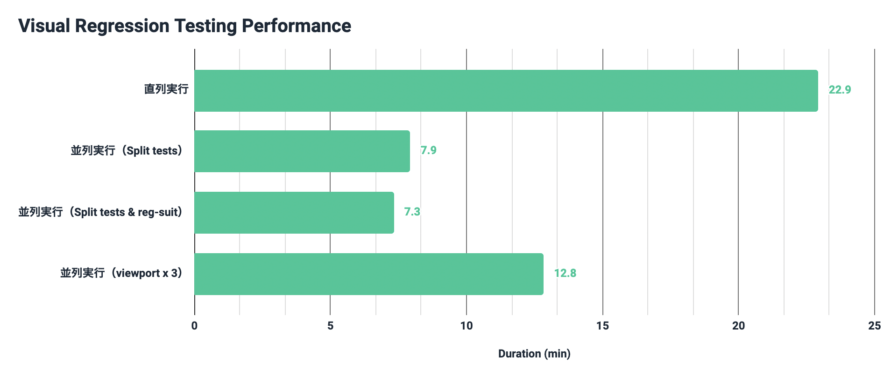
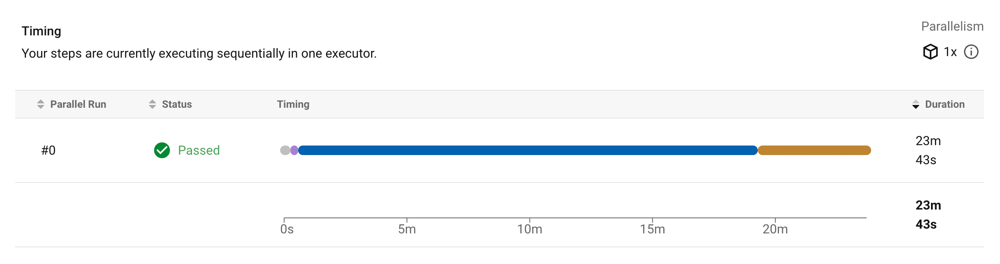
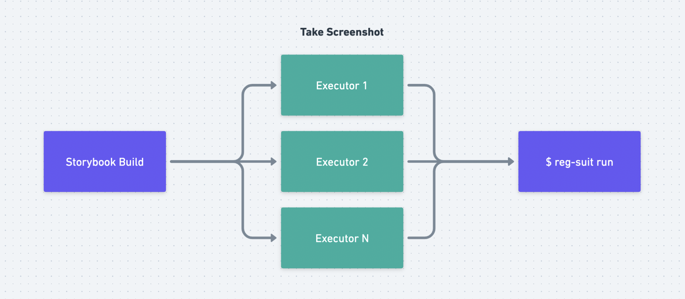
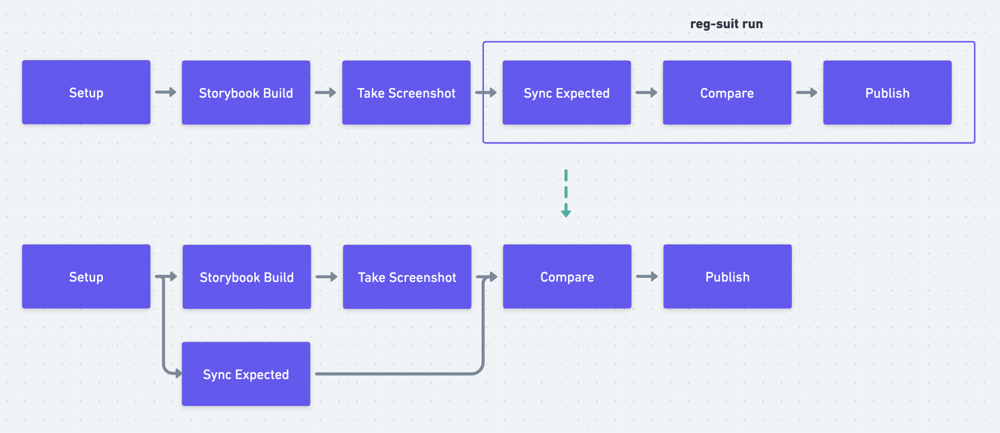

## はじめに

過去このブログでは Visual Regression Testing（以降 VRT）に関連した記事をいくつか書いてきました。

- [Puppeteer を使った Storybook の自動スクリーンショット撮影用のアドオンを作った - wadackel.me](/2017/storybook-chrome-screenshot/)
- [reg-viz のリブランディングをした - wadackel.me](/2019/reg-viz-rebranding/)
- [reg-cli の Report UI をリニューアルした - wadackel.me](/2019/reg-suit-report-ui/)
- [Storybook と reg-suit で気軽にはじめる Visual Regression Testing - wadackel.me](/2018/storybook-chrome-screenshot-with-reg-viz/)

関連ツールへのコントリビュートから始まり、現在業務でも活用しています。業務で扱うプロジェクトでは、検証対象となるケースが約 2,500 程度になっていて、実行時間に不満が出るようになりました。

今年の 1 月頃にその不満を解消するため高速化に取り組んだ結果、課題は残るもののかなりの改善に成功しました。

社内外問わず「VRT を導入しているが遅くて...」という声を聞く機会があるため、1 つの改善事例として内容をまとめておきたいと思います。

## 3 行まとめ

- VRT のボトルネックはスクリーンショット撮影になりやすい
- CircleCI ならスクリーンショットの撮影は `parallelism` で並列化する
- `$ reg-suit run` を辞め、`sync-expected` サブコマンドを別の Job に切り出すことを検討する

## 前提

利用技術、構成は以下のものを採用した前提です。

- [Storycap](https://www.npmjs.com/package/storycap) ([Storybook](https://storybook.js.org))
  - Story の数は約 2,500 程度
- [reg-suit](https://reg-viz.github.io/reg-suit)
- [CircleCI](https://circleci.com)

以降、CircleCI を前提にした内容となっていきます。ただ、未検証ではありますがその他の CI でも考え方を流用できる内容になっているかと思います。

## 改善結果

以下、Job のセットアップなどの処理時間を抜き、純粋に VRT に要している時間のみをまとめた結果です。



上図の内、一番上の項目が改善前で、約 23 分 VRT の実行に掛かっていたことを示しています。同じ検証対象数での最終的な結果は、上から 3 番目の項目で約 7 分半程度に改善できていることがわかります。

約 31% 程度まで実行時間を短縮する改善ができました。結果として、これまで実行時間がネックで行えなかった、検証対象とする Viewport の追加が行えました。

3 つの Viewport で検証に掛かっている時間が最下部の項目で、検証数は 3 倍になっているにも関わらず約 56% 程度の時間で実行できています。

## 高速化のポイント

前述した高速化のポイントについてまとめます。

### ボトルネックはスクリーンショットの撮影



上図は改善前の状態を CircleCI の TIMING タブで見た状態です。青い線がスクリーンショットの撮影 Step で、Job 全体に掛かる実行時間の大半を占めていることがわかります。そのため、Storycap を使ったスクリーンショット撮影を高速化することが、VRT 全体の高速化に最も寄与すると期待できます。

### 基本戦略は並列化

スクリーンショットの撮影は Storycap を用いて行いますが、各 Story の前後で依存関係はありません。各 Stroy が独立して撮影可能であり、撮影された画像も最終的に集約できれば良いため、工夫次第で並列化を行うことができます。

Storycap は内部で [Browser インスタンスを複数持ち](https://github.com/reg-viz/storycap/blob/e85a70b7b07b20959999cce4166d0e7de695618a/packages/storycap/src/node/main.ts#L22-L28)、デフォルトでは可能な限り並列での実行を試みます。しかし、単一の Executor(Job に割り当てられる実行環境) では利用できるマシンリソースに限界があります。そのため、Executor レベルで実行を分けることが基本戦略となります。



スクリーンショット撮影を実際に行う Executor を複数立ち上げ、各 Executor で撮影した画像を次の Job へ渡すような処理が必要となってきます。これを実現する参考実装は後述します。

CircleCI ではテスト分割の機構を提供しているため、これを活用することで対応できます。

https://circleci.com/docs/2.0/parallelism-faster-jobs

テスト分割はいくつかの手法で実現できますが、スクリーンショット撮影の並列化では[環境変数を用いた手法](https://circleci.com/docs/2.0/parallelism-faster-jobs#using-environment-variables-to-split-tests)を採用します。

ちなみに、実際検証した訳ではありませんが、例えば GitHub Actions では Matrix の機能を使うことで並列化ができると思います。

https://docs.github.com/en/actions/using-jobs/using-a-matrix-for-your-jobs

## 実装例

これらのポイントについて、実装例を含めて 2 点まとめます。随所にスクリプトを書きますが、説明を簡略化するため [zx](https://www.npmjs.com/package/zx) を利用していますが、適宜読み替えていただければと思います。

### テスト分割を活用しスクリーンショット撮影の並列化

前述したとおり、スクリーンショット撮影の並列化が高速化の肝となります。対応までのステップは以下となります。

1. Storybook の事前 Build
1. Storycap のテスト分割対応
1. Job の細分化とテスト分割の設定

次に、それぞれ詳細にまとめます。

#### 1. Storybook の事前 Build

Storycap の並列化がしやすいように、Storybook を事前に Build します。

生成した Storybook を対象に Storycap を実行するには `storybook-static` をローカルサーバーで配信することがお手軽です。以下 [serve](https://www.npmjs.com/package/serve) を使い npm script に登録する例です。

```json:package.json
{
  "scripts": {
    "screenshot": "storycap http://localhost:6006 --serverCmd \"npx serve -l 6006 storybook-static\""
  }
}
```

さらに、後述するテスト分割対応で Story の一覧が必要となってくるため、Build 時に少し工夫が必要です。

Storybook の Feature Flags として提供されている `buildStoriesJson` か `storyStoreV7` を有効化することで、`build-storybook` の実行後 `storybook-static` ディレクトリ内に `stories.json` が生成されます。

```javascript:.storybook/main.js
module.exports = {
  // ...
  features: {
    buildStoriesJson: true, // or `storyStoreV7: true`
  },
};
```

生成される `stories.json` の中身はこのようになっています。

```json:storybook-static/stories.json
{
  "v": 3,
  "stories": {
    "button--default": {
      "id": "button--default",
      "title": "Button",
      "name": "Default",
      "importPath": "./src/Button.stories.jsx"
    },
    "header--default": {
      "id": "header--default",
      "title": "Header",
      "name": "Default",
      "importPath": "./src/Header.stories.jsx"
    }
  }
}
```

各 Story のメタデータが `stories` キーのオブジェクトに入ってくるような形式であることがわかります。このファイルを用いることですべての Story が把握できます。

#### 2. Storycap のテスト分割対応

CircleCI のテスト分割の機構を用いてスクリーンショットの撮影を並列化するために、Storycap の呼び出し方法に手を加えます。

テスト分割は Job の設定に対して `parallelism: <number>` を指定することで行えます。テスト分割で並列化された各 Executor では以下の環境変数が参照できます。[^1]

[^1]: これらの環境変数については [Using Environment Variables - CircleCI](https://circleci.com/docs/2.0/env-vars#built-in-environment-variables) にまとまっています。

| 変数                | 値                                                                            |
| :------------------ | :---------------------------------------------------------------------------- |
| `CIRCLE_NODE_TOTAL` | 並列実行の総数。`parallelism` で指定した数値が入る。                          |
| `CIRCLE_NODE_INDEX` | 並列実行時の現在のインデックス。`0` 〜 `CIRCLE_NODE_TOTAL - 1` の数値が入る。 |

先ほどの `stories.json` を参照することで撮影対象の全 Story がわかりました。あとは、各 Executor が自身のインデックスと総数を元に Storycap に撮影対象範囲を絞って伝える必要があります。撮影対象が絞れたら Storycap には `--include` フラグで対象を伝えることができます。[^2]

[^2]: 大量の値を渡すような設計ではないため Storycap 側の改修を検討中

これらの処理を実装し、`scripts/screenshot-ci.mjs` として切り出しておく例です。

```javascript:scripts/screenshot-ci.mjs
import { $, fs, path } from 'zx';

// テスト情報のメタデータ、stories.json のファイルパスなど
const TOTAL = Number(process.env.CIRCLE_NODE_TOTAL ?? '1');
const INDEX = Number(process.env.CIRCLE_NODE_INDEX ?? '0');

const STORIES_JSON_PATH = path.resolve(
  __dirname,
  '..',
  'storybook-static',
  'stories.json',
);

// 配列を分割するユーティリティ関数
const split = (arr, size) =>
  arr.reduce(
    (acc, cur, i) => {
      acc[i % size].push(cur);
      return acc;
    },
    [...Array(size)].map(() => []),
  );

// stories.json の中身を読み取り
const json = await fs.readJson(STORIES_JSON_PATH);

// stories[].title と stories[].name を '/' で合わせたものが
// Storycap の `--include` フラグに渡せる
const stories = Object.values(json.stories)
  .map(({ title, name }) => `${title.trim()}/${name.trim()}`)
  .sort();

// 撮影対象を絞りつつフラグを用意する
const flags = split(stories, TOTAL)[INDEX].reduce((acc, cur) => {
  acc.push('--include', cur);
  return acc;
}, []);

// 前もって用意しておいた npm script に追加のフラグとして渡す
// 実際には以下のコマンドが実行されることとなる
// `$ npm run screenshot -- --include "Button/Default" --include "Header/Default" ...`
await $`npm run screenshot -- ${flags}`;
```

このスクリプトを実行するための npm script を登録しておきます。

```json
{
  "scripts": {
    "screenshot": "...",
    "screenshot:ci": "zx scripts/screenshot-ci.mjs"
  }
}
```

ここまでで並列化の準備は完了です。あとは、各 Job を組み合わせるための設定を行うのみです。

#### 3. Job の細分化とテスト分割の設定

Storybook の Build、スクリーンショットの撮影、reg-suit の実行をそれぞれ別の Job として切り出します。さらに、各 Job の成果物を次の Job に共有する必要があるため、適宜 `attach_workspace` と `persist_to_workspace` を利用します。

説明を簡略化するため、キャッシュ周りなど一部の処理は省略していますが、大枠次のような設定となります。

```yaml:.circleci/config.yml
version: 2.1

# executors などの各種設定は省略

references:
  workspace_root: &workspace_root ~/sample

  attach_workspace: &attach_workspace
    attach_workspace:
      at: *workspace_root

jobs:
  # 依存解決
  setup:
    executor: <your_executor>
    steps:
      - run: npm ci
      - persist_to_workspace:
          root: *workspace_root
          paths:
            - node_modules

  # Storybook の Build
  run_vrt_build:
    executor: <your_executor>
    steps:
      - checkout
      - *attach_workspace
      - run: npm run build
      - persist_to_workspace:
          root: *workspace_root
          paths:
            - storybook-static

  # スクリーンショット撮影
  # npm script に登録した screenshot:ci を実行
  # 15 の Executor を同時に利用するように設定した例
  run_vrt_capture:
    executor: <your_executor>
    parallelism: 15
    steps:
      - checkout
      - *attach_workspace
      - run: npm run screenshot:ci
      - persist_to_workspace:
          root: *workspace_root
          paths:
            - __screenshots__

  # reg-suit の実行
  run_vrt:
    executor: <your_executor>
    steps:
      - checkout
      - *attach_workspace
      - run: npx reg-suit run

workflows:
  build_and_test:
    jobs:
      - setup

      - run_vrt_build:
          requires:
            - setup

      - run_vrt_capture:
          requires:
            - run_vrt_build

      - run_vrt:
          requires:
            - run_vrt_capture
```

`parallelism` キーに数値を指定し、複数の Executor を立ち上げるようにしているのがポイントです。指定する数値は試しながら調整するのがよさそうです。CircleCI の場合なら、Job 実行結果ページの RESOURCES タブにある CPU Usage / RAM Usage などが参考になるでしょう。あとは数を変えて実行時間を見てみるのもいいかもしれません。

#### 対応結果

ここまでの対応で約 23 分掛かっていた VRT 全体の実行時間が約 8 分になりました。  
ボトルネックとなっていたスクリーンショット撮影に関しては、約 18 分から約 2 分程度まで短縮できました。

事前に Storybook の Build を行うようにしたため、そこで約 1 分半ほど追加で必要となりましたが、合計しても約 3 分半なので劇的な改善が見られました。

### reg-suit の Job 細分化

最もボトルネックだった部分の解消は行うことができました。ただ、もう少しだけ改善の余地が残っています。

reg-suit を紹介してくださっている導入記事の多くは `run` サブコマンドを使った例が紹介されていると思います。

```bash
$ npx reg-suit run
```

`run` サブコマンドの中身は、以下のドキュメントに記載のあるとおり `sync-expected`、`compare`、`publish` サブコマンドの集合と等価です。

> [reg-viz/reg-suit: Visual Regression Testing tool](https://github.com/reg-viz/reg-suit#run-command)

その中で `sync-expected` サブコマンドは、スクリーンショットの撮影などと並列に実行することが可能です。これは、比較対象となる画像の取得しか行わず事前の状態に依存がないためです。



上図のように、`run` サブコマンドの実行を別の Job へと切り出すことで、`sync-expected` サブコマンドの実行分を節約することができます。

`run` サブコマンドを実行していた Job を編集し、`sync-expected` サブコマンドと Storybook の Build などの Job を並列に実行するような設定は以下のとおりです。

```yaml:.circleci/config.yml
jobs:
  # setup, run_vrt_build, run_vrt_capture は省略...

  run_vrt_fetch:
    executor: <your_executor>
    steps:
      - checkout
      - *attach_workspace
      - run: npx reg-suit sync-expected

  run_vrt:
    executor: <your_executor>
    steps:
      - checkout
      - *attach_workspace
      - run: npx reg-suit compare
      - run: npx reg-suit publish -n

workflows:
  build_and_test:
    jobs:
      - setup

      - run_vrt_fetch:
          requires:
            - setup

      - run_vrt_build:
          requires:
            - setup

      - run_vrt_capture:
          requires:
            - run_vrt_build

      - run_vrt:
          requires:
            - run_vrt_fetch
            - run_vrt_capture
```

#### 対応結果

約 8 分掛かっていた VRT 全体の実行時間が、7 分弱まで短縮できました。`sync-expected` サブコマンドの実行には約 2 分かかっていたため、その分の実行時間短縮です。

この方法は、画像の枚数によってはかえって遅くなったりしてしまうこともあるかもしれません。Job を分けることで workspace の初期化や、`attach_workspace` などのデータ共有に時間が掛かるケースがあるためです。そのため、試してみて効果がないようなら無理に行う必要はないかもしれません。

## 残る課題

大幅に VRT に要する時間の短縮に成功しましたが、まだ完全とは言えず課題は残っています。

### reg-suit の sync-expected と publish

冒頭で 2,500 の Story があるプロジェクトを 3 つの Viewport で検証するようにしたと書きました。撮影されるスクリーンショットは 7,500 程度になります。

並列化できているスクリーンショット撮影は 1 分半程度で終わるのに対し、並列化のできていない `sync-expected`、`publish` サブコマンドは画像枚数に比例し長くなってきています。`sync-expected` サブコマンドでは約 5 分、`publish` サブコマンドは約 8 分掛かります。

撮影画像をホストする Bucket の Region が Tokyo になってしまっているため、CircleCI が動作する Region から近い Region に移すことである程度の改善はできるかもしれません。しかし、それにも限界がありそうです。

スクリーンショット撮影と同様に、Executor レベルでの並列化ができるような機構があると、劇的な改善に繋がるかもしれません。こちらは要検討です。

### Storycap の I/F

`--include` フラグを活用することで、各 Executor が担う撮影対象を絞り込んだ例を書きました。ただ、1 Executor あたりに多くの Story を撮影させると、その分フラグが増えることになります。

あまりに数が多い場合 `E2BIG` が発生し実行ができないケースがあるのと、そもそもの用途としてあまり推奨された使い方ではありません。

対象範囲を JSON ファイルで指定することができる `--list <json>` のようなフラグを追加するか否か、という内容を [@Quramry](https://twitter.com/Quramy) さんと軽く話しました。そのため、今後の storycap のアップデートでより適切な機能が入るかも知れません。

## おわりに

前述したとおり、最終的には 3 つの Viewport を対象に検証を行うようにしつつも、当初の約 56%程度まで実行時間を短縮することができました。テスト実行の高速化が、テストの質を上げることに寄与したなと思う取り組みでした。

他にも「こんな VRT の高速化に取り組んだよ」という事例がありましたら、[Twitter](https://twitter.com/wadackel) で教えていただけると嬉しいです。
