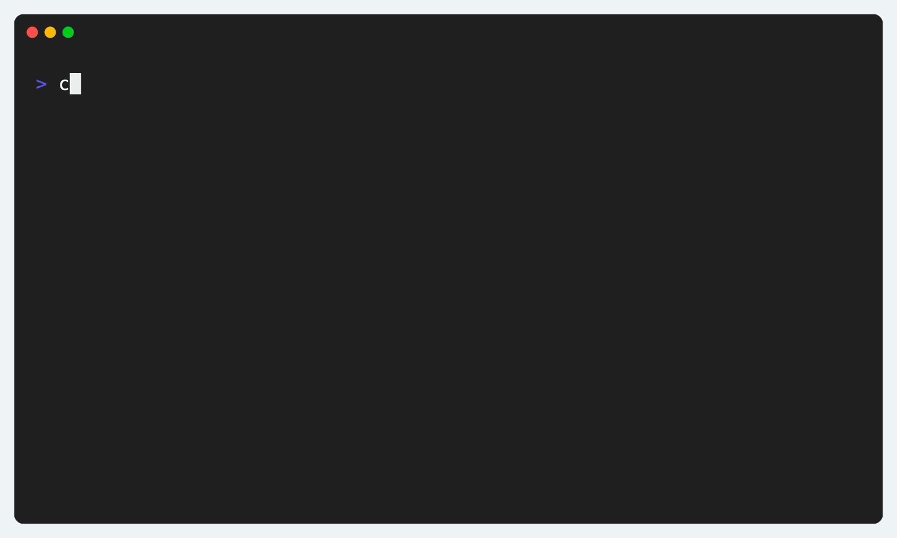
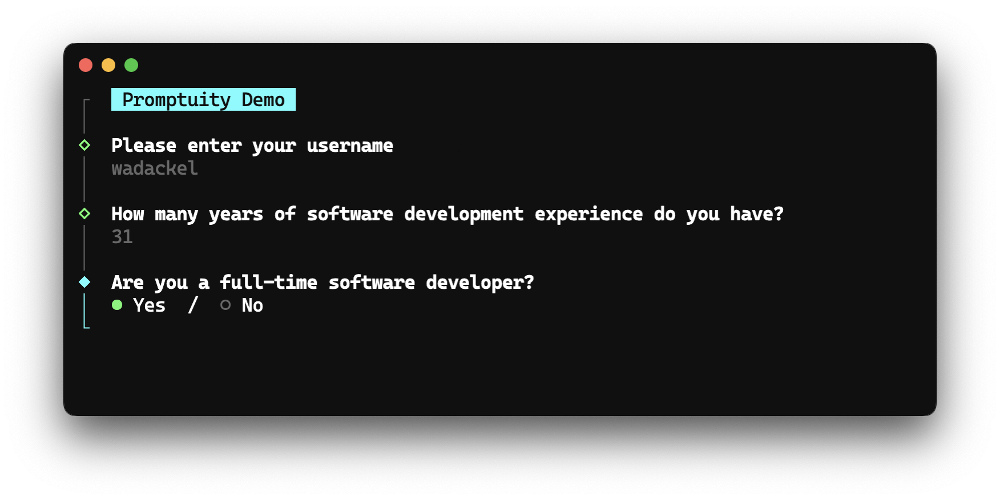
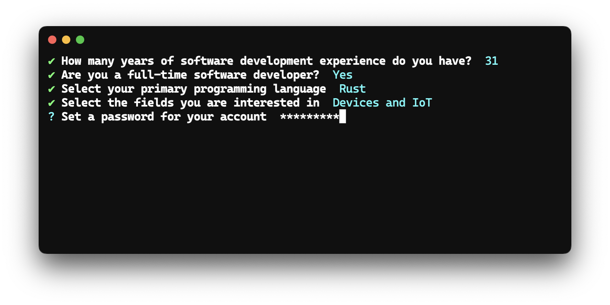

## はじめに

このブログで何度か紹介している [scaffdog](https://github.com/scaffdog/scaffdog) を Rust で書き直し、シングルバイナリとして利用可能なように実装を進めています[^1]。その yak shaving 中に表題の Crate を作りました。

類似する Crate には以下のようなものがあります。特に [dialoguer](https://github.com/console-rs/dialoguer) 及び [inquire](https://github.com/mikaelmello/inquire) が有名どころかなと思います。

- [console-rs/dialoguer](https://github.com/console-rs/dialoguer)
- [axelvc/asky](https://github.com/axelvc/asky/)
- [mikaelmello/inquire](https://github.com/mikaelmello/inquire)
- [fadeevab/cliclack](https://github.com/fadeevab/cliclack)

いずれも作り込まれた Crate ではあるものの、カスタマイズ性に難があるものが多い印象でした。ある程度、利用者側に自由度がある Crate が欲しいと思い、対話型インターフェースを構築する [Promptuity](https://github.com/wadackel/promptuity) [^2] という Crate を公開しました。

https://github.com/wadackel/promptuity?tab=readme-ov-file#build-your-own-prompt

ある程度動作確認[^3] ができたので、ブログに簡単に残しておきたいと思います。

## Promptuity

[ドキュメント](https://github.com/wadackel/promptuity?tab=readme-ov-file#quick-start) に記載している DEMO 画像です。テキスト入力、要素選択などを行っているシンプルな例です。



実装は次のとおり。ターミナルやテーマの明示的な初期化を必要とするため、実際にプロンプトを行うまでに必要なセットアップは他の Crate よりも多い傾向にあります。

```rust:main.rs
use promptuity::prompts::{Confirm, Input, Select, SelectOption};
use promptuity::themes::FancyTheme;
use promptuity::{Error, Promptuity, Term};

fn main() -> Result<(), Error> {
    let mut term = Term::default();
    let mut theme = FancyTheme::default();
    let mut p = Promptuity::new(&mut term, &mut theme);

    p.term().clear()?;

    p.with_intro("Survey").begin()?;

    let name = p.prompt(Input::new("Please enter your username").with_placeholder("username"))?;

    let _ = p.prompt(Confirm::new("Are you a full-time software developer?").with_default(true))?;

    let _ = p.prompt(
        Select::new(
            "Select your primary programming language",
            vec![
                SelectOption::new("Rust", "rust"),
                SelectOption::new("Go", "go"),
                SelectOption::new("C++", "cpp"),
                SelectOption::new("C", "c"),
                SelectOption::new("TypeScript", "typescript"),
                SelectOption::new("JavaScript", "javascript"),
                SelectOption::new("Deno", "deno"),
                SelectOption::new("Python", "python"),
                SelectOption::new("Java", "java"),
                SelectOption::new("Dart", "dart"),
                SelectOption::new("Other", "other"),
            ],
        )
        .with_hint("Submit with Space or Enter."),
    )?;

    p.with_outro(format!("Thank you for your response, {}!", name))
        .finish()?;

    Ok(())
}
```

ビルトインで提供するプロンプトは以下の6つです。個人的によく使うプロンプトを用意しています。

- `Input`
- `Password`
- `Number`
- `Select`
- `MultiSelect`
- `Confirm`

また、ビルトインで2種類のテーマを提供しています。[Inquire](https://github.com/SBoudrias/Inquirer.js) 風なものと、[clack](https://github.com/natemoo-re/clack) 風なものです。

| Fancy                            | Minimal                              |
| -------------------------------- | ------------------------------------ |
|  |  |

_完全に余談ですが、gif 動画の撮影に [vhs](https://github.com/charmbracelet/vhs) を初めて使ったのですがすごく快適でした。_

## コンセプト

テーマ、プロンプトの自作や、各種挙動の **拡張性**、そして拡張性を備えるための **シンプルさ** を重視しています。

いくつかの実装例を [examples](https://github.com/wadackel/promptuity/tree/main/examples) ディレクトリに含めているのですが、コンセプトに沿う代表的なものは以下の2つです。

- [カスタムテーマの実装例](https://github.com/wadackel/promptuity/blob/main/examples/custom_theme.rs)
  - `MinimalTheme` に近いテーマ実装例
- [カスタムプロンプトの実装例（Autocomplete）](https://github.com/wadackel/promptuity/blob/main/examples/autocomplete.rs)
  - `Select` に Fuzzy Search の機能を加えたプロンプト例
  - `Autocomplete` は Fuzzy Match アルゴリズムや、キーバインドなど好みが分かれる印象があります。そのため、Promptuity ではビルトインプロンプトとしての提供は避け、参考実装の提供のみとしています

他の類似した Crate の内、意外と「自作したプロンプトを同じ枠組みで動作させる」が達成できるものは多くないのかなと感じました。Crate 毎に提供するプロンプト種別が異なり、「あちらのプロンプトをこの見栄えやキーバインドで動作させたい」といった要件を達成できなかったです。

Promptuity での自作プロンプトは、[`Prompt`](https://docs.rs/promptuity/0.0.5/promptuity/trait.Prompt.html) トレイトを実装した構造体を用意することで達成できます。最低限必要なメソッドは以下の3つです。

| Method   | Description                                  |
| :------- | :------------------------------------------- |
| `handle` | キーコード・修飾子キーから内部状態を更新する |
| `render` | 内部状態に応じた描画内容を構築する           |
| `submit` | 最終的な値を返す                             |

キー入力などのイベント処理はコアが担い、細かい挙動については `Prompt` で実装するといった設計です。<kbd>Ctrl+C</kbd> でのプロンプト強制終了処理も各 `Prompt` に委ねており、なるべくコアは余計なことをしないようにしています。実際に [Build your own Prompt](https://github.com/wadackel/promptuity?tab=readme-ov-file#build-your-own-prompt) に記述したカスタムプロンプトの `handle` を例示します。

```rust
use promptuity::event::{KeyCode, KeyModifiers};
use promptuity::{Prompt, PromptState};

struct CustomConfirm {
    value: bool,
}

impl Prompt for CustomConfirm {
    // ...

    fn handle(&mut self, code: KeyCode, modifiers: KeyModifiers) -> PromptState {
        match (code, modifiers) {
            (KeyCode::Enter, _) => PromptState::Submit,
            (KeyCode::Esc, _) | (KeyCode::Char('c'), KeyModifiers::CONTROL) => PromptState::Cancel,
            (KeyCode::Char('y'), KeyModifiers::NONE) | (KeyCode::Char('Y'), KeyModifiers::NONE) => {
                self.value = true;
                PromptState::Submit
            }
            (KeyCode::Char('n'), KeyModifiers::NONE) | (KeyCode::Char('N'), KeyModifiers::NONE) => {
                self.value = false;
                PromptState::Submit
            }
            _ => PromptState::Active,
        }
    }

    // ...
}
```

暗黙的な挙動を避けるような設計はコアである [`Promptuity`](https://docs.rs/promptuity/0.0.5/promptuity/struct.Promptuity.html) でも同様で、テーマやターミナルといった全ての依存をコンストラクタで受け取り、暗黙的に標準出力や標準エラー出力を用いることはありません。

主にプロンプトについて触れましたが、テーマについてもプロンプトと同様 [`Theme`](https://docs.rs/promptuity/0.0.5/promptuity/trait.Theme.html#) トレイトを実装することで、好きなように見栄えを構築するすることが可能です。

## おわりに

すごく簡単な内容ではありますが、[Promptuity](https://github.com/wadackel/promptuity) について紹介しました。

キー入力を受け付ける `Input` や `Password` は Emacs 風なキーバインドにも対応していて、個人的にはかなり使いやすいものができたかなと感じています。また、ターミナル操作を [`Terminal`](https://docs.rs/promptuity/0.0.5/promptuity/trait.Terminal.html) トレイトとして切り出し、初期化を利用者側に委ねることでテストが書ける設計にもなっていることは、細かい部分ではありますが気に入っています。（代償としてセットアップに必要なコード片は多い）

本 Crate が初めての `cargo publish` でした。

https://x.com/wadackel/status/1744300479268721084?s=20

また、何かしら毛刈りの過程で Crate として切り出せるものがあれば嬉しいなぁと妄想していたりします。

[^1]: 実は Engine は既に書き終えているのですが、未解決の問題があり少しずつ検証を進めている段階です。

[^2]: Prompt + Ingenuity の造語なのですが、僕は「プロンプチュイティ」と読んでいます。

[^3]: Windows での不具合や、その他既知のバグ修正などを終えたタイミングです。
