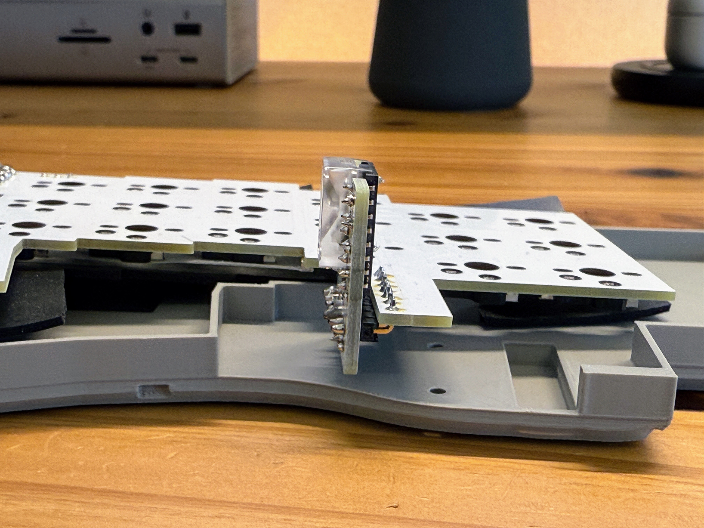

## はじめに

4月頃に「dax」という自作分割キーボードを作ったことをブログに書きました。

https://blog.wadackel.me/2025/original-keyboard

特徴は以下。

- 分割無線キーボード、Bluetooth 接続
- ZMK Firmware で動作
- 25mm トラックボール付き
- バッテリー駆動
- 43 キー、挟ピッチ（ChocV1, V2）
- ロープロファイル、カラムスタッガード配列

ブログを書いた直後くらいから「dax2」と名付けて二世代目のキーボードを作り始め、その利用も数ヶ月が経ちました。利用しながら細かい改善などを加えていった結果、一旦ここから大きく手を加えることはない想定となったので、現在の状態をまとめておこうと思います。

今回の改良では、主に以下の2点に焦点を当てて作業を行いました。

- 基板・配線の見直し
- ケースの大幅な改良

それぞれ取り組んだ内容をまとめます。

## 基板・配線の見直し

基板と配線については、大きく変わったというわけではありませんが、2点ほど改善を行いました。主に修正や微調整がメインの変更となりましたが、一度作りきって実際に使用してみることで見えてくる反省点があることを実感しました。

### 全体の高さを抑えるための工夫

トラックボール用のブレイクアウト基板を下側L字に配線すること、バッテリー用の穴を設けることで高さが抑えられるように工夫しました。

これらの改善で、全体の背を数mm低くすることに成功しました。現在使っているバッテリーが200mAhで小さめなので、実際にはバッテリー用に設けている穴はほぼ意味をなしていないのですが、多少厚みがあるものでも全体の高さには影響がでない作りとすることができました。

### 電源スイッチの配置変更

バッテリー用に新設した穴の関係で配置場所がなくなったため、電源スイッチの装着位置をキースイッチの下に配置してみました。これは正直なところ不安でしたが、意外と普通に動作して驚きました。

この変更により、USB-Cの差込口と電源スイッチが普段見えない側に統一できたので、利用時の見た目がスッキリしました。機能面だけでなく、外観の改善にもつながったのは嬉しい副産物でした。

## ケースの見直し

基板よりもケースの改善が多く行われました。打鍵感・打鍵音を少しでも良くするための変更、見た目をよりスッキリとするための変更がメインです。

### デザインの統一

全体の印象がまとまって見えるようなデザインを心がけました。特にトップケースのごちゃつきがなくなるようにケースを整理しました。

また、ケースはいくつかの色を作ってみて楽しんでいます。

いまメインで使っているのはダークグレーです。

### トラックボールの低プロファイル化

個人的に最も効果を実感できた改善が、トラックボールをできる限り低くしたことです。基板上の配線を変更したことは前述したとおりで、ケース側も形状を微調整することで手のひらに当たる部分を減らすように工夫しました。以前と同様の25mmボールでも体感で変わる程度に低くすることに成功しています。

### 疑似ガスケット構造の導入

ガスケット構造を疑似的に再現してみました。スポンジを基板の端を支えるようにボトムケースに設置することで、打鍵時にほんの少しだけ沈むこむような構造としました。

正直なところ、これについてはあまり効果は感じなかったのですが、あって悪い感じもしないのでそのまま採用しています。

### スイッチプレートの追加

daxの初期ケースはボトムケースとトップケースのシンプルな構成でした。スイッチプレートがないため、トップケースでキースイッチを安定させるしかなかったのですが、そうすると疑似ガスケット構造との相性が悪くなってしまいます。

トップケースでキースイッチを支える必要があるのに、それができなくなってしまうためです。そこで、別途スイッチプレートを入れられるように、トップケース側も微調整を行いました。

スイッチプレートが導入されてから、キースイッチが非常に安定するようになったのでこれも体感の使用感向上に寄与しました。

### テント用アクセサリの作成

快適性向上のため、テント用のアクセサリも作成しました。ほんの少し角度をつける程度のものですが、家でガッツリ作業するときはこれを装着し、会社に持っていく際には荷物を減らしたいので外すという使い分けをしています。

## その他の挑戦

元々やってみたかった Gateron Low-profile のソケット利用を途中で試しに作ってみました。ただ、残念ながら求めていた打鍵感を得ることが難しく、Keychron K3 Max がとにかく優秀だったという気付きがありました。結果的に Choc v2 ベースに落ち着きました。

Choc v2 を選んだ理由として、シンプルにキースイッチの選択肢が多くて楽しいことと、Gateron Low-profile のソケットを利用するとキーピッチが17x17mmにできなかったことが挙げられます。

## 最近使っているキースイッチ

現在使用しているキースイッチについても記録として残しておきます。

### 自宅用：Specter と Taro Ice Cream Mini

[Specter](https://lofree.co.jp/products/specter-low-profile-pom-switches?pr_prod_strat=jac&pr_rec_id=a083070ad&pr_rec_pid=9052634480871&pr_ref_pid=9052639494375&pr_seq=uniform) を主に利用することが増えました。本当はタクタイルを使いたいのですが、選択肢が少ないこととそれなりの期間使っていると品質がリニア軸と比較して低く感じることが多いと思いました。

Specter はお気に入りですが、最近は [Kailh Taro Ice Cream Mini](https://shop.talpkeyboard.com/products/kailh-taro-icecream-mini-linear-37?srsltid=AfmBOoo9lLi-Trvi-MIlPjgiMa5mojKydhvbMQIlTNRYLdniGt4QbxRl) も試しています。Specter にかなり近い打鍵感ですが、37gf と Specter と比較して 3gf 軽い作動圧となっているのが特徴です。

品質もそれなりに高い感覚があり個人的にお気に入りです。また Specter の半額程度で揃えられるのも魅力的な点です。

Specter より軽めのキースイッチを使いたいと思って Taro Ice Cream Mini と出会ったのですが、その過程で [Kailh Choc v2 パンダ軸 V1](https://cielogames.cielosiro.co.jp/products/000000000092?srsltid=AfmBOoopjjoLK-TqOheQfNT3W8_UFSBnu8BWThJ6BJiitw0YwdfjoAOU) も試してみました。しかし、これは 30gf と軽すぎて意図せずキーを打鍵してしまうことがあり、結果的に使用を断念しました。

### 会社用：Hades

会社用には [Hades](https://lofree.co.jp/products/hades-low-profile-pom-switches) を使っています。静音キースイッチ特有のむにゅっとした打鍵感が少なく、快適な使用感でお気に入りです。

### 気になるキースイッチ

最近、Lofree Flow 2 と合わせて発表されている PULSE が気になっています。40gf 程度のタクタイルで、品質も高そうな気がしているので早くキースイッチ単体で発売してほしいなとワクワクしています。

## おわりに

ここ数ヶ月で細々と改善してきた点をざっくばらんにまとめました。外観は大きく変わりませんでしたが、中身がそれなりに改善できた感覚があります。特にトラックボールの高さを抑える変更は体感でも使用感が向上したことを実感しています。

冒頭でこれから大きく手を加えることはない想定であることを記載しましたが、また数ヶ月使ってみて気になる点が出てきたり、試してみたいキーボードが出てきたらなにか挑戦するかもしれません。
