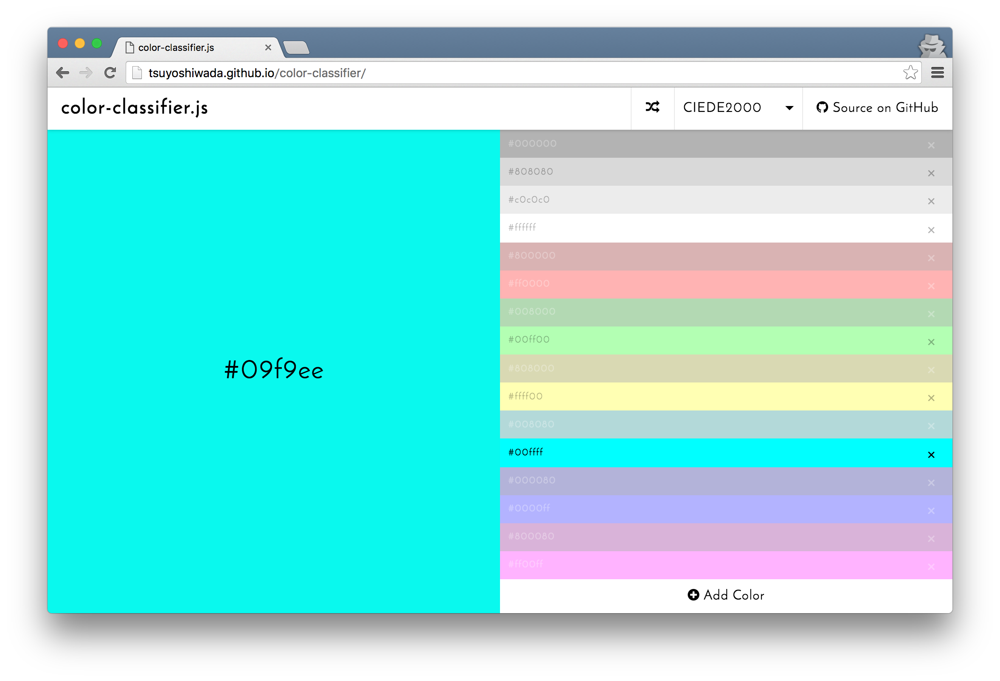

React を使って作成している Web アプリ内で、画像の色を自動的に取得後、用意しておいた幾つかの基準色(カラーパレット)に分類する必要がありました。  
この機能を実現するために実装した内容を[color-classifier.js](https://github.com/wadackel/color-classifier)というライブラリに切り出したので、処理内容や使い方について書いてみます。

## はじめに

ライブラリへ切り出して、殆ど書き終わったなという段階で[color-diff](https://github.com/markusn/color-diff)というライブラリを知りました。`diff.closest()`というメソッドを使うことで、同様の機能を実現できたみたいです。

全力で車輪の再発明をしてしまった感に押しつぶされそうだったので、ブログに書いて消化していきたいと思います。

対象のリポジトリは以下です。

> [wadackel/color-classifier](https://github.com/wadackel/color-classifier)

### 色の分類を実現するステップ

まず、色の分類を行うためのステップを整理します。  
以下の 2 ステップで基準色への分類を行うことができそうです。

1. 指定色と基準色間の色差(後述)を求める
2. 最も色差の少なかったものを分類先とする

上記で肝となるのは、**色差を求める**という部分になります。

### 色の色差を求める

正直、詳細なアルゴリズムについては研究者ではないためさっぱりですが、[CIEDE2000](https://en.wikipedia.org/wiki/Color_difference#CIEDE2000)というアルゴリズムが最も人間の色覚に近い色差を求めることが出来るようです。

計算式は Java で書かれていましたが、以下の記事が大変参考になりました。

> [色の距離（色差）の計算方法 - Qiita](http://qiita.com/shinido/items/2904fa1e9a6c78650b93)

JavaScript に書き直して、[The CIEDE2000 Color-Difference Formula](http://www.ece.rochester.edu/~gsharma/ciede2000/)にあった[テストデータ](http://www.ece.rochester.edu/~gsharma/ciede2000/dataNprograms/ciede2000testdata.txt)もパスする事を確認しました。

実際のソースは以下で確認できます。

> [color-classifier/src/utils/color-diff.js](https://github.com/wadackel/color-classifier/blob/master/src/utils/color-diff.js)

## デモページ

以下のページで指定色が、どの基準色へ分類されるか確認できます。



> http://wadackel.github.io/color-classifier/

ちょっと分かりづらいかもしれないので簡単に補足です。

- 画面左側が指定色
- 画面右側が基準色(カラーパレット)の一覧
- 分類された基準色がアクティブな表示になる (透明度が 1)

## インストール

Browserify,webpack,Node.js 上で使う場合は、npm からインストールします。

```bash
$ npm install color-classifier --save
```

`<script>`で直接読み込む場合は、[color-classifier.min.js](https://raw.githubusercontent.com/wadackel/color-classifier/master/color-classifier.min.js)をダウンロードしても OK です。

## 使い方

基本的な使い方についてです。

まず基準色となるカラーパレットを配列で用意して、`ColorClassifier`のコンストラクタに指定します。  
あとは生成したインスタンスの`classify`メソッドに分類したい色を与えると、基準色の中から最も近い色を取得できます。

```javascript
import ColorClassifier from 'color-classifier';

const palette = ['#fff', '#000'];
const colorClassifier = new ColorClassifier(palette);
const color = colorClassifier.classify('#fefefe');

console.log(color); // {r: 255, g: 255, b: 255}
```

`classify`メソッドの戻り値は、第 2 引数にフォーマットを指定することで変更することが出来ます。

```javascript
const color = colorClassifier.classify('#fefefe', 'hex');

console.log(color); // #fff
```

### 色差の計算アルゴリズムを変更

デフォルトでは、`CIEDE2000`を使い色差を求めますが、`HSV`,`RGB`,`CIEDE2000`の 3 つの中から選ぶことが可能な為、組み込むアプリなりサービスなりで、最も良い結果が出るものを使用できます。

```javascript
import ColorClassifier, { AlgorithmTypes } from 'color-classifier';

const palette = ['#fff', '#000'];
const colorClassifier = new ColorClassifier(palette, AlgorithmTypes.HSV);
const color = colorClassifier.classify('#fefefe', 'hex');

console.log(color); // #fff
```

それぞれのアルゴリズムによって、分類される結果の差異は[デモページ](http://wadackel.github.io/color-classifier/)で確認してみるのが良いかなと思います。

---

他に指定色を配列で一気に指定する`classifyFromArray`というメソッドがあったり、デフォルトで幾つかの基準色を用意していたりしますが、詳細は[README](https://github.com/wadackel/color-classifier)を確認いただけたらと思います。

## まとめ

- 色差の計算は`CIEDE2000`が優秀
- ライブラリを作る前に、既に同じものが無いかちゃんと調べる (~~車輪の再発明つらい...~~)
