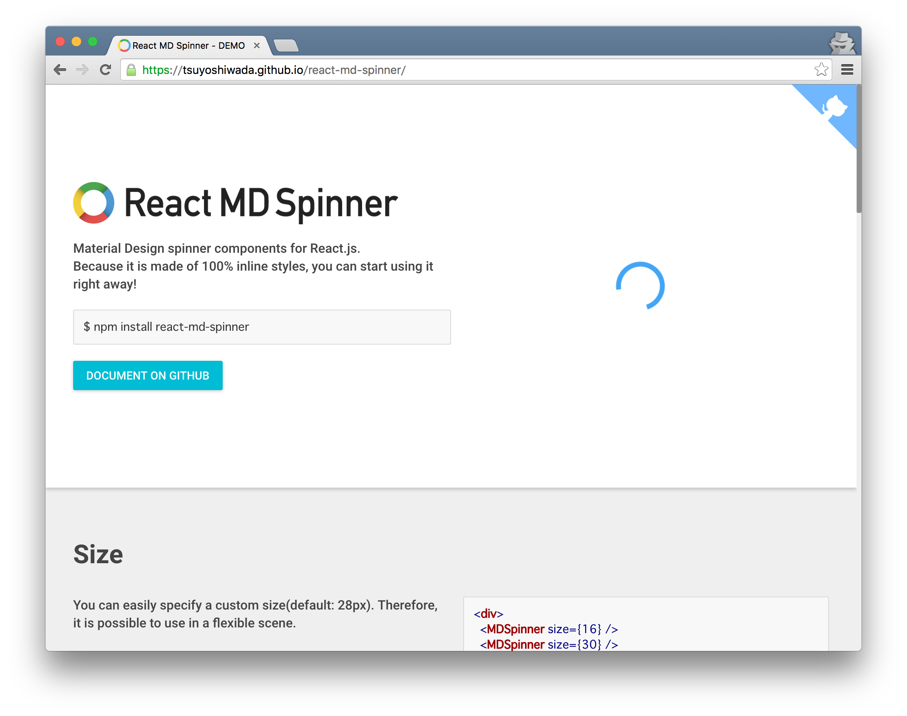

Google の提唱する[Material Design](https://material.google.com/)チックな Spinner を、React コンポーネント化して公開しました。

リポジトリは以下です。

> wadackel/react-md-spinner  
> https://github.com/wadackel/react-md-spinner

## デモ



> React MD Spinner - DEMO  
> https://wadackel.github.io/react-md-spinner/

実際の動きは以下の様にカラフルな円形がくるくる回る感じになっています。


手持ちの iPhone6s で確認している限り、スマートフォンでも必要充分スムーズに動作しています。

## 使い方

`react-md-spinner`の特長として、[material-ui](http://www.material-ui.com/)の様にインラインスタイルのみで構成されるため、インストールしたら CSS どうしようみたいに悩まずにすぐ使い始められる点があります。

### インストール

npm に公開したので、他のモジュールと同様に`npm install`します。

```bash
$ npm install react-md-spinner
```

### 基本的な使用例

全てのプロパティが Optional なので特に設定なく使えます。

```javascript
import React, { Component } from 'react';
import MDSpinner from 'react-md-spinner';

export default class SpinnerExample extends Component {
  render() {
    return (
      <div>
        <MDSpinner />
      </div>
    );
  }
}
```

`react-md-spinner`は単純にくるくるしているだけなので、表示/非表示みたいな操作はアプリに応じて使用者が実装する必要があります。

### プロパティ

指定可能なするプロパティは以下の通りです。

| プロパティ    | 型             | デフォルト値                            | 概要                                                                            |
| :------------ | :------------- | :-------------------------------------- | :------------------------------------------------------------------------------ |
| `className`   | string         | undefined                               | コンポーネントに対して`className`を設定します。                                 |
| `style`       | object         | undefined                               | MDSpinner 内のルート要素に対してスタイルを設定します。                          |
| `size`        | number, string | 28                                      | スピナーのサイズを設定します。                                                  |
| `duration`    | number         | 1333                                    | アニメーションの速度を設定します。                                              |
| `color1`      | string         |  rgb(66, 165, 245) | スピナーの色を CSS に有効な文字列で設定します。                                 |
| `color2`      | string         |  rgb(239, 83, 80)  | 同上                                                                            |
| `color3`      | string         |  rgb(253, 216, 53) | 同上                                                                            |
| `color4`      | string         |  rgb(76, 175, 80)  | 同上                                                                            |
| `singleColor` | string         | undefined                               | 基本は`color1`~`color4`と同様ですが、単色指定を行うと他の色設定は無視されます。 |

サイズや色味を変更可能な為、使う場面やアプリに応じたスタイルを適用できる様に柔軟性を持たせてみました(つもり)。

## 技術的な点

今進めている趣味プロジェクトが Material Design を参考にしたデザインで進めているのですが、巨大なロックインを避ける為に UI 周りのフレームワークは極力使わず、小さい単位でのコンポーネントを採用する方針で進めています。しかし、単体で使用できる Spinner にあんまりいいのが無いなぁという事で、設定いらずですぐに使える、という点を重視して作成しました。

使用者に webpack の style-loader なんかを強制したくなくて、スタイル周りはシンプルに Inline Styles を採用しています。

### 問題点

そこで問題となったのが、くるくる+色味の変化を行うアニメーション部分でした。一般的に挙げられる解決策として以下の様な方法があるかと思います。

1. CSS を別ファイル用意してその中で`@keyframes`を定義して、スタイルを割り当てる(ユーザに直接読み込んでもらうか、CSSModules など)
2. JS 側で`requestAnimationFrame`などを駆使してアニメーションさせる
3. JS 側で動的に`@keyframes`を作成し`head`に`style`要素を追加、各要素へスタイルを割り当てる

1 は使用者の環境へ設定が必要となってしまうのでコンセプトとずれるため却下。2 は JS 的なアプローチですが、複数の Spinner を表示した際に、同一のアニメーションなのにそれぞれの要素に対して各フレームスタイルを書き換えていくのは非効率です(あまり無いケースとは思いますが...)。

消去法で 3 の方法を使い実装しました。

### JS で動的に@keyframes を追加する

このアプローチ方法については、ググれば幾つかの方法が出てきます。`react-md-spinner`では、この処理部分のみ別のパッケージとして切り出して公開しました。(コンポーネントのテストとは分離したかったので)

> wadackel/css-keyframer  
> https://github.com/wadackel/css-keyframer

指定したスタイルに必要なベンダープレフィックスを自動的に付与したり、`@keyframes`の登録/登録解除といった必要最低限の API を実装したものです。

## まとめ

見た目は限りなくシンプルなので、Material Design の Spinner として公開しましたが、色味を変更すれば幅広いデザインに適用出来そうなので、Spinner 探してたのよね〜という方に是非使ってみて欲しいなと思います。  
バグや機能改善は[Issues](https://github.com/wadackel/react-md-spinner/issues)や[Twitter](https://twitter.com/wadackel)までいただけると嬉しいです。

> wadackel/react-md-spinner  
> https://github.com/wadackel/react-md-spinner
