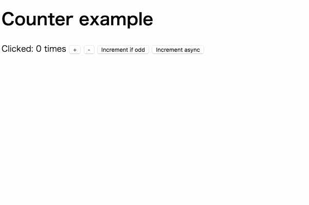

Web アプリを構築したくて久し振りに React を触ってみると、前に少し触っていたのにすっかり忘れてしまっていました。圧倒的に記憶力が低いので、継続的に触っていないと中々覚えられません...。

今だと Angular2 がグイグイ来てたりしてますが、それよりも一度触ったことのある React+Redux を使った方が学習コストを抑えられるな、という訳で再度勉強中です。
改めて色々と調べていると、[redux-saga](https://github.com/yelouafi/redux-saga)という Redux の Middleware が非同期処理を書きやすく出来るぞ！との事だったので、まずはシンプルなカウンターサンプルの実装をして感じを掴んでいきたいと思います。

最後の [参考](#参考) にもあげていますが、そもそも redux-saga とは一体何者なんだ？というところにおいて、以下の記事が大変参考になりました。

> [redux-saga で非同期処理と戦う - Qiita](http://qiita.com/kuy/items/716affc808ebb3e1e8ac)

また、今回使用したサンプルコードは以下のリポジトリに公開しています。

> [wadackel/redux-saga-sandbox/counter](https://github.com/wadackel/redux-saga-sandbox/tree/master/counter)

## 環境のセットアップ

browserify(watchify)を使ってバンドルし、開発中は browser-sync でファイルの変更とブラウザを同期するような環境を構築します。

### インストール

まずは`npm init`から初めて、必要となる各モジュールのインストールを行います。

```bash
# package.jsonを適当に作成
$ npm init

# dependeciesからインストール
$ npm i -S babel-polyfill react react-dom react-dom react-redux redux redux-actions redux-logger redux-saga

# devDependenciesをインストール
$ npm i -D babel-preset-es2015 babel-preset-react babel-preset-stage-0 babelify browser-sync browserify watchify
```

`stage-0`を入れるのは賛否両論ありそうですが、function-bind を使いたいので入れています。

### 最低限必要なファイルを作成

インストールが終わったら、HTML ファイル、エントリーポイントとなる JS ファイルを作成。

```bash
$ mkdir src
$ touch index.html src/entry.js
```

作成が完了したら最低限の中身を書いておきます。

```html:index.html
<!DOCTYPE html>
<html lang="ja">
  <head>
    <meta charset="UTF-8" />
    <meta http-equiv="X-UA-Compatible" content="IE=edge" />
    <title>Counter example</title>
  </head>
  <body>
    <div id="app"></div>
    <script src="./bundle.js"></script>
  </body>
</html>
```

```javascript:src/entry.js
console.log('Hello world');
```

`div#app`に対して、React+Redux のアプリケーションをマウントする予定です。

### npm scripts の編集

browserify, browser-sync などの設定を行います。

```json:package.json
{
  //...
  "scripts": {
    "start": "npm run server & npm run watchify",
    "build": "npm run browserify",
    "server": "browser-sync start -s -f 'index.html, bundle.js' --no-notify --no-open --no-ghost-mode",
    "browserify": "browserify -e src/entry.js -o bundle.js -v",
    "watchify": "watchify -e src/entry.js -o bundle.js -v -w"
  },
  "browserify": {
    "transform": ["babelify"]
  }
  //...
}
```

変換に babel を使うので設定ファイルを作成して、最初にインストールした`preset`を設定します。

```bash
$ touch .babelrc
```

```json:.babelrc
{
  "presets": ["es2015", "stage-0", "react"]
}
```

設定が終わったので、ここで一旦`start`を実行して動作を確認してみます。

```bash
$ npm start
```

browser-sync が起動したら`http://localhost:3000/`にアクセスしてみて、コンソールに`Hello world`と出ていれば準備完了です。

ファイルを確認してみると、`bundle.js`が生成されて以下の様なファイル構成になっています。

```text
.
├── bundle.js
├── index.html
├── package.json
└── src
    └── entry.js
```

## カウンターサンプルの方針を整理

[公式のサンプル](https://github.com/yelouafi/redux-saga/tree/master/examples/counter)は最低限のファイル構成で構築されています。
「まずは簡単な動作をさせて理解を進める」という事を踏まえると正しいアプローチだと思いますが、出来れば実際アプリの書いていくことを想定して、最低限ファイルの分割くらいはしておきたいです。

なので今回作成するサンプルでは、実装内容こそ公式に沿っていきますが、ファイル構成や細かい点において自分なりの変更を加えつつ進めてみます。

## 生 DOM とコンポーネントを結びつける

Store や Reducer などの作成の前に、Container コンポーネントと DOM を結びつける箇所の実装をしておきたいと思います。

```javascript:src/entry.js
import 'babel-polyfill';
import React from 'react';
import { render } from 'react-dom';
import { Provider } from 'react-redux';
import App from './containers/app';
import configureStore from './store/configureStore';

const store = configureStore();

render(
  <Provider store={store}>
    <App />
  </Provider>,
  document.getElementById('app'),
);
```

redux-saga では Generator を駆使した実装を行うため、`babel-polyfill`を import しています。それ以外は、至って普通の Redux な実装なので問題ありません。

## Store を作成

Store の中身を実装します。`createSagaMiddleware`を使用して後で定義する`saga`を Redux 上に乗っけていきます。

```javascript:src/store/configureStore.js
import { createStore, applyMiddleware } from 'redux';
import createSagaMiddleware from 'redux-saga';
import logger from 'redux-logger';
import rootReducer from '../reducers';
import rootSaga from '../sagas';

export default function configureStore(initialState) {
  const sagaMiddleware = createSagaMiddleware();
  const store = createStore(
    rootReducer,
    initialState,
    applyMiddleware(sagaMiddleware, logger()),
  );

  sagaMiddleware.run(rootSaga);

  return store;
}
```

プロダクションコードの場合は`logger`は必要ないですが、勉強用のサンプルなので分岐など入れずにこのまま進めていきます。

## Reducer を作成

こちらはまんま Redux なのでさくっと進めます。

```javascript:src/reducers/index.js
import { combineReducers } from 'redux';
import counter from './counter';

const rootReducer = combineReducers({
  counter,
});

export default rootReducer;
```

```javascript:src/reducers/counter.js
export default function counter(state = 0, action) {
  switch (action.type) {
    case 'INCREMENT':
      return state + 1;
    case 'INCREMENT_IF_ODD':
      return state % 2 !== 0 ? state + 1 : state;
    case 'DECREMENT':
      return state - 1;
    default:
      return state;
  }
}
```

## Action Creator を作成

[公式のサンプル](https://github.com/yelouafi/redux-saga/blob/master/examples/counter/src/main.js)では ActionType の指定を文字列を使っていたので、定数へと置き換えました。
また、redux-saga を導入することで Action Creator がやるべきは、Action を生成して戻り値として返す、という責務のみにできるみたいです。

```javascript:src/actions/index.js
import { createAction } from 'redux-actions';

export const INCREMENT = 'INCREMENT';
export const DECREMENT = 'DECREMENT';
export const INCREMENT_ASYNC = 'INCREMENT_ASYNC';
export const INCREMENT_IF_ODD = 'INCREMENT_IF_ODD';

export const increment = createAction(INCREMENT);
export const decrement = createAction(DECREMENT);
export const incrementAsync = createAction(INCREMENT_ASYNC);
export const incrementIfOdd = createAction(INCREMENT_IF_ODD);
```

より簡略した Action Creator にするため、[redux-actions](https://github.com/acdlite/redux-actions)というユーティリティを使ってみました。

`createAction`は引数に渡した文字列を`type`として、[Flux の標準的な Action オブジェクト](https://github.com/acdlite/flux-standard-action)を返す関数を生成してくれます。
例えば、上記の`increment`アクションを実行すると以下の様なオブジェクトを返します。

```javascript
console.log(increment());
// {
//   type: "INCREMENT",
//   payload: undefined
// }
```

## Saga を作成

いよいよ Saga の登場です。`INCREMENT_ASYNC`アクションが呼び出された時に動作する中身を実装していきます。

```javascript:src/sagas/index.js
import { takeEvery, delay } from 'redux-saga';
import { put, call } from 'redux-saga/effects';
import { INCREMENT_ASYNC, increment } from '../actions';

export function* incrementAsync() {
  yield call(delay, 1000);
  yield put(increment());
}

export default function* rootSaga() {
  yield* takeEvery(INCREMENT_ASYNC, incrementAsync);
}
```

正直まだほとんど理解が追いついていないので、詳しい内容については把握できていませんが、メモレベルに纏めます。

- `export default`した`rootSaga`は起動時に一度だけ実行される (Generator として実装)
- `takeEvery` - 指定した ActionType の dispatch があった際に、第二引数に指定したタスクを起動 (実行タスクの引数に Action オブジェクトが入る)
- `call` - 第一引数に実行する関数、以降の引数を指定した関数へ渡し、Promise の完了を待つ
- `put` - Action の dispatch を担当
- `delay` - `setTimeout`を Promise でラップしたユーティリティ関数

実際に起きる想定の動作は以下。

- `INCREMENT_ASYNC`アクションが呼び出される
- 1000ms 待ってから`increment`を実行

Generator/yield のおかげで非同期処理が途中に入っているとは思えない、同期的な感じで書けました。まだ簡単なサンプルなのでその恩恵が分かりづらいですが、外部 API との連携が出てきたり、少し複雑な処理が必要になった時に本領を発揮しそうです。

## Container コンポーネントの作成

Redux から props を受け取るコンポーネントを実装します。

```javascript:src/containers/app.js
import React, { Component } from 'react';
import { connect } from 'react-redux';
import {
  increment,
  decrement,
  incrementIfOdd,
  incrementAsync,
} from '../actions';

class App extends Component {
  handleIncrement() {
    this.props.dispatch(increment());
  }

  handleDecrement() {
    this.props.dispatch(decrement());
  }

  handleIncrementIfOdd() {
    this.props.dispatch(incrementIfOdd());
  }

  handleIncrementAsync() {
    this.props.dispatch(incrementAsync());
  }

  render() {
    return (
      <div>
        <h1>Counter example</h1>
        <p>
          Clicked: {this.props.counter} times{' '}
          <button className="increment" onClick={::this.handleIncrement}>
            +
          </button>{' '}
          <button className="decrement" onClick={::this.handleDecrement}>
            -
          </button>{' '}
          <button
            className="incrementIfOdd"
            onClick={::this.handleIncrementIfOdd}
          >
            Increment if odd
          </button>{' '}
          <button
            className="incrementAsync"
            onClick={::this.handleIncrementAsync}
          >
            Increment async
          </button>
        </p>
      </div>
    );
  }
}

function mapStateToProps(state) {
  return {
    counter: state.counter,
  };
}

export default connect(mapStateToProps)(App);
```

通常通り Redux のお作法に沿って実装するだけなので、特に問題無さそうです。

## 動作確認

ここまで実装できたら、`$ npm start`してから[http://localhost:3000/](http://localhost:3000/)をブラウザで開いて動作を確認してみます。



ちゃんと動作している模様です。

## テストする

ここまで動作する事を優先としてきましたが、じゃあ実際のアプリとしてガツガツ開発していくとなるとテストしていく必要が出てきます。これも[公式のサンプル](https://github.com/yelouafi/redux-saga/blob/master/examples/counter/test/sagas.js)を参考に書いてみます。

---

公式では[tape](https://github.com/substack/tape)を使ったテストをしていますが、ここでは個人的な好みにより`mocha`+`power-assert`をメインに行ってみます。
また、React+Redux においてテストを書くのが初めてなので間違っている箇所などあるかもしれません。もし問題あれば[Twitter](https://twitter.com/wadackel)などで教えていただけると嬉しいです。

テスト対象は以下とします。

- Saga
- Reducer
- Container コンポーネント(App)

### テスト用の各モジュールをインストール

必要となるモジュールを追加でインストールします。

```bash
$ npm i -D babel-register enzyme mocha power-assert react-addons-test-utils sinon
```

### npm scripts に test を追加

テスト実行用のタスクを追加します。

```json:package.json
{
  "scripts": {
    //...
    "test": "mocha --compilers js:babel-register --recursive --require babel-polyfill",
    "test:watch": "npm test -- -w"
  }
}
```

### Saga

Saga を実行することで Generator を返すので、値を拾って比較していきます。

```javascript:test/sagas.js
import assert from 'power-assert';
import { createAction } from 'redux-actions';
import { delay } from 'redux-saga';
import { put, call } from 'redux-saga/effects';
import { incrementAsync } from '../src/sagas';
import { INCREMENT } from '../src/actions';

describe('sagas', () => {
  it('incrementAsync()', () => {
    const saga = incrementAsync();

    assert.deepStrictEqual(saga.next().value, call(delay, 1000));

    assert.deepStrictEqual(saga.next().value, put(createAction(INCREMENT)()));

    assert.deepStrictEqual(saga.next(), { done: true, value: undefined });
  });
});
```

### Reducer

Action オブジェクト、初期値(InitialState)を渡して、減算+加算など、それぞれ値が期待通り返ってくるかテストしていきます。

```javascript:test/reduceres.js
import assert from 'power-assert';
import { createAction } from 'redux-actions';
import counter from '../src/reducers/counter';
import { INCREMENT, INCREMENT_IF_ODD, DECREMENT } from '../src/actions';

describe('counter reducer', () => {
  it('should return the initial state', () => {
    assert(counter(undefined, {}) === 0);
  });

  it('should handle INCREMENT', () => {
    const action = createAction(INCREMENT)();
    assert(counter(undefined, action) === 1);
    assert(counter(1, action) === 2);
  });

  it('should handle INCREMENT_IF_ODD', () => {
    const action = createAction(INCREMENT_IF_ODD)();
    assert(counter(undefined, action) === 0);
    assert(counter(1, action) === 2);
  });

  it('should handle DECREMENT', () => {
    const action = createAction(DECREMENT)();
    assert(counter(undefined, action) === -1);
    assert(counter(-1, action) === -2);
  });
});
```

### Container コンポーネント

サンプルのコンポーネントでは、4 つのボタンのクリックに応じて Action を dispatch していました。そのため最低限 dispatch が呼ばれていることをテストしていきたいと思います。

テストコードの前に、`App`コンポーネントに少し変更を加えます。

```javascript:src/containers/app.js
export class App extends Component {
  // ...
}

export default connect(mapStateToProps)(App);
```

Redux と繋ぐための`connect`で返す`App`、単純なコンポーネントとしての`App`をそれぞれ export するように変更します。
これは、テスト内ではモックの`props`を渡したいためです。

それではテストコードを書いていきます。今回はレンダリングの中身については確認していません。

```javascript:test/app.js
import assert from 'power-assert';
import sinon from 'sinon';
import { shallow } from 'enzyme';
import React from 'react';
import { App } from '../src/containers/app';
import {
  increment,
  decrement,
  incrementIfOdd,
  incrementAsync,
} from '../src/actions';

function setup() {
  const props = {
    dispatch: sinon.spy(),
    counter: 0,
  };

  return { props };
}

describe('<App />', () => {
  it('should handle dispatch', () => {
    const { props } = setup();
    const wrapper = shallow(<App {...props} />);

    wrapper.find('.increment').simulate('click');
    assert.deepStrictEqual(props.dispatch.args[0][0], increment());

    wrapper.find('.decrement').simulate('click');
    assert.deepStrictEqual(props.dispatch.args[1][0], decrement());

    wrapper.find('.incrementIfOdd').simulate('click');
    assert.deepStrictEqual(props.dispatch.args[2][0], incrementIfOdd());

    wrapper.find('.incrementAsync').simulate('click');
    assert.deepStrictEqual(props.dispatch.args[3][0], incrementAsync());
  });
});
```

sinon の`spy`を使って、dispatch の実行を監視して渡された引数が期待通りになっているか確認してみました。

---

冒頭にも書きましたが、GitHub にコードを置いているので全体の確認が必要な場合は以下よりお願いします。

> [wadackel/redux-saga-sandbox/counter](https://github.com/wadackel/redux-saga-sandbox/tree/master/counter)

## 参考

- [Read Me | redux-saga](http://yelouafi.github.io/redux-saga/)
- [yelouafi/redux-saga/README_ja.md](https://github.com/yelouafi/redux-saga/blob/master/README_ja.md)
- [kuy/redux-saga-examples](https://github.com/kuy/redux-saga-examples)
- [redux-saga で非同期処理と戦う - Qiita](http://qiita.com/kuy/items/716affc808ebb3e1e8ac)

良記事・良サンプルの公開含め、色々とご相談に乗っていただいた[@kuy](https://twitter.com/kuy)さんには感謝感謝です。

## 余談

https://twitter.com/wadackel/status/733677880660635649

恥ずかしい思いや失敗から学ぶこともある、という訳で記事のタイトル日本語にしてみました。(謎)
