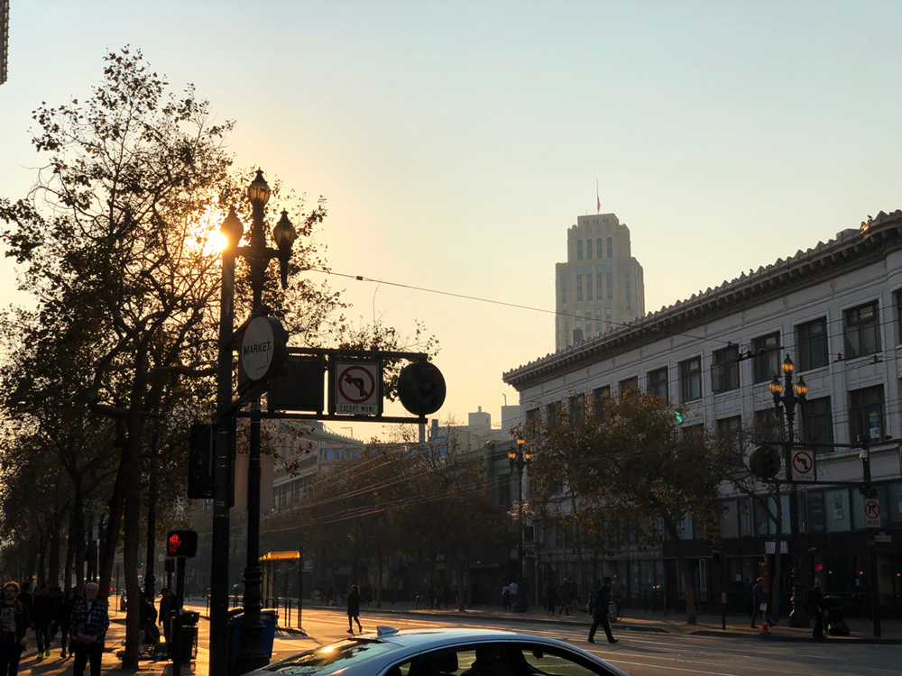

今年も 1 年を振り返ってみます。

> 去年の振り返り: [2017 年の振り返りと反省、2018 年への抱負](https://blog.wadackel.me/2017/ref/)

## 2018 年の振り返り

今年 1 年を通して沢山の初体験がありました。そして、沢山の方と繋がりができました。社会人になってからかれこれ 6 年近く経ちますが、最も刺激的な 1 年だなと感じています。

## 初めての本格的チーム開発

1 月に人生初となる転職を経て、サイバーエージェントに入社しました。入社後半年経過したあたりでも、[振り返りの記事](https://blog.wadackel.me/2018/ca-for-half-a-year/) を書いたりしてました。

初期の方では Web のメンバーが 4 人という比較的少人数の状態でしたが、9 月以降に徐々にメンバーが増えて、現時点で 10 人近い人数にまで増えてきました。いよいよ本格的なチーム開発になってきたなぁと感じています。

本格的なチーム開発が初体験であることに加えて、最近リードエンジニアとして任命されました。不慣れなところが多く、メンバーの方にフォローしてもらいながらではありますが、貴重な経験になっているなぁという自覚を持って取り組めています。

同じチームで

- パフォーマンス、アーキテクチャ方面で [@ahomu](https://twitter.com/ahomu)
- デザイン、スタイリング、犬方面で [@hiloki](https://twitter.com/hiloki)
- アクセシビリティ、富士そば方面で [@masuP9](https://twitter.com/masuP9)
- 動画方面で [@xsoundjs](https://twitter.com/xsoundjs)

などなど、多方面で個性ある方々と一緒に開発できているのも、沢山の刺激があって楽しいです。

## 初めての海外

今年はチーム開発だけじゃなく、海外を初体験しました。詳しい時期は忘れたのですが、夏前後に [Chrome Dev Summit](https://developer.chrome.com/devsummit/) (以降 CDS) に会社で行かせてもらえることが決まり、初海外ということもあり、急遽パスポートの取得から行いました。

参加に伴って共有会をしたので、その資料は後述します。余談ですが、去年の Session と比較しても今年は当たりだったかな？と個人的に思いました。

### CDS 2018 のごはんが美味しかった...

朝飯や昼飯が出るのですが、洒落っ気があるし、美味しかった...。土地柄もあってか、ベジタリアンの方への配慮もしっかりとされていて文化の違いを感じました。

### 景色がたまらなかった

これは国内旅行でも同じ感想をいだくことがあるのですが、普段と違う景色に触れ合うのは新鮮味があります。歩いていて聞こえてくる言葉が全て英語、というのも楽しい。

慣れた人にとってはどうってこと無い景色でも、僕にとっては映画や写真で見た世界が広がってるように見えました。

San Francisco でコーヒー豆を買いたくて、歩いていた途中の道。最高。

これらの写真は全て iPhone で撮ったものなのですが、治安にビビりすぎて、一眼を持っていかなかったのを凄く後悔しています...。

## アウトプット

今年も去年と同様にちょっとアウトプットの量が少なかったなぁと反省しています...。特に今年の後半 (リードエンジニア任命後) は、なかなか個人的な開発に時間を割くことができませんでした。ここらへんの両立は来年の課題だなと感じました。

### 発表資料

時間の短めな LT だけですが、去年の抱負に含まれていたので 1 つ達成できました。

- [技術面からみる パフォーマンス改善 / Frontrend Vol.13 Dec 19th, 2018](https://speakerdeck.com/tsuyoshiwada/frontrend-vol-dot-13-dec-19th-2018)
  - CDS 2018 の共有回で発表した内容です
- [Chrome の marquee 要素が優秀だった話](https://speakerdeck.com/tsuyoshiwada/chrome-false-marquee-yao-su-ga-you-xiu-datutahua)
  - ブラウザの実装を初めて覗いたやつ
- [Yarn + CI + GitHub で挑む npm パッケージの定期更新](https://speakerdeck.com/tsuyoshiwada/yarn-plus-ci-plus-github-detiao-mu-npm-patukezifalseding-qi-geng-xin)
  - 現在は Renovate を使ってます

### GitHub

- [git-chglog](https://github.com/git-chglog/git-chglog)
  - Go で実装した CHANGELOG ジェネレータ
- [rs-monkey-lang](https://github.com/wadackel/rs-monkey-lang)
  - Rust で書いたインタープリタ実装

他に細かいものでいくつか書きましたが、全体的に数がすくない...

## 2019 年への抱負とかやること

今年はとても刺激的な 1 年でした。来年も楽しい年にするために、以下のようなところに注力していきたいです。

### チームの課題解決

ここ数ヶ月チームをリードする立場でやってきましたが、自分の力不足で色々な失敗があったように思います。また、プライベートな時間との両立もできていなかったです。

失敗すること自体は仕方ないと考えているので、そこからどう改善していくかを考えて前向きな取り組みに変えていきたいなぁと考えています。(エモい)

### 発表 or 執筆

今年は LT をやってみる、という目標を達成できました。来年は少しステップアップを目指して、LT ではない発表をどこかでやるか、執筆等を経験してみたいなぁという気持ちがあります。

### storybook-chrome-screenshot

[storybook-chrome-screenshot](https://github.com/wadackel/storybook-chrome-screenshot) という、Storybook の各 Story をスクリーンショットに落とし込む Addon を書いたのですが、パフォーマンスや動作上の問題が大きくなってきました。

それらの改善について、[@Quramy さんが書いた FOLIO アドベントカレンダー 2018](https://medium.com/@Quramy/folio%E3%81%AE%E7%94%BB%E5%83%8F%E5%9B%9E%E5%B8%B0%E3%83%86%E3%82%B9%E3%83%88%E3%81%AE%E8%A3%8F%E5%81%B4-c848030991bc) でも触れられていました。実はここらへんの話は今年 Slack やご飯を食べながら話していて、[zisui](https://github.com/Quramy/zisui) との統合に向けてそろそろ動きたいなと考えています...。

### reg-suit

[reg-suit](https://github.com/reg-viz/reg-suit) は storybook-chrome-screenshot と少し関連しますが、Visual Regression Testing のツールです。GitHub 上のコメントから遷移できるレポートのページ UI をリデザインする方向で話していて、これも来年のどこかで Ship できるように動いていきたいです。

reg-suit 自体、仕事でかなりお世話になっているので、少しでも貢献をしていきたいという気持ちがあります。

### Rust / 低レイヤの世界

今年 Rust を初めて触ってみて、大分興味が強くなってきました。普段 Web に関わった仕事をしているとはいえ無関係な世界ではないため、知識として低レイヤの世界に少しでも踏み込んでいきたいなぁと考えています。

Rust の影響もあるのですが、[bokuweb.nes](https://bokuweb-nes.connpass.com/) という謎イベントの影響も大きいです。

## 犬飼いたい

最近やっとペットの可の物件に引っ越すことができたので、来年は犬を飼いたいです。もちろんダックスフンド。なんだかんだで、現時点の最注力目標です。

## まとめ

皆様良いお年を！
