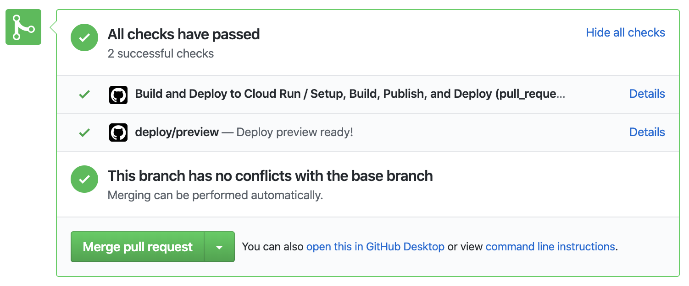

## はじめに

最近 Google Cloud Platform の [Cloud Run](https://cloud.google.com/run/) が [GA となった](https://cloud.google.com/blog/products/serverless/knative-based-cloud-run-services-are-ga)のが話題に上がりました。また `gcloud` コマンドを GitHub Actions 上で簡単に扱うための [GoogleCloudPlatform/github-actions](https://github.com/GoogleCloudPlatform/github-actions) もリリースされました。これまで使われることの多かった [actions/gcloud](https://github.com/actions/gcloud) は [deprecated となりアーカイブ](https://github.blog/changelog/2019-12-10-github-actions-aws-and-gcloud-actions-deprecated/)されています。

これらのサービス、ツールを使うことでかなり簡単に Docker コンテナを動かす環境を構築できます。そのユースケースの一つとして、実際に僕が携わっているプロジェクトでレビューコスト低減のために行っている、Pull Request (以下 PR) 単位で独立したプレビュー環境を起動する方法についてメモがてらブログにまとめようと思います。

## 前提

以下のようなアプリケーション、プロジェクトを想定します。

- Docker コンテナ単体で動作可能なアプリケーション
- 既に GCP を利用している (もしくは使いたいと考えている)
- GitHub Actions の利用できる環境
- 使用する Cloud Run は fully managed を前提にします (手軽に使いたいので)

## 要件

以下の要件を達成する内容について記載していきます。

- PR を作成するとプレビュー環境が起動する
- PR を更新 (e.g. push) するとプレビュー環境が更新される
- PR をクローズ、またはマージするとプレビュー環境が破棄される
- ドメイン管理の手間を考えたくないので、自動で振られるハッシュ付きの URL を使用

## 利用するもの

記載する内容で細かい点について触れないことがありますので、以下のドキュメントを先に眺めていただけると概ね理解できる内容かと思います。

- [Container Registry](https://cloud.google.com/container-registry/?hl=ja)
- [Cloud Run](https://cloud.google.com/run/?hl=ja)
- [GitHub Actions](https://help.github.com/ja/actions)

## 前準備

GitHub Actions のワークフローを設定する前に、今回の説明に使用する簡単なアプリケーションについてです。

### サンプルアプリケーション

以下の Go で書いた簡単な HTTP サーバを想定します。

```go:とても簡単なHTTPサーバ
package main

import (
	"fmt"
	"net/http"
	"os"
)

func main() {
	port := os.Getenv("PORT")
	if port == "" {
		port = "8080"
	}

	baseURL := os.Getenv("BASE_URL")
	if baseURL == "" {
		baseURL = fmt.Sprintf("http://localhost:%s", port)
	}

	http.HandleFunc("/", func(w http.ResponseWriter, r *http.Request) {
		fmt.Fprintf(w, "Hello World! (%s)", baseURL)
	})

	http.ListenAndServe(fmt.Sprintf(":%s", port), nil)
}
```

- `Hello World! (<URL>)` という文字列を返すだけのシンプルな HTTP Server
- `PORT`、`BASE_URL` 環境変数を受け取る
  - `PORT` は Cloud Run の実行時に渡されるため [受け取る必要がある](https://cloud.google.com/run/docs/reference/container-contract#port)
  - `BASE_URL` は任意。動作環境の URL を動的に差し込んでみたいので自前で設定する

説明用のため `Dockerfile` は以下の簡素なものとします。

```docker:Dockerfile
FROM golang:1.13-alpine

WORKDIR /go/src/app

COPY . .

RUN go get -d -v ./...
RUN go build -v ./...

CMD ["./app"]
```

### GitHub の Secrets 設定

事前に Container Registry、及び Cloud Run が操作可能な権限を持ったサービスアカウントを用意している前提で進めます。(自分で分からなそうならサーバ管理者に相談してみるのが良いかと思います)

GitHub のリポジトリ設定から Secrets を開き、サービスアカウントキーを base64 エンコードした文字列を `GCP_KEY` という名称で保存します。macOS なら以下のコマンドでクリップボードにエンコードされた文字列を保存できます。

```shell
$ cat your-service-key.json | base64 | pbcopy
```

## ワークフローの設定

前準備が完了したので、実際にワークフローを作成します。ここでは `.github/workflows/preview.yml` というファイル名で進めます。

補足は後述しますが、まずは全体像を載せてしまいます。

```yaml:.github/workflows/preview.yml
name: Build and Deploy to Cloud Run

on:
  pull_request:
    types: [synchronize, opened, reopened, closed]

env:
  PROJECT: <YOUR_PROJECT_ID>
  HOSTNAME: asia.gcr.io
  REGION: asia-northeast1
  SERVICE: preview-${{ github.event.number }}

jobs:
  setup-build-publish-deploy:
    name: Setup, Build, Publish, and Deploy
    if: github.event.action == 'opened' || github.event.action == 'reopened' || github.event.action == 'synchronize'
    runs-on: ubuntu-latest
    steps:
      - uses: actions/checkout@v2

      # Setup gcloud CLI
      - uses: GoogleCloudPlatform/github-actions/setup-gcloud@master
        with:
          version: '274.0.0'
          service_account_key: ${{ secrets.GCP_KEY }}

      # Configure gcloud
      - run: |
          gcloud config set project ${PROJECT}
          gcloud config set run/platform managed
          gcloud config set run/region ${REGION}
          gcloud auth configure-docker

      # Build the Docker image
      - name: Build
        run: |
          docker build -t ${HOSTNAME}/${PROJECT}/${SERVICE} .

      # Publish the Docker image to GCR
      - name: Publish
        run: |
          docker push ${HOSTNAME}/${PROJECT}/${SERVICE}

      # Deploy the Docker image to the Cloud Run
      - name: Deploy
        run: |
          gcloud run deploy ${SERVICE} --image ${HOSTNAME}/${PROJECT}/${SERVICE} --allow-unauthenticated
          PREVIEW_URL=$(gcloud run services describe ${SERVICE} --format 'value(status.url)')
          gcloud run services update ${SERVICE} --set-env-vars BASE_URL=${PREVIEW_URL}

      # Notify to Statuses
      - name: Notify
        run: |
          PREVIEW_URL=$(gcloud run services describe ${SERVICE} --format 'value(status.url)')
          curl -X POST \
            --url ${{ github.event.pull_request._links.statuses.href }} \
            -H "Authorization: Bearer ${{ secrets.GITHUB_TOKEN }}" \
            -H "Content-Type: application/json" \
            -d "{
              \"state\": \"success\",
              \"target_url\": \"${PREVIEW_URL}\",
              \"description\": \"Deploy preview ready!\",
              \"context\": \"deploy/preview\"
            }"

  cleanup-preview:
    name: Cleanup the Preview
    if: github.event.action == 'closed'
    runs-on: ubuntu-latest
    steps:
      # Setup gcloud CLI
      - uses: GoogleCloudPlatform/github-actions/setup-gcloud@master
        with:
          version: '274.0.0'
          service_account_key: ${{ secrets.GCP_KEY }}

      # Configure gcloud
      - run: |
          gcloud config set project ${PROJECT}
          gcloud config set run/platform managed
          gcloud config set run/region ${REGION}
          gcloud auth configure-docker

      - name: Delete the Cloud Run Service
        run: gcloud --quiet run services delete ${SERVICE}

      - name: Delete the Docker image in GCR
        run: gcloud container images delete ${HOSTNAME}/${PROJECT}/${SERVICE}
```

比較的シンプルな定義なので、説明不要な方もいるかと思いますが、それぞれ軽く補足をしていきます。

### セットアップ

`on` で `pull_request` イベントをトリガーにして、以降の処理を実施します。`pull_request` でトリガーするアクティビティタイプは以下の 4 種で十分そうです。(更新、オープン、再オープン、クローズ)

```yaml
name: Build and Deploy to Cloud Run

on:
  pull_request:
    types: [synchronize, opened, reopened, closed]

env:
  PROJECT: <YOUR_PROJECT_ID>
  HOSTNAME: asia.gcr.io
  REGION: asia-northeast1
  SERVICE: preview-${{ github.event.number }}
```

また、ここでは共通で使用する値をトップレベルの `env` で定義してしまっています。`<YOUR_PROJECT_ID>` は GCP で使用しているプロジェクトの ID を指定する必要があります。

`SERVICE` は Cloud Run のサービス名となります。例えば `#3412` という番号を持った PR の場合は `preview-3412` といった具合にユニーク (かつ Human Readable) な名称となるようにしています。

それ以外はアジアにホストすることを前提にした値を持っています。ここらへんはお好みで。

### PR の作成、更新

- Docker イメージのビルド
- Container Registry への push
- Cloud Run へのデプロイ

あたりを行う方法についてです。

```yaml
jobs:
  setup-build-publish-deploy:
    name: Setup, Build, Publish, and Deploy
    if: github.event.action == 'opened' || github.event.action == 'reopened' || github.event.action == 'synchronize'
    runs-on: ubuntu-latest
    steps:
      - uses: actions/checkout@v2

      # Setup gcloud CLI
      - uses: GoogleCloudPlatform/github-actions/setup-gcloud@master
        with:
          version: '274.0.0'
          service_account_key: ${{ secrets.GCP_KEY }}

      # Configure gcloud
      - run: |
          gcloud config set project ${PROJECT}
          gcloud config set run/platform managed
          gcloud config set run/region ${REGION}
          gcloud auth configure-docker
```

前述したアクティビティタイプの内 `synchronize`, `opened`, `reopened` をフックして、PR の作成、更新をカバーするジョブを定義しています。ジョブ単位で `if` を設定することで各種ステップ内でのチェックは不要となります。

次に `GoogleCloudPlatform/github-actions/setup-gcloud` に、前準備しておいた `GCP_KEY` を指定して `gcloud` コマンドが使える状態にします。

あとは `gcloud` コマンドを使って基本的なセットアップをしておくだけです。

セットアップが完了すれば、Docker イメージをビルド、Container Registry へ push します。

```yaml
# Build the Docker image
- name: Build
  run: |
    docker build -t ${HOSTNAME}/${PROJECT}/${SERVICE} .

# Publish the Docker image to GCR
- name: Publish
  run: |
    docker push ${HOSTNAME}/${PROJECT}/${SERVICE}
```

イメージが Registry へ上がったら、Cloud Run のサービスを作成 (更新) します。

```yaml
# Deploy the Docker image to the Cloud Run
- name: Deploy
  run: |
    gcloud run deploy ${SERVICE} --image ${HOSTNAME}/${PROJECT}/${SERVICE} --allow-unauthenticated
```

最低限必要なコマンドはこれだけです。ただ、今回 `BASE_URL` という Cloud Run が自動的に振ってくれる URL を環境変数に含めたかったので以下のようにして URL を取得、環境変数への適用を行っています。

```shell
$ PREVIEW_URL=$(gcloud run services describe ${SERVICE} --format 'value(status.url)')
$ gcloud run services update ${SERVICE} --set-env-vars BASE_URL=${PREVIEW_URL}
```

#### おまけ: PR の Statuses に URL を設定する



こんな感じで PR の画面からさくっとプレビュー環境を確認したいので、Statuses へ URL が設定された `Details` が表示されるようにしています。

`github.event.pull_request._links.statuses.href` の中に Statuses を更新するための API エンドポイントが含まれているため、これを `curl` で叩くだけで OK です。

```yaml
# Notify to Statuses
- name: Notify
  run: |
    PREVIEW_URL=$(gcloud run services describe ${SERVICE} --format 'value(status.url)')
    curl -X POST \
      --url ${{ github.event.pull_request._links.statuses.href }} \
      -H "Authorization: Bearer ${{ secrets.GITHUB_TOKEN }}" \
      -H "Content-Type: application/json" \
      -d "{
        \"state\": \"success\",
        \"target_url\": \"${PREVIEW_URL}\",
        \"description\": \"Deploy preview ready!\",
        \"context\": \"deploy/preview\"
      }"
```

### PR の merge & close

ここでは PR の作成、更新で作成したものをクリーンアップしていきます。具体的には以下の処理です。

- Cloud Run のサービス削除
- Container Registry に push したイメージの削除

削除のジョブはアクティビティタイプ `closed` の時にだけ実行するようにします。セットアップまでは前述したものと同様です。

```yaml
cleanup-preview:
  name: Cleanup the Preview
  if: github.event.action == 'closed'
  runs-on: ubuntu-latest
  steps:
    # Setup gcloud CLI
    - uses: GoogleCloudPlatform/github-actions/setup-gcloud@master
      with:
        version: '274.0.0'
        service_account_key: ${{ secrets.GCP_KEY }}

    # Configure gcloud
    - run: |
        gcloud config set project ${PROJECT}
        gcloud config set run/platform managed
        gcloud config set run/region ${REGION}
        gcloud auth configure-docker

    - name: Delete the Cloud Run Service
      run: gcloud --quiet run services delete ${SERVICE}

    - name: Delete the Docker image in GCR
      run: gcloud container images delete ${HOSTNAME}/${PROJECT}/${SERVICE}
```

削除はかなりシンプルです。作成した `SERVICE` に該当するサービスの削除と、Container Registry のイメージ削除のみです。

これでプレビュー環境のクリーンアップが完了です。

## おわりに

この記事では Go を使ったアプリケーションを稼働させていますが、仕事で実際に使っているのは Node.js で書かれたアプリケーションだったりします。各種ツールが揃っていることでとにかく気軽に試せるのでいい感じです。

Docker コンテナ単体で動作可能なアプリケーションとなっていれば、様々なホスト方法が検討できるのは利点となりえますね。
