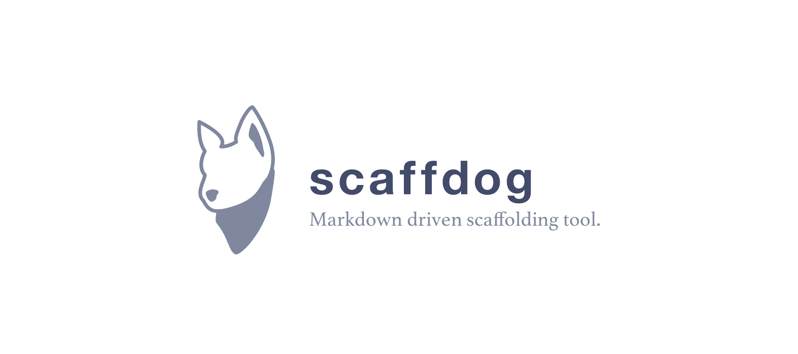
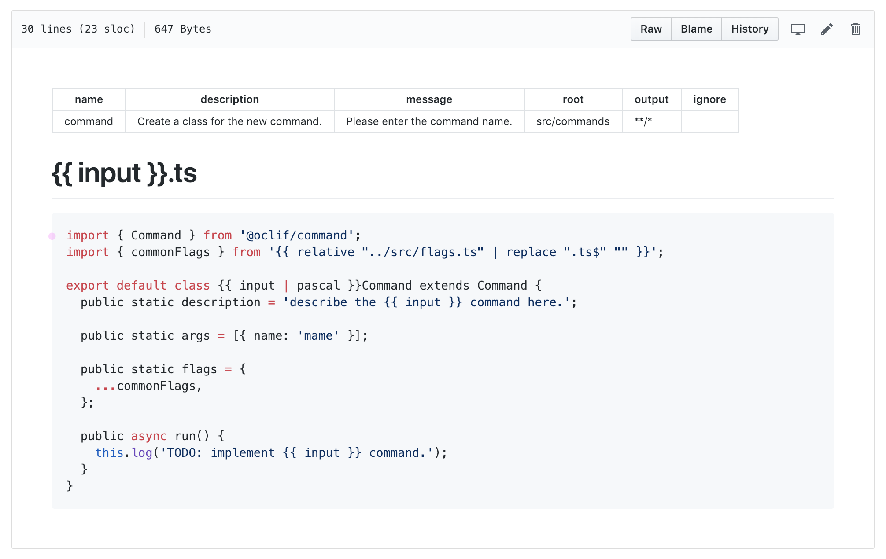
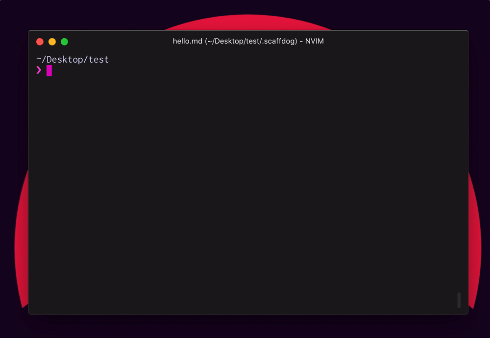

## はじめに

タイトルにある通り、[scaffdog](https://github.com/cats-oss/scaffdog) という scaffolding のためのツールを作りました。Node.js で書いています。



> scaffdog\
> https://github.com/cats-oss/scaffdog \
> _スカーフを巻いた犬がロゴ..._

Markdown で記載されたテンプレートに従ってファイルを生成するものとなっています。

具体的には次のようなテンプレートです。

````markdown:.scaffdog/component.md
---
name: 'component'
description: 'Generate standard React component.'
message: 'Please enter component name.'
root: 'src'
output: '**/*'
ignore: []
---

# `{{ input | pascal }}/index.js`

```javascript
export { {{ input | pascal }} } from './{{ input | pascal }}';
```

# `{{ input | pascal }}/{{ input | pascal }}.js`

```javascript
import React from 'react';

export const {{ input | pascal }} = ({ children }) => (
  <div>{children}</div>
);
```

# `{{ input | pascal }}/__tests__/{{ input | pascal }}.test.js`

```javascript
import React from 'react';
import TestRenderer from 'react-test-renderer';
import { {{ input | pascal }} } from '../';

describe('{{ input | pascal }}', () => {
  test('__TODO__', () => {
    const node = TestRenderer.create(<{{ input | pascal }}></{{ input | pascal }}>);

    expect(node.toJSON()).toEqual({ /* ... */ });
  });
});
```
````

例では React の Component 一式を吐き出すようなテンプレートになっています。

基本的な Syntax は [mustache.js](https://github.com/janl/mustache.js/) と似ていて、`{{` と `}}` の間が展開されます。\
テンプレートは、Heading (`<h1>`) と Code blocks を使って、1 ファイルを定義します。1 つのテンプレートで複数のファイルを生成することができるため、分類毎にテンプレートファイルを纏められるようになっています。

Heading と Code blocks 以外はテンプレートとして扱われないため、コメントやメモなどを残しておけるのも地味に便利かもしれません。Markdown (Front Matter 付きではありますが...) で書かれていることで 1 ドキュメントとしても機能させることができそうです。以下の画像は GitHub でファイルを開いた状態です。



上記ファイルを、今回作った `scaffdog` コマンドに食わせるとテンプレートがいい感じに解釈されて、展開される仕組みとなっています。

## モチベーション

個人的には仕事でも趣味でも、新規で開発を始める時、よほど小規模では無い限り Project local で簡易的な scaffold を作成することが多いです。共通で読み込むファイル、テストファイルの配置、Storybook 用の Story ファイルなど、一回作ったものをコピペでもいいですが、ミスも増えるし数が多いと面倒なので。

Project local なものだと、必要最低限のものだけを作るのでそれほど手間ではありませんが、そろそろ使い回しがしやすいものを作っておこうかなぁと思ってガッと実装した次第です。

特に要件として満たしたかったのは、以下のとおりです。

1. 1 テンプレートで複数のファイルが出力できる
1. 必要最低限のテンプレート構文を持つ
1. よく使うであろう関数を用意しておく

それぞれ、簡単にではありますが後述します。

## インストール

以下、`yarn` コマンドを使って書いていきますが、`npm` or `npx` を使ってもほとんど同様です。

---

他の package と同様に `npm` or `yarn` を使って `devDependencies` としてインストールすることを推奨します。グローバルでインストールしても使うことが出来ますが、Project local を基本として、`yarn install` でインストールするだけで使えないと不便なので前述した方法がオススメです。

```bash
$ yarn add -D scaffdog
```

`init` サブコマンドを使うことで、テンプレート用のディレクトリと初期テンプレートを生成することができます。

```bash
$ yarn scaffdog init
```

テンプレートの置き場所はデフォルトで `.scaffdog` というディレクトリになります。Markdown で書かれたテンプレートファイルはこのディレクトリへ入れておく必要があります。

## 基本的な使い方

詳しい使い方については [ドキュメント](https://github.com/cats-oss/scaffdog#table-of-contents) を参照いただけると嬉しいです。この記事では基本的な使い方と、お気に入りの機能について紹介します。

### 作ったテンプレートを元にファイルを生成する

`generate` サブコマンドで作成したテンプレートを元に scaffold することができます。

```bash
$ yarn scaffdog generate
```



上記は、`component` というテンプレートを使用しているデモです。

`scaffdog` は以下のユーザ入力を受けて、ファイルを出力します。

1. 出力先 (Front Matter で候補を指定しておく)
1. 何らかの入力

2 の入力は特に制限はありません。入力した内容がクラス名になったり、ファイル名になったりします。
基本的にはこの値を使って、バリエーションを生成するイメージです。

この値は `input` という変数として渡されます。

テンプレート自体を生成するには `template` サブコマンドを使うのが便利です。

```bash
$ yarn scaffdog template <TEMPLATE_NAME>
```

### mustache.js に似た構文

テンプレートの展開には mustache.js で使われるような構文を採用しました。

```html
foo {{ input }} baz
```

`input` の値が `bar` の場合は

```html
foo bar baz
```

として出力されます。ここらへんは馴染み深い方も多いかと思います。

---

例えば入力された値の加工をしたい場合は関数を使用することができます。

```html
{{ input | pascal }}
```

上記例では `input=foo_bar` という値の場合

```html
FooBar
```

といった具合に展開されます。

シェルのパイプのように次々に処理を適用するような仕組みをとっています。

```html
{{ input | lower | upper }}
```

最後のパイプ処理の結果が展開されます。

```html
FOO_BAR
```

### 便利なビルトイン関数群

現時点では文字列のケース変換がメインですが、9 つの関数を提供しています。\
https://github.com/cats-oss/scaffdog#functions

その他の関数だと、地味に便利だと思っているのが `relative` 関数です。\
これはテンプレートファイルからの相対パスを、出力先ファイルからの相対パスへ変換する機能を持ちます。

ファイルの出力先はネストが深くなることも有りえますが、展開するファイルの中で相対パスで module の import をしたい場合などに重宝します。

---

例えば次のような前提を置いた場合。

- テンプレートパス - `.scaffdog/component.md`
- 出力先ファイル - `src/components/atoms/Button/Button.tsx`

出力先から `src/utilities/strings.ts` を import する際に、必要となる相対パスは `../../../utilities/strings` となります。\
しかし、出力先が `src/components/atoms/internal/Hoge/Hoge.tsx` のように一段深くなった場合は、相対パスが一つずれてしまうことになります。

その時に `relative` 関数を使うと、テンプレートファイルからの相対パスで自動的に解決することができます。

```html
{{ relative "../src/utilities/strings" }}
```

上記のように `.scaffdog/component.md` からの相対パスで書くと

```html
../../../utilities/strings
```

または

```html
../../../../utilities/strings
```

のように解決されます。個人的に地味に便利だなと感じている機能です。

## さいごに

簡単ではありますが、基本機能とモチベーションについて紹介しました。

---

余談ではありますが、年末に書いた今年の抱負で書いた reg-suit のりデザイン UI を実装するにあたり、大量のコンポーネントを実装する必要があったのが発端で作成しました。こちらの作業にお正月を持っていかれたため、本題の方の進捗は皆無で終わりました。頑張ろっ...。
