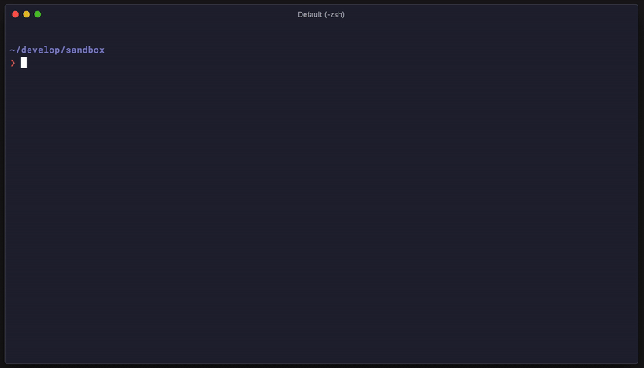
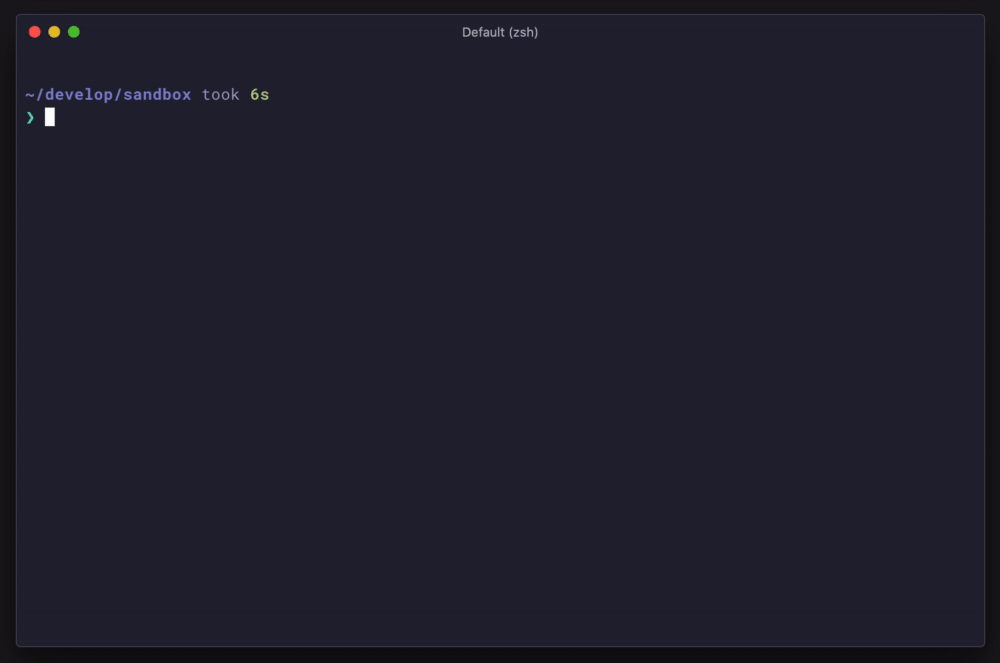

## はじめに

タイトルにもある通り、最近 Web アクセシビリティ (以下アクセシビリティ) の検証ツールを作っています。この記事では作るにあたったモチベーションや、現時点での機能、今後の展望についてまとめます。

## モチベーション

アクセシビリティを評価しようとすると [Lighthouse](https://github.com/GoogleChrome/lighthouse) にも付随する [axe](https://github.com/dequelabs/axe-core) のようなツールを用いることが多いと思います。axe は [WCAG 2.0](https://www.w3.org/TR/WCAG20/) や [WCAG 2.1](https://www.w3.org/TR/WCAG21/) に則った数多くのルールを持ち、アクセシビリティに関する問題発見を支援してくれます。Lighthouse 以外では、axe をモジュールとして使えることはもちろん、Chrome の Extension などからも実行可能で、ユースケースに合わせた柔軟な利用ができます。

ただ、検証精度はどうかというと少し物足りなさを感じる部分があります。例えば以下のような例です。

```html:axeに物足りなさを感じる例
<div role="button" tabindex="0">Save!</div>

<script>
  const button = document.querySelector('[role="button"]');

  button.addEventListener(
    'click',
    (e) => {
      // ...
    },
    false,
  );
</script>
```

`[role="button"]` で、かつ Focusable な要素に対して `click` イベントを設定しています。要素をクリックするだけなら実装者の期待通りに動作しますが、キーボードで <kbd>Space</kbd>、もしくは <kbd>Enter</kbd> を押しても反応しません[^1]。具体的には `keydown`、`keyup` などのイベントを持っていることが期待されます。これらのキーに対しても作用するべき、というのは [WAI-ARIA Authoring Practices](https://www.w3.org/TR/wai-aria-practices-1.2/#keyboard-interaction-3) でも言及されている内容ですが、axe で検証しても問題として表面化しません。

[^1]: `button` 要素など適切な要素を選択することで、そもそも起きない問題ではあります。

実務の中でその他にも細かい部分に物足りなさを感じていました。この課題に対して CyberAgent の同僚で社内のアクセシビリティエキスパートである [@masuP9](https://twitter.com/masuP9) と話し合い、「自分たちが欲しかったツールを作ろう」という流れで検証ツールの実装を始めました。

## 作っているもの


> acot-a11y/acot  
> https://github.com/acot-a11y/acot

acot (アコット) という名前のツールで、自称 Accessibility Testing Framework です。axe などと同様にルールベースでの検証を行います。

以下の画像は実際に動作させている様子です。



本ブログへ実行させてみていますが、ページに対するレポート結果は次のように出力されます。

```text:まだバギーですがレポート結果の例
 ERROR  https://blog.wadackel.me/2020/hugo-to-gatsby/ - ✔ 2 ✖ 36 ⚠ 0
✖  The target size must be at least 44 x 44 CSS pixels, but actual: 17.359375 x 38 CSS pixels.  @acot/wcag/interactive-has-enough-size
   ├─ wcag21aaa, 2.5.5 Target Size
   ├─ <a href="#%E3%81%AF%E3%81%98%E3%82%81%E3%81%AB" aria-label="はじめに permalink" class="anchor after"><span aria-hidden=…
   └─ at "#\306F\3058\3081\306B > .anchor"

✖  The target size must be at least 44 x 44 CSS pixels, but actual: 40 x 40 CSS pixels.  @acot/wcag/interactive-has-enough-size
   ├─ wcag21aaa, 2.5.5 Target Size
   ├─ <a class="f_k f_l" target="_blank" rel="noopener noreferrer" href="http://twitter.com/intent/tweet?text=Hugo%20%E3%81%8…
   └─ at ".f_l"
```

ツール自体はまだまだ開発途中というステータスで、リリースも canary を中心にバージョンを積んでおり、ドキュメントも整備が追いついていません。

ただ、核となる機能が少し落ち着いてきたので、これからの開発に対するモチベーション担保として記事に起こしてみました。

以下、acot がどんなツールであるかについて触れます。

## acot の特徴

まだこれから大きな変更が入るかもしれませんが、現時点での特徴についてです。

### ブラウザネイティブの API を活用

acot では [Puppeteer](https://github.com/puppeteer/puppeteer) を利用します。そのため Node.js 及びブラウザに依存したコードいずれも書くことができます。Puppeteer が備えているアクセシビリティ系の機能[^2]をはじめ、`getComputedAccessibleNode` を通して取得した `ComputedAccessibleNode`、DOM API そのものを活用した検証ができることを意味します。静的解析だけでは難しいようなケースも、ブラウザの機能に依存できるため DOM や AOM を使いカバーすることが可能です。

[^2]: acot では Puppeteer に最近入った [aria handler](https://github.com/puppeteer/puppeteer/releases/tag/v5.4.0) なども一部利用しています。

例えば対象要素がアクセシブルな `name` を提供しているかどうか、のような内容も `ComputedAccessibleNode` を利用すると簡単に検証できます。

前述した EventListener の例は、CDP (Chrome DevTools Protocol) を通すことで対象の要素が持つイベントの一覧を取得できるため、`click` イベントに加えて、最低限 `keyup` などのイベントを持ち合わせているかは確認することができます。

では実際どのようにルールが定義されているかを、現在 acot が持つルールの中から一つ例に挙げます。

```typescript:ルールの実装例
import type { ElementHandle } from 'puppeteer-core';
import { createRule } from '@acot/core';

type Options = {};

// <title /> に含まれている文字列の存在有無を確認する
export default createRule<Options>({
  type: 'global',
  immutable: true,
  meta: {
    tags: ['wcag2.1', 'wcag2.4.2'],
    recommended: true,
  },

  // 検証ロジック部分
  test: async (context) => {
    const title = await context.page.evaluate(() => document.title);

    context.debug('title="%s"', title);

    if (!title) {
      let node: ElementHandle | undefined;
      try {
        const el = await context.page.$('head');
        if (el != null) {
          node = el;
        }
      } catch (e) {
        context.debug(e);
      }

      // <title /> に文字列が含まれていないようならレポートする
      await context.report({
        node,
        message: 'Page MUST have a title.',
      });
    }
  },
});
```

ルールの `test` という関数に対して渡ってきた実行コンテキスト (Puppeteer の `Page` や `Browser`、レポート用の関数などが入っている) を使って、検証手段を表現します。

細かい部分については触れませんが、Puppeteer を利用してルールを組み立てていることがイメージできるかと思います。

### ESLint Like な構成

ルールベースであることは前述したとおりですが、設定ファイルやプラグインシステムなど多くの部分を ESLint に似せています。acot の設定ファイルを例示してみます。

<!-- prettier-ignore-start -->
```javascript:acot.config.js
module.exports = {
  presets: ['@acot/wcag'],
  extends: ['preset:@acot/wcag/recommended'],
  origin: 'http://localhost:8000',
  connection: {
    command: 'npm run serve',
  },
  paths: [
    '/',
    '/path',
    '/path/to',
    '/path/to/dir',
  ],
  rules: {
    '@acot/wcag/interactive-has-enough-size': 'warn',
    '@acot/wcag/page-has-valid-lang': 'off',
    '@example/foo/bar': ['error', { /* options */ }],
  },
};
```
<!-- prettier-ignore-end -->

細かい項目にこそ違いはありますが、概ね見覚えのある形式になっているかと思います。ルール毎にレポートレベルを設定でき、Preset (ESLint でいう Plugin でルールのまとまり) があり、設定を extends できる、といった大枠の仕組みを踏襲しています。その他にも Shareable Config などの仕組みも参考に取り入れています。

acot では Rule や Preset、Config などはコアから隔離され、それぞれ package として独立しています。利用者がローカルな Rule を実装することも可能です。ルールの追加実装に対する拡張性、そしてその再利用性を開いておくことでプロジェクト毎のニーズに合わせた利用が可能であると考えています。

ESLint のようにルールベースでありつつ、実情としてはブラウザ (Puppeteer) を使っているため、「ルールベースの E2E テスティングフレームワーク」という捉え方もできるかもしれません。

### axe との関係

acot は axe と対立したツールではなく、acot の中で axe を利用することが可能です。axe を利用した Preset も既に存在し、axe のタグ毎に acot のルールとしてまとめています。

> `@acot/acot-preset-axe`  
> https://github.com/acot-a11y/acot/tree/canary/packages/acot-preset-axe

## 機能の紹介

インストール方法をはじめ、現時点で持っている CLI の機能について紹介します。前述したとおり、まだ canary でのリリースが多く非常に不安定な状態が続いているため参考程度に。動作が安定し、ドキュメントも整備ができてきたくらいのタイミングで改めて詳細に紹介できればと思います。

### インストール

以下のコマンドからインストール可能です。

```bash
$ npm install --save-dev @acot/cli puppeteer
# 実際、現時点では canary インストールを推奨
$ npm install --save-dev @acot/cli@canary
```

もし acot を利用するプロジェクトで既に Puppeteer が依存に含まれている場合は `puppeteer` のインストールは不要です。acot 自体は `puppeteer` ではなく `puppeteer-core` へ依存するため、別途インストールが必要な構成となっています。

### `acot init`

インストールが完了したら、以下のコマンドで設定ファイルの構築を対話形式で行うことができます。

```bash
$ npx acot init
```

実際に動かしているデモです。



### `acot run`

設定ファイルに基づいた評価の実行は `run` サブコマンドで行うことができます。

```bash
# 以降、npx は省略
$ acot run
```

環境に応じて設定ファイルの一部項目を上書きして実行したい場合などは、`run` の flag から指定可能です。

```bash
$ acot run --origin "https://example.com"
```

### `acot preset test`

ここからは Preset 開発時に利用するコマンドで、開発支援として用意しているものとなります。

前提として Preset 自体のテストには Documentation Testing を採用しています。ドキュメントと実装の一致を強制させることに加え、Preset によってドキュメントの体裁がバラバラで認知しづらい、といった問題が起こりづらいようにするためです。

具体的には Preset に含まれている Rule と、そのルール名に対応する Markdown で記載されたドキュメントがテスト対象となる仕組みをとっています。

`page-has-title` というルールを例に説明します。

````markdown:docs/rules/page-has-title.md
# page-has-title

Web pages have titles that describe topic or purpose. WCAG 2.1 - 2.4.2.

## :white_check_mark: Correct

```html acot-head
<title>Meaningful title text</title>
```

## :warning: Incorrect

```html acot-head
<title></title>
```
````

上記ドキュメント内の、`Correct` というキーワードが含まれる見出しレベル 2 以降のコードブロック、`Incorrect` が含まれる見出しレベル 2 以降のコードブロックがそれぞれテスト対象と判断されます。

`Correct` では対象のルールを実行し、問題がなかった場合に Pass。`Incorrect` では問題が含まれている場合に Pass というテスト内容です。

`preset test` サブコマンドは、この Preset の Documentation Testing を実行するためのコマンドです。

```bash
$ acot preset test
```

### `acot preset serve`

`preset serve` は、前述したルールのドキュメントに記載された各種コードブロックを、実際に HTML として配信するローカルサーバを立ち上げるコマンドです。

### `acot preset docgen`

`preset docgen` はルールの一覧を、`README.md` などのファイルに書き出すためのコマンドです。

例えば [@acot/acot-preset-axe](https://github.com/acot-a11y/acot/tree/canary/packages/acot-preset-axe) では、対象ルールが以下のように出力されています。

```markdown:README.md
<!-- acot-rules:start -->

| Name                                                       | Summary                                                    | :heavy_check_mark: |
| :--------------------------------------------------------- | :--------------------------------------------------------- | :----------------- |
| [`@acot/axe/best-practice`](./docs/rules/best-practice.md) | Run the rules specified in the "best-practice" tag of Axe. | :heavy_check_mark: |
| [`@acot/axe/experimental`](./docs/rules/experimental.md)   | Run the rules specified in the "experimental" tag of Axe.  | :heavy_check_mark: |
| [`@acot/axe/wcag21a`](./docs/rules/wcag21a.md)             | Run the rules specified in the "wcag21a" tag of Axe.       | :heavy_check_mark: |
| [`@acot/axe/wcag21aa`](./docs/rules/wcag21aa.md)           | Run the rules specified in the "wcag21aa" tag of Axe.      | :heavy_check_mark: |
| [`@acot/axe/wcag2a`](./docs/rules/wcag2a.md)               | Run the rules specified in the "wcag2a" tag of Axe.        | :heavy_check_mark: |
| [`@acot/axe/wcag2aa`](./docs/rules/wcag2aa.md)             | Run the rules specified in the "wcag2aa" tag of Axe.       | :heavy_check_mark: |
| [`@acot/axe/wcag2aaa`](./docs/rules/wcag2aaa.md)           | Run the rules specified in the "wcag2aaa" tag of Axe.      | :heavy_check_mark: |

<!-- acot-rules:end -->
```

## 運用イメージ

実はまだ acot は実運用前で、社内のプロジェクトに適用していこうと準備を進めている段階です。実際に使ってみたら「もっとこうした方がいい」「こんな機能がほしい」といったニーズが出てくると想定しています。そのため、以下に記載する運用イメージは開発当初の構想となります。

### Pull Request 毎のアクセシビリティ評価

ビルドやユニットテスト、Lint などと同様に acot を使って Pull Request 毎にアクセシビリティ評価を行うことをイメージしています。サイト内の特定のページに対して都度評価されるように設定を行い、ソースコードの変更に対してアクセシビリティ上の問題が発生したかどうか、ないし解決したかどうかを機会的にチェックできると良いと考えています。

新規のプロジェクトであれば、最初から acot をセットアップし問題が出た時点で修正を行うのが良いでしょう。が、既存のプロジェクトで特にアクセシブルな実装を意識していない場合 (していても) 、かなり多くの問題がレポートされるはずです。その場合、全てのレポートレベルを `warn` とすることで CI は Pass させて、結果だけは確認できる状態にしておく、というのも手かと考えています。

### Storybook の活用

[Storybook](https://github.com/storybookjs/storybook) を Visual Regression Testing に活用するように[^3]、acot も Storybook をソースに実行するためのインテグレーションを用意しています。

[^3]: [reg-suit](https://github.com/reg-viz/reg-suit) などのツール

> `@acot/acot-runner-storybook`  
> https://github.com/acot-a11y/acot/tree/canary/packages/acot-runner-storybook

このインテグレーションは acot の Runner という仕組みを使って実現しています。

基本的には全ての Story に対して実行することを前提としています。ただ、コンポーネントレベルでのアクセシビリティ評価が、どの程度精度高くできるかは未知数です。例えば Atomic Design でいう Pages や Templates あたりの粒度になってくると、精度が上がってくるイメージはあります。Storybook 用の Runner にオプションとして `include`、`exclude` が存在し、対象の Story を絞り込むことができるので、大きめの粒度に該当するコンポーネントの Story にのみ実行するのが現実的かもしれません。

## 今後の展望

実際にプロジェクトへ適用し、運用していく中で出てくるであろう要望や、まだ手の付けられていない部分を含む、今後の展望について箇条書きでまとめます。

- WCAG 2.0、2.1 あたりを優先しルール整備を進める
  - 現状、まだまだほんの一部しかルール整備できていない
- HTML のレポーターが欲しい
  - 現状、標準出力への出力のみしか機能としては存在しない
  - 視覚的に問題を把握しやすいように、レポート結果を HTML で確認したい
  - 結果をどうホストさせるか検討中 (CircleCI の artifact 的な)
- パフォーマンス改善
  - 1 Rule / 1 Browser (Page) が基本構成
  - 細かい部分でチューニング[^4]しているものの、数の多い URL を対象とするとかなり実行時間が掛かる
  - 根本的な仕組みを再考するのか、チューニングもっと頑張るのか、そもそも E2E は遅いと諦めるか。検討中ステータス

[^4]: Puppeteer の `Browser` を CPU コア数の分並列実行、ページに影響を及ぼさないルール (immutable) は Puppeteer の `Page` を再利用しページアクセスを減らすなど。

## おわりに

途中で何度か記載した通り、今回の内容はまだ暫定を含むものばかりです。ただ、モチベーションに書いたような内容へ共感し、導入や開発に興味ある方がいれば是非お声がけいただけると嬉しいです。

一緒に開発している [@masuP9](https://twitter.com/masuP9) も [Web アクセシビリティ Advent Calendar 2020](https://adventar.org/calendars/5001) の 12/18 分で、別観点から acot について書いてくれるみたいなのでお楽しみに。
