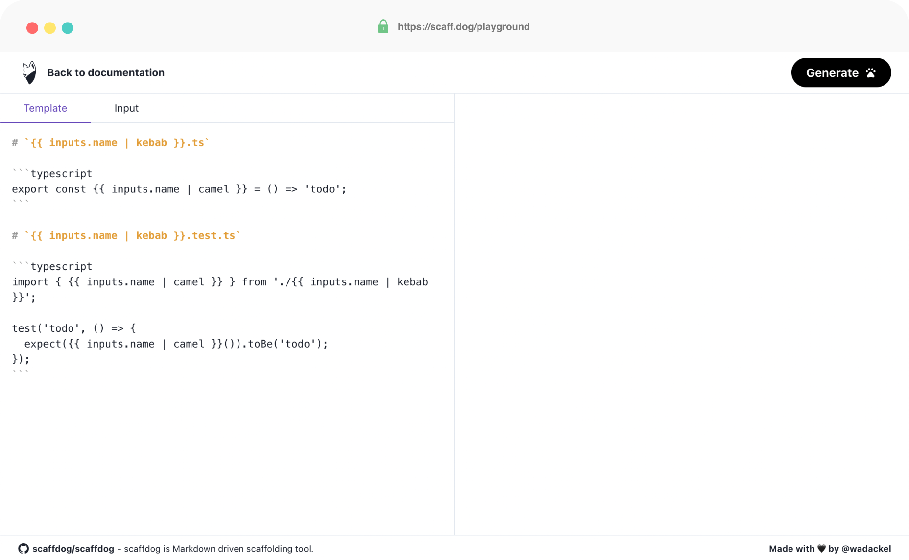
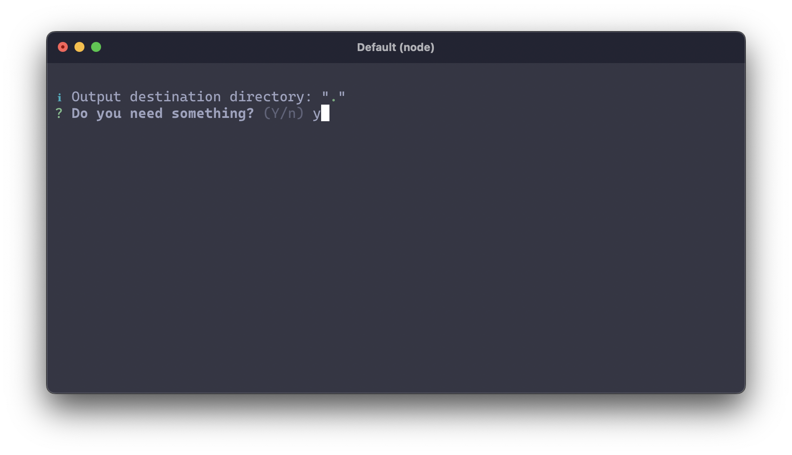
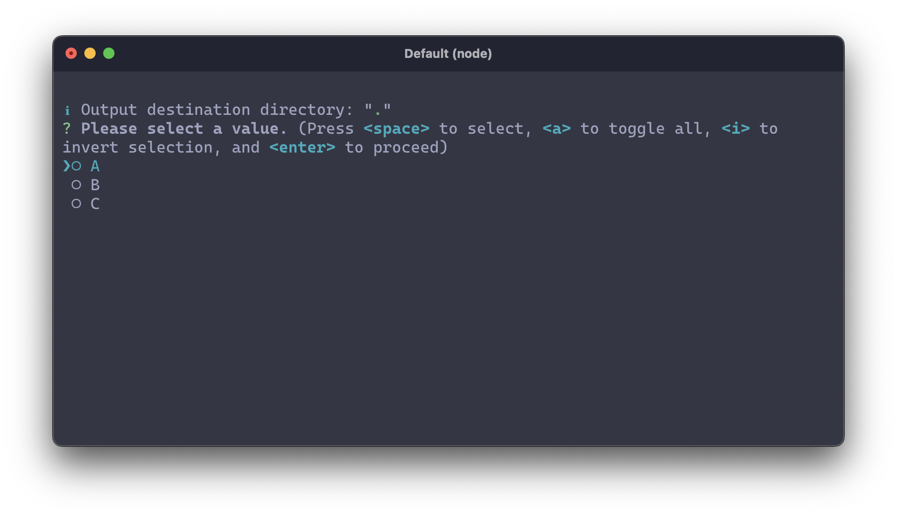

## はじめに

Markdown Driven な scaffolding ツール [scaffdog](https://github.com/scaffdog/scaffdog) の v2 をリリースしました。

以前 v1 のリリース時にブログ記事で変更点をまとめましたが、v2 でも同様にまとめてみたいと思います。なお v2 での破壊的変更は Node.js のサポートバージョンが `v14.16.0+` になったことのみで、基本的には機能追加がメインです。

> [scaffdog v1.0.0 のリリースと移行方法 - wadackel.me](https://blog.wadackel.me/2021/scaffdog-v1/)

## サマリー

厳密には `v2.0.0` ではなく、`v2.4.0` 以降の変更が含まれていますが、以下 v2 の主な変更点です。

- ドキュメントサイト
- 設定ファイルの形式追加
- 構文の拡張
- 対話型プロンプトの完全スキップ
- プロンプト種類の追加
- プロンプトに対する条件追加
- ファイル生成の条件分岐
- ヘルパー関数の追加
- その他細かい点

それぞれ詳しくは各セクションで紹介します。

## ドキュメントサイト


> scaffdog - Markdown driven scaffolding tool.  
> https://scaff.dog

v2 にかけてドキュメントの量が増える想定があったこと、Web 上で scaffdog の Playground を提供したかったためドキュメントサイトを新たに用意しました。scaffdog を利用する上で必要となるドキュメントはきちんと用意できたのではないかなと思います。

特に [Built-in Helpers](https://scaff.dog/docs/templates/helpers) のページで、scaffdog が提供するヘルパー関数を一覧にしたページでは、利用例を新たに追加したため以前よりわかりやすくなったと思います。



Playground では任意の入力を使って、テンプレートドキュメントとその出力を確認することができます。従来、実際にファイルに書いてみて各種プロンプトを埋めてから晴れて動作確認ができるという状態でした。それが Web 上でさくっと動作確認ができるので個人的に重宝している機能となっています。

ファイルシステムへ依存する一部のヘルパー関数が動作しない点に注意してください。

https://twitter.com/wadackel/status/1558612350868959233

GitHub の README はじめ、このタイミングでアートワークを見直し、少しポップな印象となるようにリニューアルを図ってみました。余談ですが、`.dog` ドメインは初めて使いましたが scaffdog にはぴったりの TLD で取得できてよかったです。

## 設定ファイルの形式追加

v1 までの設定ファイルは CommonJS を前提としたものでした。具体的には次のような設定ファイルが利用されていました。

```javascript:.scaffdog/config.js
module.exports = {
  files: ['./*'],
};
```

scaffdog を利用する環境が Native ESM である場合、この設定ファイルが機能しないケースが存在しました。そのため ESM をはじめいくつかの方式で定義できるように改修を加えました。

最新バージョンでは `.scaffdog` 配下のファイルから、以下の順に設定ファイルを検索します。

1. `config.js`
2. `config.cjs`
3. `config.mjs`
4. `config.ts`

4 にある `.ts` が特殊で TypeScript で記述されたファイルのサポートも追加しています。`$ scaffdog init` で生成されるファイルも ESM へと変更されています。

```javascript:.scaffdog/config.js
export default {
  files: ["*"],
};
```

scaffdog 自体はまだ内部的に CommonJS として動作させているため、[jiti](https://github.com/unjs/jiti) を利用してトランスパイルを挟むことで ESM / CommonJS / TypeScript のサポートを行っています。

## 構文の拡張

他の scaffolding 系のツールと比較した場合 scaffdog はテンプレートエンジンの表現力が貧弱です。[hygen](https://github.com/jondot/hygen) であれば EJS、[plop](https://github.com/plopjs/plop) であれば Handlebars を利用でき、無理の効く場面が多いはずです。

scaffdog は僕自身の趣味嗜好[^1]から独自のテンプレートエンジンを採用しているのですが、他のツールでできることの最低限はカバーしようと思い、v2 のタイミングでエンジンを刷新しました。これまでは字句解析器として [Esprima](https://esprima.org) を利用していたのですが、v2 では依存からいなくなりました。

[^1]: 趣味としてパーサー実装の知識を深めたい節が強く、v2 ではパーサーコンビネータを自作してみています :)。将来的に Go / Rust などのシングルバイナリが配布しやすい言語に移植する際に、テンプレートエンジンの仕様を JavaScript に依存したくないという理由もある

それぞれ代表的な構文について紹介します。詳細なテンプレートエンジンの構文仕様については [こちら](https://github.com/scaffdog/scaffdog/tree/canary/packages/%40scaffdog/engine#language-specification) にまとめています。

### 式の導入

これまでまともな式の概念がありませんでした。v2 では ECMAScript に似た式を利用可能です。

```clike
{{ 2 + 3 }}
--> 5

{{ "f" + "oo" }}
--> foo
```

一般的な四則演算をはじめ、グルーピング演算子、三項演算子のサポートもあります。

```clike
{{ (2 + 3) * 2 }}
--> 10

{{ 2 > 3 ? "foo" : "bar" }}
--> bar
```

パイプ上の引数に渡す場合は、構文上の曖昧さ回避のためグルーピングが必須です。

```clike
{{ /* `replace "<number>" 2 + 3` とは書けない */ }}
{{ "OUT: <number>" | replace "<number>" (2 + 3) }}
--> OUT: 5
```

### ローカル変数定義

これまでテンプレート内で変数を定義する場合は、`define` ヘルパー関数を使う必要がありました。v2 からは構文上のサポートが追加されています。代入演算子として `:=` を用いて、左辺には変数名となる識別子、右辺には式を書くことで変数が宣言できます。

```clike
{{ name := "scaffdog" }}
{{ name | upper }}
--> SCAFFDOG
```

以前から存在する、タグデリミタに `-` を付与する空白の除去と組み合わせて、テンプレート上部に変数をまとめて定義するのが全体の見通しをよくすると思います。

```clike
{{- name := inputs.name | pascal -}}
{{- id := inputs.name | kebab -}}

export const {{ name }} = () => '{{ id }}';
```

空白が除去されると、前半の変数宣言文に存在する改行が消え、きれいな出力となります。

```javascript:出力例
export const FooBar = () => 'foo-bar';
```

### if 文

入力内容によって出力を分けたいケースに対応するべく if 文が導入されました。`if` ではじめた文は、`end` 文で閉じる必要があります。

構文は次のとおりで、else 文のサポートも存在します。else-if を使ったネストも可能です。

```clike
{{ if <expression> }}body{{ end }}
{{ if <expression> }}body{{ else }}body{{ end }}
{{ if <expression> }}body{{ else if <expression> }}body{{ end }}
{{ if <expression> }}body{{ else if <expression> }}body{{ else }}body{{ end }}
```

利用例は次のとおりです。

```clike
{{ if 2 > 3 }}foo{{ end }}
-->

{{ if 2 > 3 }}foo{{ else }}bar{{ end }}
--> bar

{{ if 2 > 3 }}foo{{ else if 2 > 2 }}bar{{ else }}baz{{ end }}
--> baz
```

### for 文

利用頻度はそれほど高くないかもしれませんが、繰り返しのサポートも v2 で追加されました。構文は次のとおりです。

```clike
{{ for <identifier> in <expression> }}body{{ end }}
{{ for <identifier>, <identifier> in <expression> }}body{{ end }}
```

各イテレーションで値とインデックスを利用可能です。

以下 [seq](https://scaff.dog/docs/templates/helpers#seq) ヘルパー関数を使って、配列を生成し繰り返しをしている例です。

```clike
{{ for v in seq 1 5 }}{{ v }}{{ end }}
--> 12345

{{ for v, i in seq 1 5 }}{{ v + i }}{{ end }}
--> 13579

{{ for v in seq 1 5 }}{{ if v == 2 }}{{ continue }}{{ end }}{{ v }}{{ end }}
--> 1345

{{ for v in seq 1 5 }}{{ if v == 2 }}{{ break }}{{ end }}{{ v }}{{ end }}
--> 1
```

## 対話型プロンプトの完全スキップ

scaffdog は対話型プロンプトをベースとして、テンプレートドキュメントをはじめ、出力内容の決定を行います。具体的には次の 4 通りが存在します。

- テンプレートドキュメント名
- 出力先ディレクトリ
- `questions` に対する回答
- 既存ファイルの上書き

これまで、上記のプロンプトは利用者が任意の入力とともにスキップできるものではありませんでした。しかし、作業の自動化を行う上でインタラクションなしで出力を行いたいケースも存在します。

対話型のプロンプトをスキップするために、以下のフラグを追加しました。

- `--answer`
- `--output`

以下のテンプレートドキュメントを例に CLI のフラグを組み立てる例を示します。

```markdown:.scaffdog/component.md
---
name: "component"
root: "src/components"
output: "**/*"
questions:
  name: "msg"
  test:
    confirm: "msg"
  type:
    message: "msg"
    choices: ["A", "B", "C"]
    multiple: true
---

<!-- template definition -->
```

テンプレート部分は省略していますが、以下のように実行することで前述した 4 通りの対話型プロンプトを完全にスキップ可能です。

```bash:CLIの実行例
$ scaffdog generate component \
    --force \
    --output "buttons" \
    --answer "name:OutlinedButton" \
    --answer "test:true" \
    --answer "type:A" \
    --answer "type:C"

# output --> src/components/buttons/OutlinedButton
```

`--output` フラグは、テンプレートドキュメントに指定している `root` からの相対パスになる点に注意してください。

## プロンプト種類の追加

テンプレートエンジンに対する if と for 文の追加によって、テンプレートに与えたい値の種類が増えました。v2 では Boolean 及び Array に該当する値を与えるためのプロンプトが追加されました。

### Boolean

`confirm` フィールドに質問時に表示したいメッセージを与えることで `true` または `false` を `inputs` から取得可能です。

```yaml
questions:
  # basic
  bool1:
    confirm: 'Do you need something?'

  # with default value
  bool2:
    confirm: 'Do you need something?'
    initial: false
```

上記の定義以下のようなプロンプトが表示されます。



### Array

主に for 文で利用を想定し、配列の入力が行えるようになりました。`multiple` と `choices` を組み合わせることで `inputs` に文字列の配列が入ります。

```yaml
questions:
  # basic
  value1:
    message: 'Please select a value.'
    multiple: true
    choices:
      - 'A'
      - 'B'
      - 'C'

  # with default value
  value2:
    message: 'Please select a value.'
    multiple: true
    choices:
      - 'A'
      - 'B'
      - 'C'
    initial: ['B']
```

上記の定義以下のようなプロンプトが表示されます。



## プロンプトに対する条件追加

事前の入力によって、プロンプトを実行するか否かを決定する機構として `if` フィールドが追加されました。使用感としては GitHub Actions の workflow 定義に利用できる `if` と近いものを意識しています。

```yaml
questions:
  name:
    message: 'Please enter a component name.'
  test:
    if: contains(inputs.name, 'Form')
    confirm: 'Do you need a test?'
```

`if` フィールドの値には `{{` と `}}` のタグデリミタを省略した式を記述することができます。上記の例では `inputs.name` に `Form` という文字列を含む入力があった場合にのみ `Do you need a test?` というプロンプトが表示されます。

## ファイル生成の条件分岐

Boolean のプロンプトなど、入力内容によってファイル生成をスキップしたいケースをサポートしました。

`<h1>` に記述するファイル名の先頭に `!` トークンをつけることで生成をスキップします。次の例では、`inputs.test` が `true` の場合にのみファイルを生成し、`false` の場合はファイル生成をスキップします。

````markdown
---
name: 'component'
root: '.'
output: '.'
questions:
  test:
    confirm: 'Do you need a test?'
    initial: true
---

# `{{ inputs.test || "!" }}index.test.ts`

```typescript
// ...
```
````

インタラクションを含む UI コンポーネントにのみユニットテストを追加したい、といったケースを想定したものとなっています。

## ヘルパー関数の追加

テンプレートエンジンの機能追加に合わせ、ヘルパー関数が追加されました。利用例とシグネチャに関しては [ドキュメント](https://scaff.dog/docs/templates/helpers) を確認してください。

| ヘルパー                                                      | 概要                                               |
| :------------------------------------------------------------ | :------------------------------------------------- |
| [plur](https://scaff.dog/docs/templates/helpers#plur)         | 単数形、複数形を変形する                           |
| [seq](https://scaff.dog/docs/templates/helpers#seq)           | 配列を生成する。`seq` コマンドと似たシグネチャ     |
| [append](https://scaff.dog/docs/templates/helpers#append)     | 配列に値を追加する                                 |
| [uniq](https://scaff.dog/docs/templates/helpers#uniq)         | 配列から重複を削除する                             |
| [split](https://scaff.dog/docs/templates/helpers#split)       | 文字列を特定のキーワードで分割し配列を生成する     |
| [len](https://scaff.dog/docs/templates/helpers#len)           | 文字列、配列などの長さを返す                       |
| [slice](https://scaff.dog/docs/templates/helpers#slice)       | 文字列または配列の一部を切り取る                   |
| [contains](https://scaff.dog/docs/templates/helpers#contains) | 文字列または配列から値を検索し、結果を真偽値で返す |
| [s2n](https://scaff.dog/docs/templates/helpers#s2n)           | 文字列を数値に変換する                             |
| [n2s](https://scaff.dog/docs/templates/helpers#n2s)           | 数値を文字列に変換する                             |

## その他細かい点

それほど多くありませんが、以下細かいところで変更が含まれます。

- `$ scaffdog generate` 実行後、テンプレートドキュメントにシンタックスエラーがあった場合早期にエラーを出力するように
  - これまですべてのプロンプトを入力し終わって初めてレポートされていた
  - シンタックス上のエラーがあるなら、中身がどうあれ早く知りたい
- GitHub Organization を [cats-oss](https://github.com/cats-oss/) から [scaffdog](https://github.com/scaffdog) へ移行
  - artwork はじめ、いくつか本体の repository に含めたくないものが増えた（増えそう）ため

## おわりに

テンプレートエンジンの後方互換性を維持しながら、表現力の向上を行うことができて個人的に満足いくアップデートとなりました。CLI の改善としても、普段利用している中でユーザとして「これできるようになりたいなぁ」というものがかなり盛り込めたと思います。

実際に使ってみて不具合、機能要望等あれば [Issues](https://github.com/scaffdog/scaffdog/issues) や [Twitter](https://twitter.com/wadackel) に報告いただけると嬉しいです。
