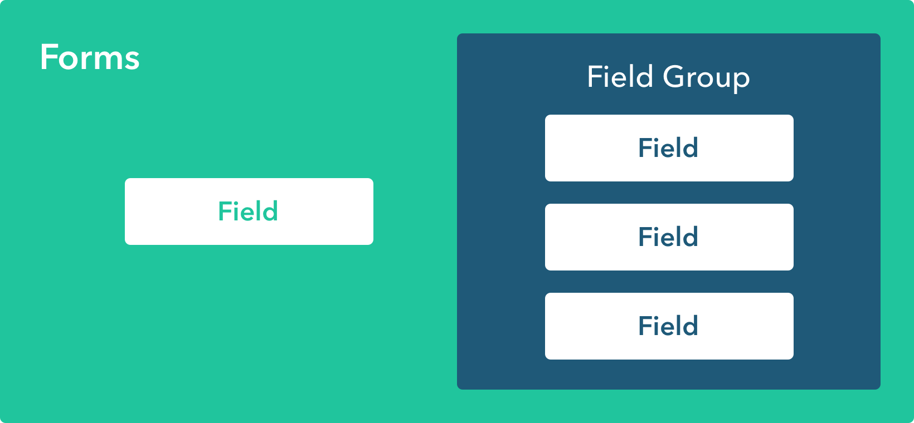
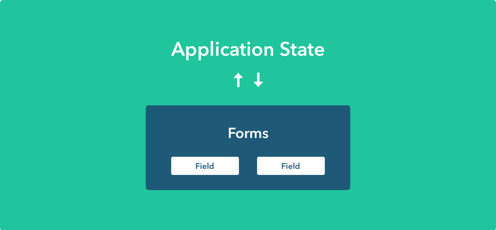

[create-react-app]: https://github.com/facebookincubator/create-react-app
[redux-form]: https://github.com/erikras/redux-form

2017 年。React のフォームに消耗しました。

いくつか良さそうなフォームライブラリはありますが、個人的に満足のいくものが無かったので、とあるプロジェクトで実装したものをベースにしてライブラリにまとめました。

## 作ったもの


**react-drip-form** という、HoC ベースで React のフォームコンポーネントを構築するライブラリを作りました。元となるコードを書いている時、「**さくっとフォームの実装を済ませてゆっくりコーヒーでも飲みてぇ...**」という気持ちがかなり高まってたので、コーヒーを連想させる名前にしてみました。

> wadackel/react-drip-form  
> https://github.com/wadackel/react-drip-form

ドキュメントのページでは、[Create React App][create-react-app] を使った [Quick Start](https://wadackel.github.io/react-drip-form/docs/) もあるので、さくっと試すことが出来ると思います。

## 特徴

- HoC ベースの API
- 設計に対する制約をできるだけ小さく
- ルールベースのバリデーション
  - 同期も非同期も可
  - カスタマイズも可
- 値の正規化 (normalize) も対応
- ネスト + 動的なフィールドの対応
- エラーメッセージの i18n
  - とりあえず英語 + 日本語は対応済み

## 使い方

### インストール

npm を使ってインストールできます。

```bash
$ npm install --save react-drip-form
```

### 基本的なフォームの構築

ドキュメントページからの引用ですが、シンプルなログインフォームの例です。

```javascript:App.js
import React, { Component } from 'react';
import Form from './Form';

export default class App extends Component {
  handleSubmit = (values) => {
    console.log(values);
  };

  render() {
    return (
      <div>
        <h1>Login</h1>
        <Form onValidSubmit={this.handleSubmit} />
      </div>
    );
  }
}
```

```javascript:Form.js
import React from 'react';
import { dripForm } from 'react-drip-form';
import Input from './Input';

const Form = ({ handlers, meta: { invalid, pristine } }) => (
  <form onSubmit={handlers.onSubmit}>
    <div>
      <label htmlFor="email">Email-Address</label>
      <Input
        id="email"
        type="email"
        name="email"
        label="Email-Address"
        placeholder="Enter your Email-Address"
      />
    </div>

    <div>
      <label htmlFor="password">Password</label>
      <Input
        id="password"
        type="password"
        name="password"
        label="Password"
        placeholder="Enter your Password"
      />
    </div>

    <button
      type="submit"
      disabled={invalid || pristine}
      onClick={handlers.onSubmit}
    >
      Submit
    </button>
  </form>
);

export default dripForm({
  validations: {
    email: {
      required: true,
      email: true,
    },
    password: {
      required: true,
    },
  },
})(Form);
```

`<Input label="**" />` はエラーを表示する際のフィールド名にあたります。

```javascript:Input.js
import React from 'react';
import { dripFormField } from 'react-drip-form';

const Input = ({ input, meta: { error, dirty, touched }, ...rest }) => (
  <div>
    <input {...rest} {...input} />
    {error && dirty && touched && <span style={{ color: 'red' }}>{error}</span>}
  </div>
);

export default dripFormField()(Input);
```

実際の動作は [ドキュメントページ](https://wadackel.github.io/react-drip-form/) で確認できます。

### ネストしたフィールド

オブジェクトの様にフィールドがネストする場合は **ドット記法** を使用します。  
配列に対するバリデーションの指定は **ドット記法** と **\* (ワイルドカード)** を組み合わせて行います。

現実的にはもう少し複雑なものになると思いますが、次に簡易的な例をあげます。

```javascript:Form.js
const Form = ({ handlers, meta: { invalid, pristine } }) => (
  <form onSubmit={handlers.onSubmit}>
    <Input type="text" name="name.first" label="First name" />

    <Input type="text" name="name.last" label="Last name" />

    <Input type="text" name="members.0" label="Member Name" />

    <Input type="text" name="members.1" label="Member Name" />

    <button
      type="submit"
      disabled={invalid || pristine}
      onClick={handlers.onSubmit}
    >
      Submit
    </button>
  </form>
);

export default dripForm({
  validations: {
    // ドット記法でプロパティを指定します
    'name.first': {
      required: true,
    },
    'name.last': {
      required: true,
    },

    // 配列に対しては * (ワイルドカード) を使用してキーを指定します
    'members.*': {
      required: true,
      max: 30,
    },
  },
})(Form);
```

上記の例では、次の様な値を返します。

```javascript:結果となる値
{
  name: {
    first: '名前',
    last: '名字',
  },
  members: [
    '入力値1',
    '入力値2',
  ],
}
```

### 送信後のエラーハンドリング

API のエラーレスポンスをエラーとしてフォームの UI に反映したいケースがあると思います。

このような場合、フォームのインスタンスメソッドを使用して、フォーム外部からエラーを注入することができます。また、送信中にスピナーを出したり、フィールドを無効化する場合には、通常の React コンポーネントと同様に Props にフラグを渡すことで表現できます。

先程のログインフォームをハンドリングする例です。

```javascript:App.js
import React, { Component } from 'react';
import Form from './Form';

export default class App extends Component {
  state = {
    submitting: false,
  };

  // `form` インスタンスを保持しておく
  handleInitialize = (form) => {
    this.form = form;
  };

  handleSubmit = (values) => {
    this.setState({ submitting: true });

    // 実際にはAPIをコールする。ここでは説明の為に全部エラーに
    setTimeout(() => {
      this.form.setErrors({
        email: 'Failed to login...',
      });

      this.setState({ submitting: true });
    }, 1000);
  };

  render() {
    const { submitting } = this.state;

    return (
      <div>
        <h1>Login</h1>
        <Form
          submitting={submitting}
          onInitialize={this.handleInitialize}
          onValidSubmit={this.handleSubmit}
        />
      </div>
    );
  }
}
```

上記の例の場合、`submitting` Props で送信中の判定を行なう想定になります。

---

他にもエラーメッセージのカスタマイズや、非同期検証の実装例、Redux との統合などの[サンプル](https://wadackel.github.io/react-drip-form/examples/basic-form/)がありますので、興味があれば確認してみてください。

以降、背景や設計について紹介していきます。

## 背景

満足にバリデーションができてコードの見通しがよく、新規・既存問わずプロジェクトに導入がしやすいものって意外と見つかりませんでした。(最近知ったものだと [formik](https://github.com/jaredpalmer/formik) は良さそう...)

[redux-form][redux-form] を例に挙げると、アプリケーションのステートとして組み込む事を前提としたり、バリデーション周りが辛かったり、そもそも redux が不必要な規模なのに redux の導入を強制されたり。  
他のライブラリだとコンポーネント設計に制約が強かったり、機能的に不十分だったり。

### きっかけ

そんな中、**react-drip-form** を作り始める一番のきっかけとなったのは、以下の様なケースに遭遇したときでした。

- サイト全体は SPA ではない
- ユーザ管理画面のみ SPA
- SPA では無いものの、部分的に React を導入
- 同一サイトではあるが、共通の CSS は無い (コンポーネントは別扱い)

ユーザ管理画面では Redux を使ってたので、 [redux-form][redux-form] でも良かったのですが、その他局所的に導入されている部分に関しては redux は未使用です。

フォームのためだけに redux 入れるのは大袈裟な気がするし、かといってここだけ別の方法でフォームのステート管理を行うのは統一感が無いし、学習コスト的にも痛いところです。

### 打開策

この状況を受けて、今後同じ思いをしたくないと考え、以下の様な指針でフォーム周りの実装を行い回避しました。

- 基本フォームのステートはフォームコンポーネントが保持
- ただし、アプリケーションステート (Redux やその他 Flux 系の実装) には必要に応じて流せるようにインターフェースを整えておく
- 様々なプロジェクトに導入したいので、デザイン的な制約は極力排除したい

記事冒頭でも書きましたが、ここで実装した内容を整えてライブラリとして使えるようにまとめたものになります。

## 設計

背景を踏まえた上で、設計に関する部分について書いていきます。

基本的な API は割と [redux-form][redux-form] に寄せています。これは恐らく React + Forms (Redux) において、最も使われているであろうという点からです。後発のライブラリになるので、学習コストは極力下げておきたいところです。

### 基本構成



以下の 3 つのコンポーネントが登場しました。

| -          | 概要                                                                                                      |
| :--------- | :-------------------------------------------------------------------------------------------------------- |
| Forms      | `<form />` に該当します。                                                                                 |
| Field      | `<input />`、`<select />` 等のコントロールコンポーネントに該当します。                                    |
| FieldGroup | Checkbox や Radio などの複数 `Field` をまとめ上げる役割。主にエラーメッセージのハンドリングに使用します。 |

**react-drip-form** では、これらのコンポーネントを組み合わせてフォームを構築することになります。

### 振る舞いと見た目の分離

**react-drip-form** の役割は、HoC でラップするコンポーネントに対して、フォームに関する値を Props として与えることと各種変更をハンドリングすることに徹し、**振る舞い** を提供することです。実際に描画されるコンポーネントは提供しません。

例えば、以下はエラー表示付きのテキストフィールドコンポーネントの実装例です。

```javascript:Input.js
import React from 'react';
import { dripFormField } from 'react-drip-form';

const Input = ({ input, meta, ...rest }) => (
  <div>
    <input {...rest} {...input} />
    {meta.error && meta.dirty && meta.pritine && (
      <div style={{ color: 'red' }}>{meta.error}</div>
    )}
  </div>
);

export default dripFormField()(Input);
```

`dripFormField` は、ラップしたフィールドコンポーネントに `input` 及び `meta` を提供します。それぞれの役割は以下のとおりです。

| キー    | 概要                                                                                   |
| :------ | :------------------------------------------------------------------------------------- |
| `input` | `onChange` や `value` 等の実際のコントロールコンポーネントに対して指定する必要がある値 |
| `meta`  | `error` や `dirty`、`validating` 等の UI を描画する上で補助的な役割を持つ状態          |

`dripFormField` が制約を要求するのは、「**`input` のプロパティをコントロールコンポーネントに指定する**」という点のみです。これさえクリアすれば自動的に値が連動します。

フィールドコンポーネントに自由度を持たせることで、UI フレームワークやプロジェクトのデザインシステムと統合しやすくなります。ただ、自由度を高めた一方で、各フィールドのコンポーネントは全て自前で実装する必要があるため、ある程度必要なコードが多くなります。

これは個人的な好みではありますが、変に処理がブラックボックス化されるよりも、多少冗長であっても透過的な API の方が好きなので **短く書く** よりも **分かりやすく書ける** を優先しました。

しかし、「**プロトタイプの段階だからまずは動作するものを**」といったケースにさくっと使えるように、別パッケージとして [styled-components](https://github.com/styled-components/styled-components) でスタイルを持たせたコンポーネントセットを提供しています。

> wadackel/react-drip-form-components  
> https://github.com/wadackel/react-drip-form-components

他にもこの記事を公開した段階で [Material-UI](https://github.com/callemall/material-ui) と [React-Bootstrap](https://github.com/react-bootstrap/react-bootstrap) 用のコンポーネントセットも公開しています。

### フォームの状態をフォームが持つ



一般的な React のフォーム、というよりはライブラリが提供する機能部分での話になります。  
**react-drip-form** はアプリケーションのステートには一切関知せず、フォームの中で状態が閉じています。それには以下のメリットがあると考えています。

1. アプリケーションステートの管理は使用者に委ねたい (設計の自由度)
   - 必要に応じて **流し込める口** を提供する
   - フォームコンポーネントの `onChange`、 `onValidSubmit` 等
   - 規模を選ばずに使用可能
2. 段階的な導入が容易
   - 全体への影響が小さい為、部分的な導入から始めやすい
   - 新規プロジェクトにとってはあまり重要ではないかもしれませんが、既存プロジェクトにはありがたい

### Validator のパッケージを分割

内部的に使用する Validator は[別パッケージ](https://github.com/wadackel/drip-form-validator)として切り出しています。  
これはお気持ち程度の内容になってしまいますが、**React (View ライブラリ) とロジックの依存性を最小限に**したかったためです。

あまり現実的に無いケースだとは思いますが、React の外からも扱えるようになっていれば、サーバサイドで同じバリデーションロジックを使いまわしたり出来るかなと思います。

## TODO と今後の展望

ここまで書いてきましたが、リファクタリングが必要な箇所や、未完了のタスクがまだ結構あったりします。

- ファイルの扱い周りがまだ
- Flow 及び TypeScript のサポート
- React Native をサポートしたい

まずは、ファイル + Flow サポートは最優先で取り掛かる予定です。  
React Native は自分自身が使ったことが無いため、今後の予定にとどまっています...。

## おわりに

実は元となる実装は年末からあったのですが、途中ほとんど作業が出来ない時期があったりして、ずるずる半年くらい掛かっちゃいましたがなんとかリリースまでは持ってこれました。

これから少しずつ TODO の消化と安定した動作への調整をしていきたいと思います。

お気づきの点などあれば [Issues](https://github.com/wadackel/react-drip-form/issues) や [Twitter](https://twitter.com/wadackel) で教えてくださるとうれしいです。

> wadackel/react-drip-form  
> https://github.com/wadackel/react-drip-form
