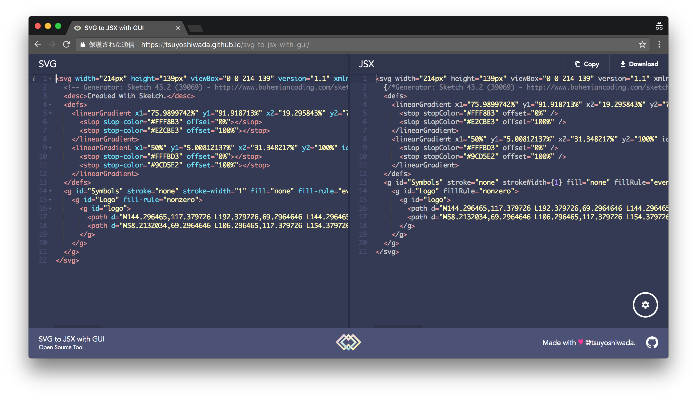

以前に [CLI で SVG を React Components へ変換する方法](https://blog.wadackel.me/2016/react-svg-converter/) を記事に書きました。数が多いものなら一気に変換したいのですが、ちょっとしたデモサイトのロゴや、少量のアイコン追加など、CLI で変換する為の環境準備をするより気軽に使いたい場合は、ブラウザ上でさくっと変換出来た方が使い勝手が良さそうです。

という訳で、ちょっと前に作った [React の Form ライブラリ](https://blog.wadackel.me/2017/react-drip-form/) のお試しを兼ねて、良い意味で雑に使える変換ツールを作ってみました。

## 作ったもの

https://wadackel.github.io/svg-to-jsx-with-gui/

よくある 2 ペインエディター風味です。  
コードは以下のリポジトリに。

https://github.com/wadackel/svg-to-jsx-with-gui

## 出来ること

- 左側のエディターに入力した SVG 文字列を JSX に変換し、右側のエディターに表示
- JSX をクリップボードへコピー
- JSX のダウンロード
- [SVGO](https://github.com/svg/svgo) を使った最適化
  - 最適化の内容は設定画面から変更可能
- SVG ファイルのドラッグ & ドロップ可能
- エディターの設定を微妙に変更可能 (やりたかっただけ)

[Prettier](https://github.com/prettier/prettier) を使ったコードフォーマットも実装したかったのですが、ブラウザ上で動作させるのが辛かったので未実装です。

## 出来ないこと

名前空間付きの属性やタグは、JSX にした時にパースされないので変換時に削除しています。  
その為一部 SVG はうまく変換されないかも?

## SVG から JSX への変換処理

HTML から JSX への変換処理には [htmltojsx](https://github.com/reactjs/react-magic/blob/master/README-htmltojsx.md) が結構使われているようです。ただ、このライブラリは SVG の変換に不完全な箇所が幾つかあります。

- `stroke-width` 等の属性がキャメルケースに変換されない
- `linearGradient` 等のキャメルケースのタグ名が全て小文字になってしまう

上記に対応すべく、2 つの PR を投げてはいるのですが動きがゆったりとしているため、暫定的な対処としてパッチを適用したものを [Scoped Package](https://github.com/wadackel/htmltojsx) として公開して使用しています。

https://github.com/reactjs/react-magic/pull/136

https://github.com/reactjs/react-magic/pull/138

## その他、技術的ないろいろ

- React で実装
  - 小さいアプリなので Flux 系の実装は無し
- エディターには [react-ace](https://github.com/securingsincity/react-ace) を使用
  - 見た目が良いし、一度使ったことがあったので
- Web アプリのスタイリングは [styled-components](https://github.com/styled-components/styled-components)
  - 使い方に慣れておきたくて
  - この位の規模のものなら、かなり雑に書けちゃうので気軽
  - CSS そのまま書けるのはやっぱりいい
- [stylelint](https://github.com/stylelint/stylelint) を使った Linting
  - [stylelint-processor-styled-components](https://github.com/styled-components/stylelint-processor-styled-components) を合わせて使用
  - **styled-components** で定義したスタイルにも Lint 出来て最高
  - JS は普通に **eslint** で Linting
- [Jest](https://github.com/facebook/jest) + [enzyme](https://github.com/airbnb/enzyme) を使ったテスト
  - 最近結構使ってる
  - Snapshot テストが楽
  - **styled-components** の為に [jest-styled-components](https://github.com/styled-components/jest-styled-components) を使用
  - これまた便利
- [reg-cli](https://github.com/reg-viz/reg-cli), [reg-suit](https://github.com/reg-viz/reg-suit) を使った Visual Testing を試してみたい

## おわりに

この位の小さいツールを作るのはいい気分転換になっていい感じです。ただ、毎回この手のものを作る時、実装よりもデザイン的な面に迷うことが多く、必要以上に時間がかかってしまっているなという感じがしています。ここらへん皆さんどうしているか気になるこの頃です。

https://wadackel.github.io/svg-to-jsx-with-gui/
