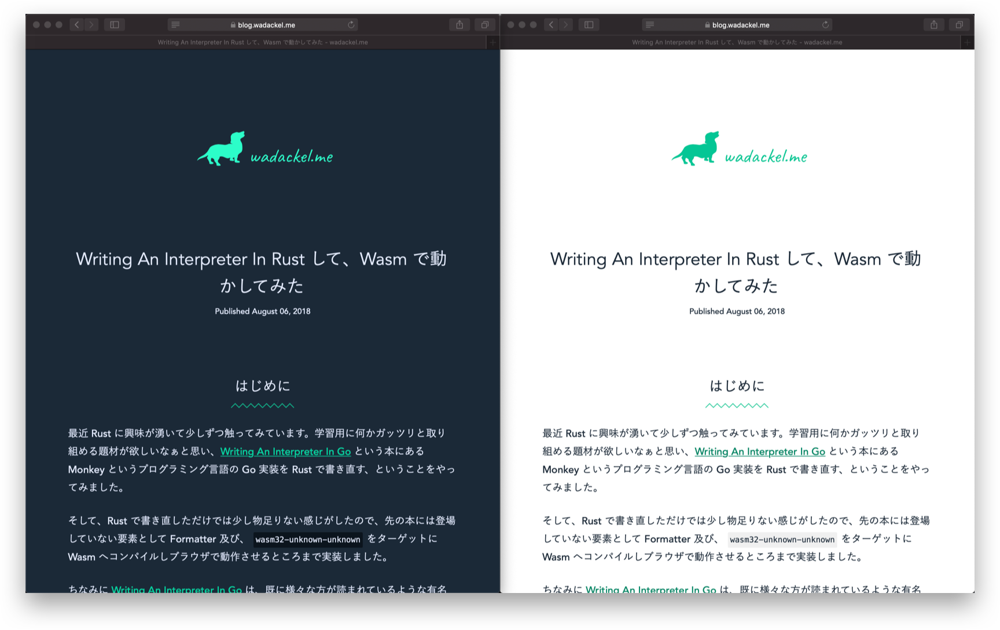
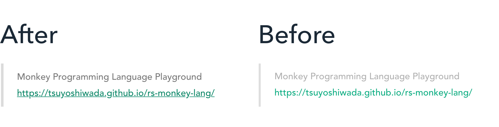
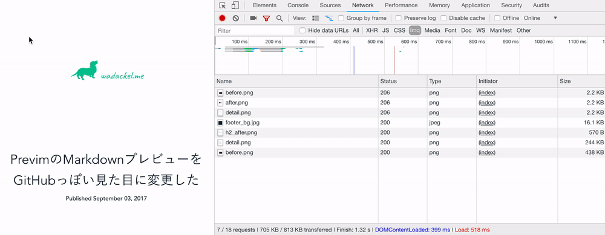

## はじめに

以下 [@Jxck\_](https://twitter.com/jxck_) さんの記事に触発されて、このブログのデザインをダークモードに対応してみました。

https://blog.jxck.io/entries/2018-11-10/dark-mode-via-prefers-color-scheme.html

また、機能追加のついでに幾つかの改善やリファクタリングを行ったのでそれらをまとめておきたいと思います。

## ダークモードへの対応

実際の動作は Safari Technology Preview 68 (以下 Safari TP) 以降、システム環境設定からダークモードに設定した上でこのブログを閲覧することで確認することができます。  
以下、ダークモード対応している Safari TP 68 と Safari 12 での比較画像です。



その他 OS の UI と色合いが馴染んで、視覚的な刺激を受けづらくなったかなと思います。

---

実装的には上述したブログを見ていただくのが詳しいですが、このブログでどう適用したかについて簡単にまとめます。

### CSS Custom Properties の静的解決を廃止

これまでは PostCSS の [postcss-custom-properties](https://github.com/postcss/postcss-custom-properties) を使って、CSS Custom Properties を静的に解決していました。

```css
:root {
  --color: black;
}

p {
  color: var(--color);
  /* post process -> color: black; */
}
```

しかし、今回のように Media Query によって定義を上書きしたい場合などには、ネイティブの実装を使用するのが賢明です。加えて、CSS Custom Properties 自体メジャーブラウザが[全て対応](https://caniuse.com/#search=custom%20properties)していることもあり、上記プラグインは外しました。不要なものはどんどん無くしていきたいですね。

### ダークモード時に色定義の上書き

このブログで使用している CSS では `variables.css` というファイルで、各種色定義をまとめています。

```css:src/css/foundations/variables.css
:root {
  /* ... */
  --color-primary: #00c795;
  --color-primary-dark: #008666;
  --color-secondary-lightest: #283d52;
  --color-secondary-lighter: #344f6a;
  /* ... */
}
```

これらの定義を `prefers-color-scheme: dark` 時に、必要な部分だけ上書きすることで対応しました。

```css:ダークモード用の色定義
@media (prefers-color-scheme: dark) {
  :root {
    --color-primary: #2dfdc9;
    --color-primary-dark: #01d6a2;
    --color-background: var(--color-secondary);
    --color-text: #e4ebff;
    --color-gray-dark: #788ea2;
    --color-divider: #40596f;
    --color-code-background: var(--color-secondary-dark);
    --color-code-block-background: var(--color-secondary-dark);
    --color-kbd-border: #527d9e;
    --color-kbd-background: #334e67;
    --color-kbd-shadow-inset: #51718c;
    --color-kbd-shadow-from: #2c4b67;
    --color-kbd-shadow-to: #1d3c58;
    --selection-background: rgba(255, 255, 255, 0.1);
  }
}
```

上記コードはダークモード対応用の全コードです。様々なファイルに定義を散らせたくないため、色の定義を見直し / リファクタリングすることで、最終的に小さな差分のみで対応を入れることができました。

## カラーコントラストの改善



ロゴで使用する Primary color、及び一部 Syntax highlight を除きほぼ全てのテキストで、コントラスト比の Level AA (4.5:1) をクリアするところまで調整を行いました。

主に引用テキストのカラーと、とリンクカラーがクリア出来てなかった模様です。比較してみると全然見えやすさが違うなぁという印象です。

ロゴに関しては Primary color でここだけは譲れないなぁと感じたため、意図的に変更を加えていません。(_あと、フォントサイズも大きめなので色のコントラストは最悪いいかなという妥協で_)

## img 要素に対して lazyload 属性の付与

全ての記事中画像に対して、Chrome 70 で**入ると言われていた** `` と `<iframe />` に付与可能な `lazyload` 属性を実験的に付与してみました。

「入ると言われていた」と表現したのは、現在手元の Chrome 70 (Stable) では有効化されていないからです。[Features schedule](https://www.chromestatus.com/features/schedule) を見るに 72 でも入ってなさそうです。詳しくは追えてないのですが、安定版としてリリースするに十分な品質までまだ少し掛かるということなんですかね？

現時点では `chrome://flags/#enable-lazy-image-loading` から有効にしないと使用できないようです。

実際にフラグを有効化して、動作させてみると以下のような動作となります。



少々分かりづらいですが、まず [range request](https://developer.mozilla.org/en-US/docs/Web/HTTP/Range_requests) (206 Partial Content) が行われます。ここで画像サイズを得てプレースホルダを作成するようです。スクロールを下へ進めると実際に表示に必要な全ての画像をリクエストしています。

ほとんど実装の手間も無くコストパフォーマンスの高そうな feature なので、Stable で有効化されるのが楽しみです。

## Babel の廃止

一部に `async-await` やアロー関数などを使用した JavaScript を書いているので、これまでは Babel を使ってトランスパイルを挟んでいました。が、これも最近のメジャーブラウザなら基本的にサポートされているのでトランスパイル処理を廃止しました。そのため、現在は webpack をモジュールバンドラ 兼 Optimizer としてのみ使っています。

## カテゴリを廃止

このブログでは申し訳程度にカテゴリを導入していたのですが、カテゴリを上手に運用するほど器用ではないので思い切って廃止しました。不要なものはどんどん無くしていきたいですね。(2 度目)

## その他細かい点

- さくら VPS から Netlify へ移行
- 古くなっていた npm のパッケージ群をメンテした
- 水平線のデザインや、リストの余白等、細かいデザイン上の微調整をした

一回どこか手を付けるとあっちもこっちも気になりだして完全に沼ですね...。

## まとめ

今回のメインはダークモードへの対応でしたが、アクセシビリティを意識してコントラストの微調整も行いました。  
`prefers-color-scheme` と同じく [Media Queries Level 5](https://drafts.csswg.org/mediaqueries-5/) で定義されている [prefers-contrast](https://drafts.csswg.org/mediaqueries-5/#prefers-contrast) (ユーザーがコントラスト量を増加または減少させるよう要求したかどうか) が使えるようになると、ユーザの環境に最適化して Level AA ではなく Level AAA (7:1) に対応したコントラストへ調整してあげるなど、デザインの制約上難しい場面への対応がより柔軟に出来るようになるなぁと楽しみになりました。

ここらへんの動きが気になりなるので、ゆるく追っていきたいなぁと思います。
