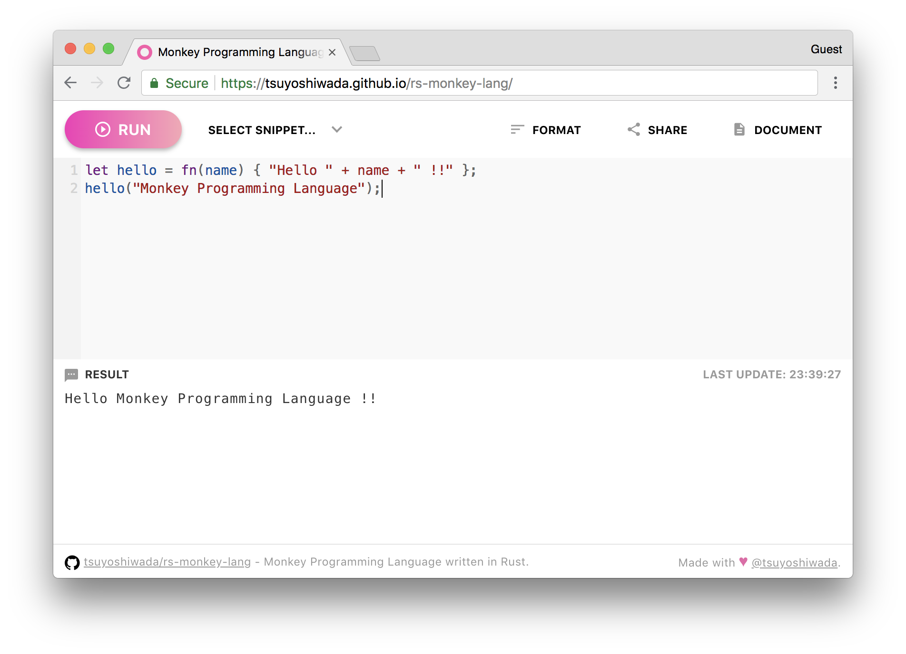

## はじめに

最近 Rust に興味が湧いて少しずつ触ってみています。学習用に何かガッツリと取り組める題材が欲しいなぁと思い、[Writing An Interpreter In Go][writing-an-interpreter-in-go] という本にある Monkey というプログラミング言語の Go 実装を Rust で書き直す、ということをやってみました。

そして、Rust で書き直しただけでは少し物足りない感じがしたので、先の本には登場していない要素として Formatter 及び、`wasm32-unknown-unknown` をターゲットに Wasm へコンパイルしブラウザで動作させるところまで実装しました。

ちなみに [Writing An Interpreter In Go][writing-an-interpreter-in-go] は、既に様々な方が読まれているような有名な本なので特別紹介はしませんが、かなりの良書なので「**読んだことない！**」という方は是非読んでみると面白いかもしれません。

https://razokulover.hateblo.jp/entry/2018/06/18/121105

https://deeeet.com/writing/2017/01/12/go-interpreter/

https://medium.com/@r7kamura/write-an-interpreter-in-go-%E3%82%92%E8%AA%AD%E3%82%93%E3%81%A0-99c98d746d7c

最初のブログ記事にある通り、最近 O'Reilly さんから 『[Go 言語でつくるインタプリタ](https://www.oreilly.co.jp/books/9784873118222/)』というタイトルで日本語訳も出ています。

## 成果物

実際に出来上がったものは以下のリポジトリです。

https://github.com/wadackel/rs-monkey-lang

ターミナル上で REPL を動作させることも出来るのですが、どちらかというと今回はブラウザ上で動かすことの出来る Playground が主役です。



https://wadackel.github.io/rs-monkey-lang/

幾つかスニペットを用意しているので実際に動かしてみると面白いかなと思います。Monkey 言語の簡単なドキュメントも [README](https://github.com/wadackel/rs-monkey-lang#documentation) に記載しています。

※ちなみにガワの実装をサボりまくっているので、Chrome でしか動作しないと思います :)

## 実装について

Writing An Interpreter In Go では、次の流れで実装が進んでいきます。

1. Lexing (字句解析)
2. Parsing (構文解析)
3. Evaluation (評価)
4. Extending the interpreter (言語拡張)

3 までのステップでは `Integer` のみを扱い、4 で `String` や `Array`、`Hash` 等が追加で実装される構成です。各ステップ分かりやすく解説してくれながら進んでいくし、ライブラリ等は使用せずにスクラッチで書かれているので、非常に分かりやすかったです。Rust へのポーティング、実装内容の理解という面でスクラッチは嬉しいですね。

---

以下、各ステップ + Formatter についての概要と、Rust での実装について簡単にですが触れたいと思います。

### Lexer (字句解析器)

Lexer は、AST (抽象構文木) を構築する前段階として、ソースコードをトークンに分解する処理を行います。やることが非常に単純な為、全ての工程の中で一番実装が簡単でした。

受け取ったソースコードの読み取り位置を進めていき、現在の文字列がどのトークンに対応するかをパターンマッチにかけるだけです。大部分を端折っていますが、以下の様なイメージです。

```rust:src/lexer/mod.rs
impl<'a> Lexer<'a> {
    pub fn next_token(&mut self) -> Token {
        // 現在の読み取り文字を `.ch` が持っている
        let tok = match self.ch {
            b'=' => {
                if self.nextch_is(b'=') {
                    self.read_char();
                    Token::Equal
                } else {
                    Token::Assign
                }
            }
            b'+' => Token::Plus,
            b'-' => Token::Minus,
            b'0'...b'9' => {
                // 数値の読み取りを行う
                return self.consume_number();
            }
            b'"' => {
                // 文字列の読み取りを行う
                return self.consume_string();
            }
            0 => Token::Eof,
            _ => Token::Illegal,
        };

        // 次の読み取り位置へ進める
        self.read_char();

        return tok;
    }
}
```

パターンマッチの部分は Go の場合だと `switch` になっています。`switch` でも充分に可読性は高いと思いますが、Rust の場合だと `b'0'...b'9'` の様な範囲を指定したマッチングが出来るため、比較的理解しやすいコードになっているなと思います。

結果として返すトークンの値は `enum` として定義しています。以下はトークン定義の一部です。

```rust:src/token.rs
#[derive(Debug, Clone, PartialEq)]
pub enum Token {
    Illegal,
    Blank,
    Eof,

    // Identifiers + literals
    Ident(String),
    Int(i64),
    String(String),
    Bool(bool),

    // Statements
    Assign,
    If,
    Else,

    // Operators
    Plus,
    Minus,
    Bang,
    Asterisk,
    Slash,
}
```

### Parser (構文解析器)

Parser は Lexer によってトークン化されたソースコードを AST へと変換していきます。AST の構造が Go とは大きく異なるため、ここが一番実装が大変でした...。

Go ではベースとなる Node, Statement, Expression は次のような定義です。

```go
package ast

type Node interface {
  TokenLiteral() string
}

type Statement interface {
  Node
  statementNode()
}

type Expression interface {
  Node
  expressionNode()
}
```

例えば `if` を表す `IfExpression` は、`Expression` インターフェースを満たすような実装を用意するイメージです。

一方 Rust では `Token` と同様に `enum` を使って各ノードを表現しています。以下、諸々端折った例です。

```rust:src/ast.rs
pub enum Expr {
    Ident(Ident),
    Literal(Literal),
    Prefix(Prefix, Box<Expr>),
    Infix(Infix, Box<Expr>, Box<Expr>),
    If {
        cond: Box<Expr>,
        consequence: BlockStmt,
        alternative: Option<BlockStmt>,
    },
}

pub enum Stmt {
    Let(Ident, Expr),
    Return(Expr),
    Expr(Expr),
}
```

`Stmt` が `Expr` を持ち、`Expr` が更に `if` やリテラル等の式を内包する形です。

正直、当初全くどうやって実装したら良いか分からなかったのですが、Rust 本体の Parser や他の Parser 系実装を参考に見て回っていると、その殆どが `enum` に任意のフィールドを持たせた構造になっていたので、踏襲した感じです。この辺の言語化は宿題です...。(ともあれ、様々なソースコードを見て回ったのは勉強になりました)

AST の定義さえ出来れば、あとはひたすらトークンを落とし込む実装を書いていくのですが、演算子周りの解析は非常に面白かったです。Writing An Interpreter In Go では **Pratt Parser (下向き演算子順位解析)** という手法を使っています。やっていることを雑に書くと、演算子の来る位置を `Prefix` と `Infix` に分け、各演算子に対して優先度を付けて解析を行う感じです。(`+` よりも `*` が優先した構造を取るべき)

例えば、以下の様な一見複雑に見える式をパース出来るようになった時はすごく嬉しかったです。

```javascript
10 + 5 * 7 + 10 / 2 - 30 + (-10 + 10 * 4);
```

Pratt Parser に関して、Writing An Interpreter In Go 以外だと、以下の記事が疑似コードを使った説明があり参考になるかと思います。

https://dev.to/jrop/pratt-parsing

### Evaluator (評価器)

Evaluator はパース結果の AST を受け取り、ホスト言語 (Rust) で逐次実行し、結果を Object system (評価値の内部表現) に変換していきます。本の中では Tree-warking Interpreter と呼ばれていました。実行速度が出ない代わりに、最適化もコンパイルもせず実行できる手頃な実装の為、学習用に採用されているみたいです。

Object system も `enum` を使って表現されています。

```rust:src/evaluator/object.rs
pub enum Object {
    Int(i64),
    String(String),
    Bool(bool),
    Array(Vec<Object>),
    Hash(HashMap<Object, Object>),
    Func(Vec<Ident>, BlockStmt, Rc<RefCell<Env>>),
    Builtin(i32, BuiltinFunc),
    Null,
    ReturnValue(Box<Object>),
    Error(String),
}
```

例えば、リテラルの評価は以下の様な実装としています。

```rust:src/evaluator/mod.rs
impl Evaluator {
    // ...
    // リテラルの評価
    fn eval_literal(&mut self, literal: Literal) -> Object {
        match literal {
            Literal::Int(value) => Object::Int(value),
            Literal::Bool(value) => Object::Bool(value),
            Literal::String(value) => Object::String(value),
            Literal::Array(objects) => self.eval_array_literal(objects),
            Literal::Hash(pairs) => self.eval_hash_literal(pairs),
        }
    }

    // Array の評価
    fn eval_array_literal(&mut self, objects: Vec<Expr>) -> Object {
        Object::Array(
            objects
                .iter()
                .map(|e| self.eval_expr(e.clone()).unwrap_or(Object::Null))
                .collect::<Vec<_>>(),
        )
    }

    // Hash の評価
    fn eval_hash_literal(&mut self, pairs: Vec<(Expr, Expr)>) -> Object {
        let mut hash = HashMap::new();

        for (key_expr, value_expr) in pairs {
            let key = self.eval_expr(key_expr).unwrap_or(Object::Null);
            if Self::is_error(&key) {
                return key;
            }

            let value = self.eval_expr(value_expr).unwrap_or(Object::Null);
            if Self::is_error(&value) {
                return value;
            }

            hash.insert(key, value);
        }

        Object::Hash(hash)
    }
    // ...
}
```

`eval_array_literal` を見ていただくと分かる通り、Rust (ホスト言語) にある機能 (`Array` を `Vec` で表現) を使って評価していくことがメインの実装です。

### Formatter

Evaluator + REPL までで、Writing An Interpreter In Go のメインとなる内容は終わりです。Formatter は本で学習した内容の応用編として作ってみました。言語本体が Formatter を提供するのは気持ちいいですよね。

考え方は Evaluator に近く、AST を受け取って、よしなに整形済みのソースコードの文字列を返す実装としています。

以下、関数式を整形する処理の例です。

```rust:src/formatter/mod.rs
impl Formatter {
    // ...
    fn format_func_expr(&mut self, params: Vec<Ident>, body: BlockStmt) -> String {
        let mut params_str = String::new();

        for (i, param) in params.into_iter().enumerate() {
            if i > 0 {
                params_str.push_str(", ");
            }

            params_str.push_str(&self.format_ident_expr(param));
        }

        self.indent += 1;

        let body_str = self.format_block_stmt(body);

        self.indent -= 1;

        format!(
            "fn({}) {{\n{}\n{}}}",
            params_str,
            body_str,
            self.indent_str(0)
        )
    }
    // ...
}
```

ブロック (`{}`) で囲われている分のインデント等を考慮しながら、整形処理をしていくイメージです。

例に上げた関数以外の文や式を全て実装し、

<!-- prettier-ignore-start -->
```javascript:BEFORE
if         (          true ) {  puts("Hello")     }      else 
{
  puts("unreachable")    }
```
<!-- prettier-ignore-end -->

こんなグダグダなソースコードも

```javascript:AFTER
if (true) {
  puts('Hello');
} else {
  puts('unreachable');
}
```

良い感じに整形されるようになっています。

### これらを Wasm で動かす

冒頭で書いた通り今回はコンパイルターゲットを `wasm32-unknown-unknown` としています (Rust 単体で `Emscripten` 無し)。今回は勉強の為、[wasm-bindgen](https://github.com/rustwasm/wasm-bindgen) 等の便利ツールは一切使用しないでやってみています。

Rust 側実装の一部です。

```rust
#[no_mangle]
pub fn alloc(size: usize) -> *mut c_void {
    let mut buf = Vec::with_capacity(size);
    let ptr = buf.as_mut_ptr();
    mem::forget(buf);
    ptr as *mut c_void
}

#[no_mangle]
pub fn dealloc(ptr: *mut c_void, size: usize) {
    unsafe {
        let _buf = Vec::from_raw_parts(ptr, 0, size);
    }
}

#[no_mangle]
pub fn eval(input_ptr: *mut c_char) -> *mut c_char {
    let input = unsafe { CStr::from_ptr(input_ptr).to_string_lossy().into_owned() };

    // ... JavaScript から渡ってくる文字列 `input` を Parsing -> Evaluation する

    let output = /* 実行結果の文字列を生成する */;

    CString::new(output).unwrap().into_raw()
}
```

`alloc`, `dealloc` 辺りは JavaScript と Rust (というより WebAssembly) で共有されるメモリ空間である [WebAssembly.Memory](https://developer.mozilla.org/en-US/docs/Web/JavaScript/Reference/Global_Objects/WebAssembly/Memory) の Allocate, Deallocate を行うための実装で、以下とっても参考になりました。

https://qiita.com/bokuweb/items/87a169429960f0dae2cb

https://github.com/KOBA789/rust-wasm

JavaScript と WebAssembly では、直接渡せるデータ型が数値に限定されるみたいです。そのため、ソースコードの様な文字列を渡すためには、渡す側がメモリに書き込み受け取る側ではそのポインタを受け取るような実装にする必要があります。(ここが最初本当に分からなかった...)

---

JavaScript 側で文字列を渡した後、戻り値を文字列化するには以下のような実装になります。

```javascript:実装の雰囲気
const input = '...'; // 入力されたソースコード

const {
  instance: { exports },
} = await WebAssembly.instantiateStreaming(fetch('...'));
const encoder = new TextEncoder('UTF-8');
const decoder = new TextDecoder('UTF-8');

// WebAssembly へ文字列を渡すためにメモリに書き込む
const buf = encoder.encode(input);
const ptr = exports.alloc(buf.length + 1);
const heap = new Uint8Array(exports.memory.buffer);

for (let i = 0; i < buf.length; i++) {
  heap[ptr + i] = buf[i];
}

heap[ptr + buf.length] = 0;

// ポインタを渡し、評価後のポインタを受け取る
const resultPtr = exports.eval(ptr);
exports.dealloc(resultPtr, buf.length);

// 評価後の値 (文字列) をメモリから読み込む
const resultBuf = new Uint8Array(exports.memory.buffer, resultPtr);
let i = 0;

while (resultBuf[i] !== 0) {
  i++;
}

const result = decoder.decode(resultBuf.slice(0, i));

// result -> 評価結果
```

実際にはもう少し整理したり、エラーチェック等が入っていますが、大枠としては上記のような実装となっています。

---

一通り実装し終えたら、`wasm32-unknown-unknown` 向けにコンパイルをするのですが、[alexcrichton/wasm-gc](https://github.com/alexcrichton/wasm-gc) を使用することでファイルサイズを小さくすることが出来るみたいです。(_とはいえ小さくしても今回の `.wasm` は `196KB` ある..._)

```bash:wasm-gcのインストール
$ cargo install wasm-gc
```

コンパイルと `wasm-gc` の実行は以下。

```bash
$ cargo build --release --target wasm32-unknown-unknown
$ wasm-gc target/wasm32-unknown-unknown/release/main.wasm main.wasm
```

大部分を端折ってはいますが、これで一通り実装についての紹介は終わりです。もし詳細な実装に興味がある方がいれば [リポジトリ](https://github.com/wadackel/rs-monkey-lang) を見ていただけると良いかなと思います :D

## さいごに

初洋書、初 Rust、初言語処理系、初 Wasm と、かなり自分の中では挑戦的な内容だったんですが、最後までかなり楽しく進められたなという感想です。  
簡単なものでも、自分で実装した言語処理系が動作する (しかもブラウザで) という体験はすごい満足感と感動がありました。今まで触れたことが無いような領域に挑戦している感覚は楽しいですね。

Rust を触ってみて、まだまだ理解が足らず、コンパイラに怒られるから書き換える (理由の理解も曖昧) みたいなケースが多いです。ここらへんがこれからの課題かなと感じていて、とにかく手を動かさないとなと感じています。

今度は、LLVM バックエンドに、フロントエンドを Rust で実装する自作言語を作って、Hello World を目指してみたいなと密かに企んでいます。

---

ちなみに Writing An Interpreter In Go の続編? である [Writing A Compiler In Go](https://compilerbook.com/) (Monkey 言語用のコンパイラ及び VM の実装を行う) が最近出たのでそっちも読んでみようと思っています。

[writing-an-interpreter-in-go]: https://interpreterbook.com/
