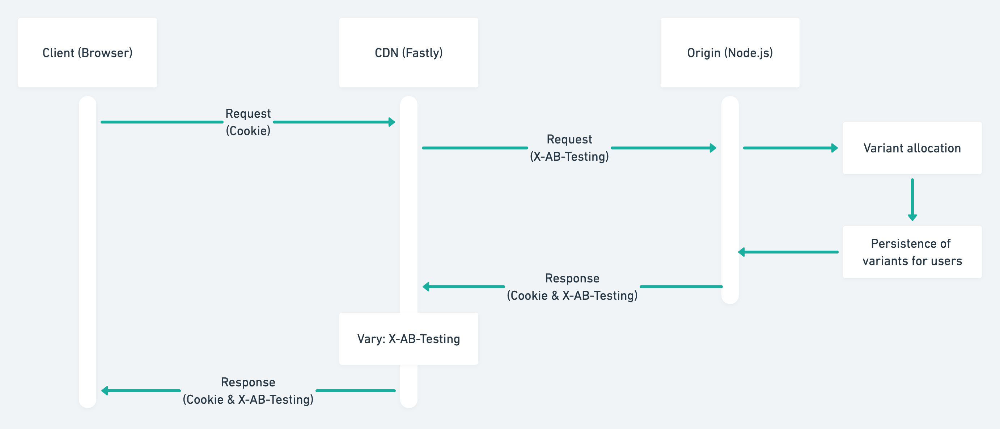
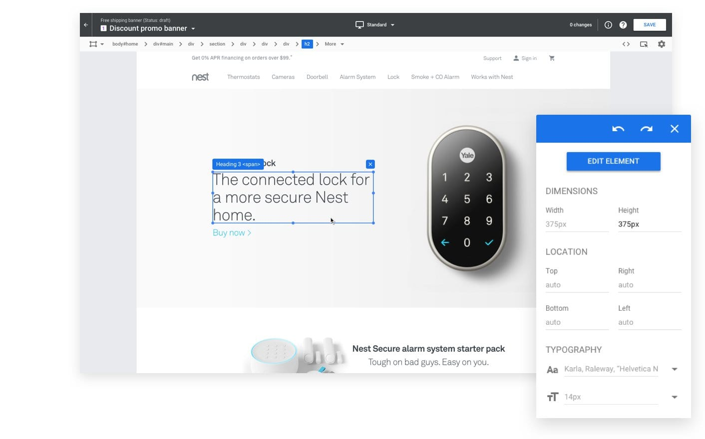

## はじめに

少し前に業務で実装した A/B Testing の実装について、チームメンバー用にドキュメントを書いたのですが、Optimize の導入を考えている社内外の開発者の参考になればと思ったため雑にブログにまとめます。

僕が業務で携わっている [WinTicket](https://www.winticket.jp) というサービスでは CDN に Fastly を使用しており、その環境下でキャッシュ可能な [Google Optimize](https://marketingplatform.google.com/about/optimize/) (以降 Optimize) を使った A/B Testing の仕組みと、この仕組を採用することによって発生する制約について記載します。

---

この記事で記載する内容は Optimize のガイドで紹介されている [Server-side Experiments](https://developers.google.com/optimize/devguides/experiments) の内容とほとんど同じです。まずはガイドを読んで外観を掴んでいただけると良いかと思います。

また Optimize 自体の概要については公式ドキュメントや紹介ブログが多くあるためそちらを参照ください。

## 技術スタック

WinTicket では一般的な React x Redux を使った SSR x SPA 構成をとっています。

詳細な技術構成や開発の体制については今年 Inside Frontend に登壇した際の資料を参照いただけますと幸いです。

https://docs.google.com/presentation/d/13QD86hxp0dB_xHkYcyLrFX1xNt0Vg4wsqIo8yeBQmFs/edit?usp=sharing

上記リリース当時の内容で、細かい変更点は多々ありますがそれほど大きく様変わりはしていません。

## A/B Testing の要件

以降記載する内容は、以下の要件をクリアするための仕組みについてです。

- CDN によるキャッシュが行える状態
  - TTI の最適化、オリジンへの負荷低減
- SSR で配信する HTML は各バリアント[^1] に対応する (Serving content & Experiment inclusion)
  - クライアントのみでの表示制御はしない
  - キャッシュ可能に
- 一度振られたバリアントは一定期間再利用する (Persistence of variants for users)
  - 配信するたびに内容が変わるのは避ける

[^1]: A/B Testing で振られる各種バリエーションのこと。

## 自分たちで管理する必要のある処理群

Optimize をブラウザで完結する使い方[^2] をする分には全て不要な処理なのですが、Server-side Experiments の手法に沿う場合は、コンテンツの配信を含めた多くの処理を自分たちで管理する必要があります。(これは大きなデメリットの一つですね)

[^2]: ブラウザ上で実行される JavaScript によってのみ制御する場合。ビジュアルエディタを始めとして、多くの機能を使えて管理画面上で操作するだけで完結できる。https://marketingplatform.google.com/about/optimize/features/

- Serving content. (コンテンツの配信)
- Experiment inclusion. (テスト対象の判定)
- Variant allocation. (パターンの割り当て)
- Persistence of variants for users. (ユーザーごとの配信パターンの固定)
- Sending users’ hits (e.g., pageview hits) on the variants to Google Analytics. (各パターンでユーザーが発生させたヒット（例: ページビュー ヒット）の Google アナリティクスへの送信)

https://developers.google.com/optimize/devguides/experiments?hl=en

かなりの部分を自分たちで負担する必要がありますが、分かりやすいレポート画面、有意差の判定などはそのまま使える点は強みとなります。

## HTML 配信までの流れ

1 回目のアクセス、2 回目以降のアクセス時でそれぞれ挙動が変わります。それらの動きについて記載します。大まかなフローは以下のとおりです。



### 1 回目のアクセス (初回)

1. クライアントが CDN にリクエスト (空の Cookie)
1. CDN がオリジンへリクエスト
1. オリジンが以下のタスクを実行
   - バリアントの割り当てを実施 (WinTicket では [ab-testing](https://github.com/xavimb/ab-testing) を使用)
   - 割り当てられたバリアント毎にコンテンツを生成
   - Cookie にバリアントを保存 (`Set-Cookie` で `ab` というキーに対して保持)
     - CSR 時でも Cookie への書き込みが必要となるため、ここで書き込む Cookie は `HttpOnly` フラグを無効化しておく
1. オリジンがレスポンスを返す
1. Google Analytics へバリアントの識別子を送信する
1. CSR での遷移時にも 3, 5 と同様のロジックを実行する

### 2 回目以降のリクエスト (バリアントの再利用)

1. クライアントがバリアントを保持した Cookie を載せて CDN へリクエスト
1. CDN が Cookie から `ab` キーを取得し `X-AB-Testing` という独自ヘッダに値をすげ替える
1. CDN で Cookie を削除
   - キャッシュのヒット率を向上するためオリジンに対して Cookie を送らない
1. CDN がオリジンへリクエスト
1. オリジンが以下のタスクを実行
   - `X-AB-Testing` に含まれるバリアントを使ってコンテンツの生成
1. Google Analytics へバリアントの識別子を送信する
1. CSR での遷移時にも 5, 6 と同様のロジックを実行する

---

バリアントの割り当てとコンテンツの生成周りの大まかな実装イメージです。

```javascript:実装イメージ
import uuid from 'uuid/v4';
import { createTest } from 'ab-testing';

/**
 * Optimize ではバリアントの識別子として 0 始まりでパターン毎のインデックスを使用します
 */
const variant = createTest('testId', [
  { name: '0', weight: 0.5 }, // A パターン
  { name: '1', weight: 0.5 }, // B パターン
]).getGroup(uuid());

switch (variant) {
  case '0':
    /* A パターンのコンテンツ生成 */
    break;

  case '1':
    /* B パターンのコンテンツ生成 */
    break;
}
```

あとは Cookie にサーバ、クライアント共に `variant` を保持すれば OK です。

ついでに CDN (Fastly) での Cookie のすげ替えと、`Vary` ヘッダ周りの処理です。

```javascript
sub vcl_recv {
  # Cookie に含まれる `ab` キーの内容を `X-AB-Testing` ヘッダにすげ替える
  set req.http.X-AB-Testing = req.http.Cookie:ab;
  unset req.http.Cookie:ab;
}

sub vcl_fetch {
  # Vary ヘッダに `X-AB-Testing` を含めることでキャッシュのバリエーションを分ける
  if (beresp.http.Vary) {
    set beresp.http.Vary = beresp.http.Vary + ", X-AB-Testing";
  } else {
    set beresp.http.Vary = "X-AB-Testing";
  }
}
```

## この手法で必要となる制約

様々な処理を自分たちで管理することによって様々な制約が必要となります。(Server-side Experiments 特有の制約)

### ビジュアルエディタの使用ができなくなる



https://marketingplatform.google.com/about/optimize/

クライアントサイドで完結する Optimize を使用する際は、ブラウザ上のビジュアルエディタを使ってバリアント毎のコンテンツを管理できます。

しかし、冒頭に記載した通りバリアントに対応したコンテンツの配信、振り分けなどのロジックは自分たちで管理する必要があるため、これらの機能は使用することができません。

### Optimize の管理画面での設定は直接反映されなくなる

こちらも同様に、各種バリアントの数 & 比率などは全て自分たちで管理する必要があり、Optimize が API などで保持している情報を公開しているわけでもないため、管理画面上での設定と自分たちの値の更新は別々で行う必要があります。

ここらへんもう少しこなれた方法がないかは検討中です。

## そもそも何故 Optimize なのか

A/B Testing に使用するツール選定時に [Optimizely](https://www.optimizely.com/) と Optimize の比較検討を行っていました。Optimizely の方が僕たちが使いたかった機能、使い方に沿っていて使い勝手は良さそうでした。

が、利用料が Optimize の方がお手軽 (5 つまでのテストケースなら無料で使える) なこと、自分たちで管理する手間はあるものの、逆に言えば自分たちに合った使い方に寄せることができると判断し最終的に Optimize を使い始めることになりました。

## おわりに

Optimize の Server-side Experiments に関連した情報が少ないなぁと感じたため今回記事にまとめてみました。僕たちもまだ改善する余地はあると思う部分はありますが、タイトルにもあるキャッシュ可能でパフォーマンスへの影響を最小化した状態での A/B Testing 基盤はできました。

同様に低コストで A/B Testing をしたい、が費用を抑えたいと思い Optimize の導入を検討している方の参考となれば幸いです。
