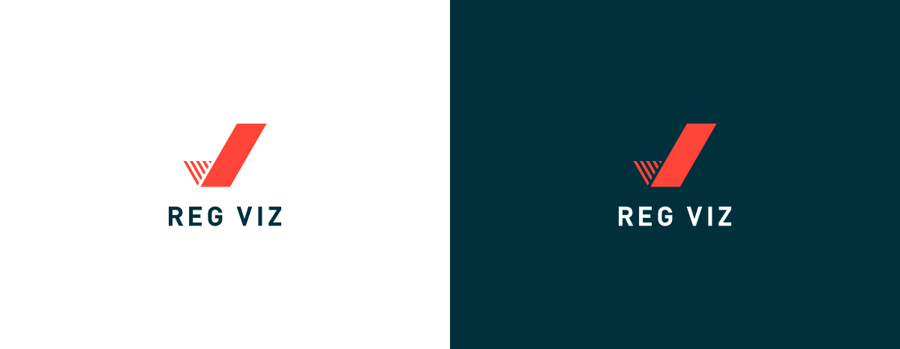
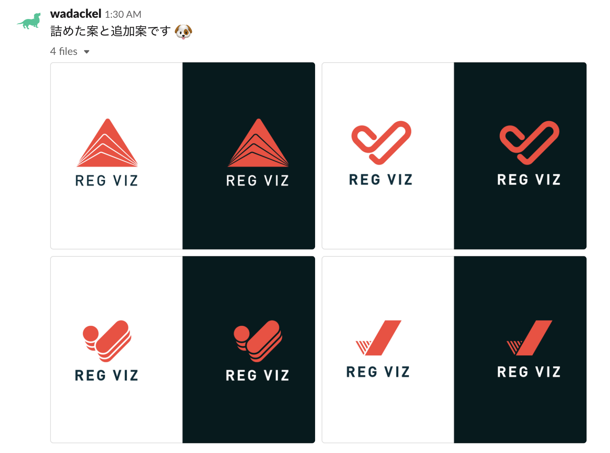
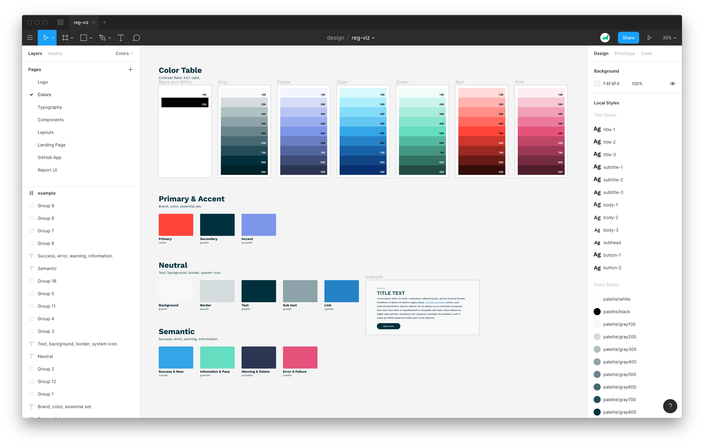
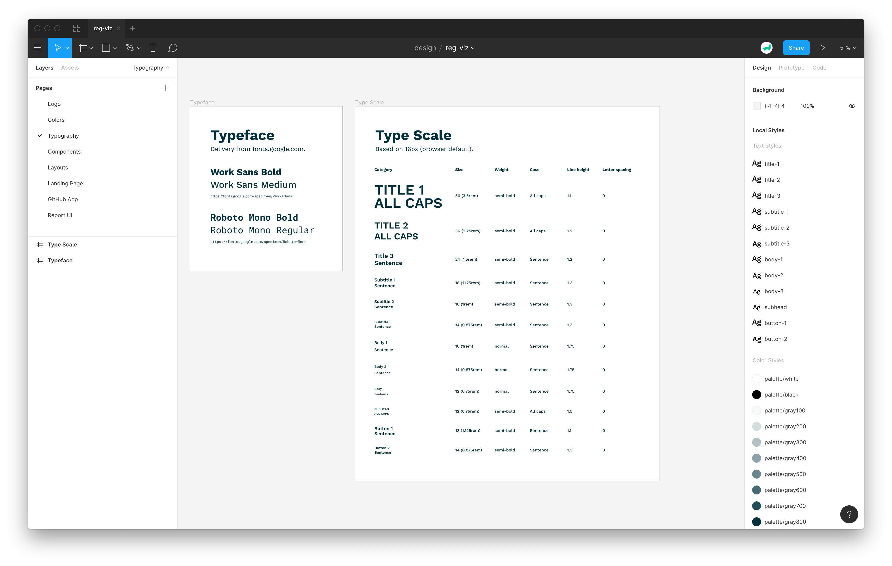
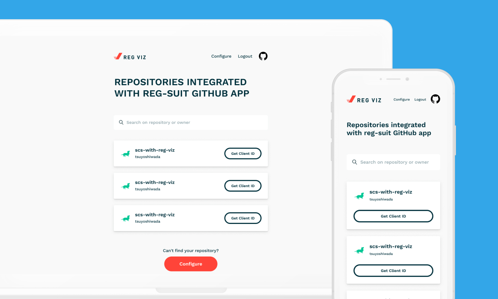
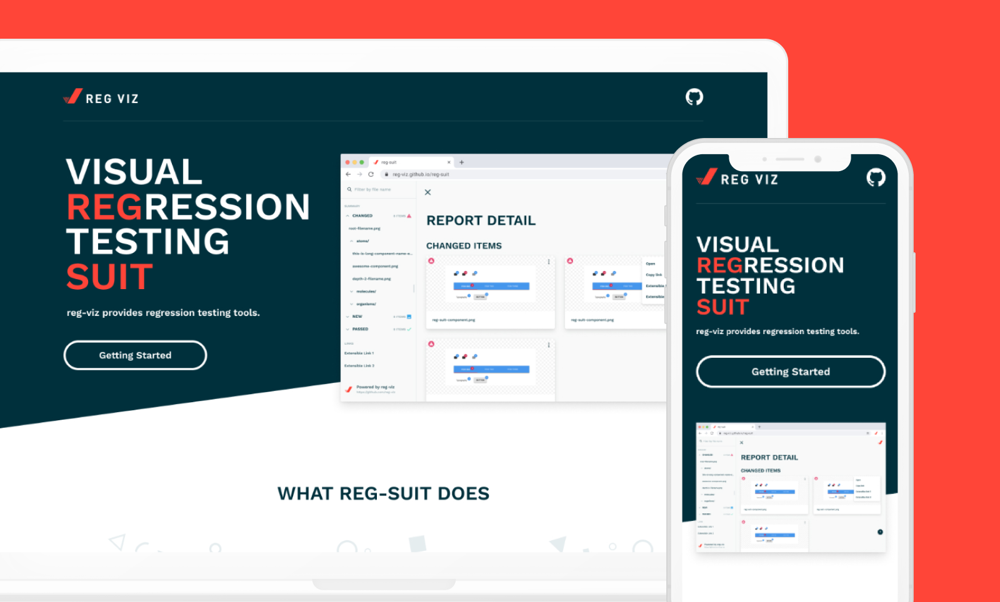

## はじめに

11 月の頭に Visual regression testing のツールを提供する Organization である [reg-viz](https://github.com/reg-viz) 全体のブランディングを心機一転しました。

この対応をする少し前の 9 月後半に [reg-cli の Report UI は刷新](https://blog.wadackel.me/2019/reg-suit-report-ui/) していましたが、その変更に次ぐ形でのリリースです。
いざリブランディングをしようと決意して、実際に着手するまでは以前の記事と同様なので割愛します。

思いの外時間の掛かってしまったタスクでしたが、せっかくリリースまで漕ぎつけたので、変更内容や過程について軽く記事にしておきたいと思います。

## 背景

- そもそもの発端は Report UI の改修
- Quramy さんに相談したら、ついでにロゴも変えちゃっていいですよ！という流れに
- ロゴを変えるなら全体のリブランディングをしたいですね〜

若干記憶が曖昧ですが、おおよそこのくらいの軽いノリで始まったリブランディング計画です。

当初のデザインが時間を掛けたものじゃなかったようで、やってくれるならぜひ！ということで手を動かしはじめました。多少デザインに気を配った OSS が個人的に好きで、そういった視点から reg-viz のユーザを少しでも増やすことができれば万々歳かなというお気持ちです。

## 変更 / 策定したもの

今回のリブランディングで変更、策定したものたちについて紹介します。

これら全てのデザイン制作に Figma を使用しているため、もし興味があれば以下のファイルを閲覧することもできるかと思います。

> Figma のデザインファイル  
> https://www.figma.com/file/2SqjEDoQyhm0QaRYfv0tpR/reg-viz?node-id=872%3A2&viewport=37%2C-218%2C0.37943142652511597

### ロゴ

Organization のブランディングを変えるにあたって、最も悩んだのがロゴの変更でした。結果として以下のシンボルに落ち着きました。

小文字の `r` をアイコンとし、「**重なり**」をコンセプトに置いたシンボルとしました。`r` を表現しつつも Success を意図したチェックマークもシンボルに含めることで検証ツールらしさを意識しています。また、アウトラインでの表現をしやすく、取り回しが効くように複雑性を持たないシンボルに調整しています。

このシンボルに落ち着くまで幾つかの案を Slack 上で提案し、Quramy さんを始めとする reg-viz の主要メンバー ([@bokuweb](https://twitter.com/bokuweb17) さん含む) からフィードバックをいただきながら決定に漕ぎ着けました。

### Color x Typography

Landing page (LP) や GitHub App 用のページ、Report UI など、数こそ多くありませんが、reg-viz が提供するページは幾つか存在します。リブランディングに入る前は明確なデザインルールは存在していなかった (そうあるもんではありませんよね) ため、イメージの基礎となる色、タイポグラフィに関するルールを策定しました。

Figma 上ではこれらのルールを Text Styles x Color Styles としてすぐに使えるように定義し、それぞれのデザインへ適用することで、一貫性 / 変更容易性の担保につながっています。個人的にここらへんは Sketch よりも取り回しがしやすく、柔軟性も高いため断然使い勝手がいいなぁと感じる部分です。

### Report UI

既に一旦リニューアルを終えたばかりだったので、新しい配色設計、シンボルの差し替えがメインです。その他は基本的に以下の記事で書いた変更そのままです。

> [reg-cli の Report UI をリニューアルした - wadackel.me](https://blog.wadackel.me/2019/reg-suit-report-ui/)

一度リニューアルを終え、実際に使ってくださる方々から少しずつフィードバックをもらっていて、それらの対応については今後進めていきたいと考えています。

### GitHub App

情報構造を整理して、閲覧性を上げることを主軸に置きながらリブランディング後のガイドラインに沿って整えました。

### Landing page

リブランディング前の情報を基本はそのまま引き継ぎ、トンマナを合わせました。この LP のデザインを作っている時が、自分の画作りの弱さを実感して辛かったです。(デザイナーさんってすごい...)

## 所感

一通りのデザインを作成、提案、一部実装までやることで、自分が好きな OSS に対してかなり図々しく首を突っ込むいい機会になりました。  
個人的に配色の整備なんかは仕事でも活かせる知見に繋がったし、達成感があるなぁと感じています。

これらの動きを主導していたおかげか、正式に reg-viz のデザイン担当に任命していただけました。(この時期エディタよりも Figma を開いてる時間の方が長かった)

> [フロントエンドカンファレンス福岡 2019 | VRT in Action](https://speakerdeck.com/quramy/vrt-in-action?slide=41)

## 余談

リニューアルをしたくらいのタイミングから、最近社内の iOS x Android のチームでも [reg-suit](https://github.com/reg-viz/reg-suit) を導入してくださっているところがあります。

https://twitter.com/wasabeef_jp/status/1199218445503488001

https://twitter.com/ra1028fe5/status/1199235712555470848

近い距離で導入が進むことで、直接フィードバックをいただく機会が増えていて、reg-viz の今後の改善に繋げていければと考えています。
