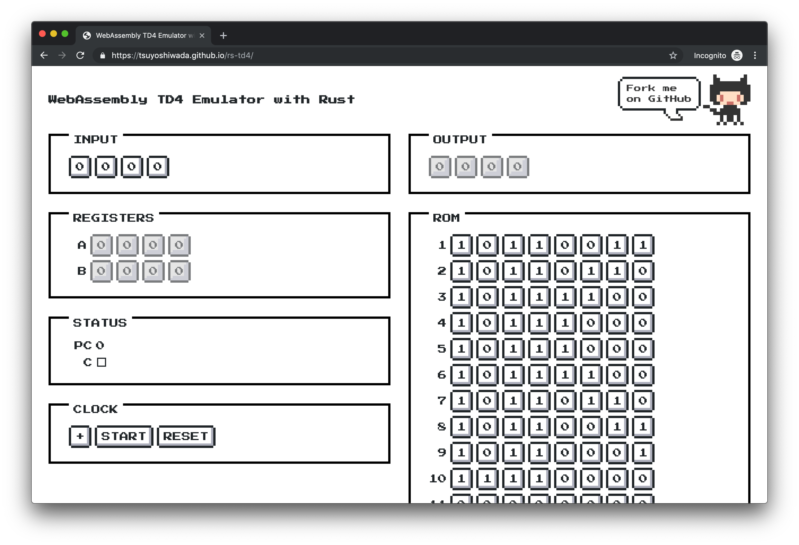
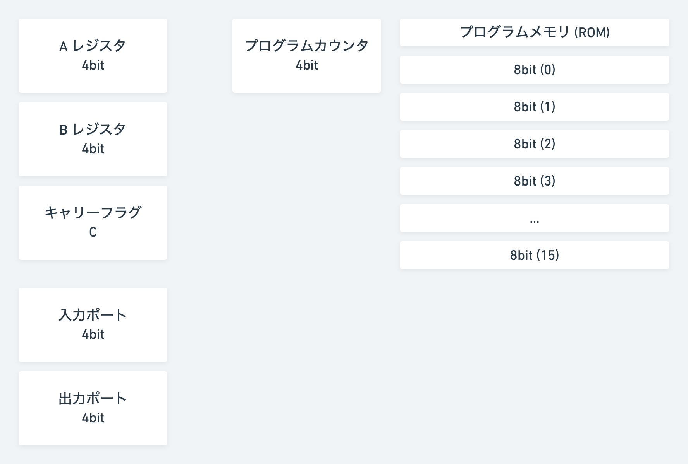

## はじめに

1 年くらい前に Monkey というインタープリタ言語を Rust で実装、WebAssembly で動かすということをやってみました。

> [Writing An Interpreter In Rust して、Wasm で動かしてみた](/2018/rs-monkey-lang/)

それ以来、全然 Rust を触れていなかったので改めて入門したいと思い、名著 [CPU の創りかた](https://www.amazon.co.jp/CPU%E3%81%AE%E5%89%B5%E3%82%8A%E3%81%8B%E3%81%9F-%E6%B8%A1%E6%B3%A2-%E9%83%81/dp/4839909865) で紹介されている TD4 という CPU を実装してみました。

## 作ったもの



> https://wadackel.github.io/rs-td4/

GitHub Pages にホストした上記の URL で、実際に入力を与え、書き込んだ ROM に従ってプログラムを実行することができます。(16 ステップで表現できるものは大分限られますが...) デフォルトで設定されている ROM は、書籍で紹介されている `LED ちかちか` というプログラムの内容です。

リポジトリは以下。

> wadackel/rs-td4  
> https://github.com/wadackel/rs-td4

## TD4 の仕様

TD4 はこの手のものに興味がある方だと大多数知っている気もしますが、改めてまとめておきます。



- レジスタ構成: 4bitCPU
- プログラムカウンタ: 4bit
- I/O: 入出力共に 4bit
- 命令フォーマット:
  - 上位 4bit: オペレーションコード
  - 下位 4bit: イミディエイトデータ (不要な場合は 0 で満たす)
- 命令数: 12
- 動作クロック: 3MHz 程度 (らしい)

## 命令一覧

全て合わせてたったの 12 命令なので、一覧を書き出してみます。

### 算術演算

A 又は B レジスタとイミディエイトデータ間の加算のみ対応。

- `ADD A, Im`
- `ADD B, Im`

### データ転送

イミディエイトデータ又はレジスタへの転送に対応。

- `MOV A, Im`
- `MOV B, Im`
- `MOV B, A`
- `MOV A, B`

### ジャンプ

指定した絶対アドレスへのジャンプ。

- `JMP Im`
- `JNC Im` (C フラグがセットされている場合にのみジャンプを実行。条件分岐)

### 入力

入力ポートから A 又は B レジスタへ転送。

- `IN A`
- `IN B`

### 出力

B レジスタの値、又はイミディエイトデータをそのまま出力ポートへ転送。

- `OUT B`
- `OUT Im`

## エミュレーション方針

CPU をエミュレーションするにあたっては、ざっくりと分けて以下の方法が存在するかと思います。

1. NAND, AND, OR, NOT 等の論理回路から再現
1. クロック毎のレジスタ内の値のみ再現

今回の取り組みで CPU の基本動作を理解する、という目的があったため最小限の労力で済ますために 2 番目の方針でエミュレーションを行っています。

そのため、以降の内容では回路部分は考慮せず、2 を実現する上で必要なものについて記載します。

## CPU の基本動作を理解する

大部分端折って、基本動作をまとめると以下の通りかなと思います。

### 1. 読み出し (fetch)

プログラムカウンタ (プログラムの現在の実行位置) を使ってメモリ上から命令を取り出す。

### 2. 解釈 (decode)

取り出した命令を解釈し、実行する処理を確定する。

### 3. 実行 (execute)

2 で確定した処理を実行する。

---

今回の Emulator はレジスタの値をエミュレーションするだけなので、どのステップもかなりシンプルなものになります。

## CPU Emulator の実装

ここからが実装のお話です。

### 実装準備

まず手始めにレジスタやポート、ROM 周りを表現する構造体を用意しておきます。

```rust:擬似コード
// 以下のような構造体を定義
// 実際のコードでは、それぞれの構造体に必要そうな setter / getter を定義しています
pub struct Register {
    pc: u8,
    c: u8,
    a: u8,
    b: u8,
}

pub struct Port {
    input: u8,
    output: u8,
}

pub struct Rom {
    vec: Vec<u8>,
}
```

### オペレーションコード

先程挙げた全 12 命令分と対応するオペレーションコードを用意します。

```rust:opcode.rs
use num_derive::FromPrimitive;

// Operation Code
#[derive(Copy, Clone, FromPrimitive, ToPrimitive)]
pub enum Opcode {
    AddA = 0b0000,  // ADD A, Im
    AddB = 0b0101,  // ADD B, Im
    MovA = 0b0011,  // MOV A, Im
    MovB = 0b0111,  // MOV B, Im
    MovAB = 0b0001, // MOV A, B
    MovBA = 0b0100, // MOV B, A
    Jmp = 0b1111,   // JMP Im
    Jnc = 0b1110,   // JNC Im
    InA = 0b0010,   // IN A
    InB = 0b0110,   // IN B
    Out = 0b1011,   // OUT Im
    OutB = 0b1001,  // OUT B
}
```

[num-derive](https://github.com/rust-num/num-derive) を使って `enum` の各ヴァリアント値をプリミティブ型に相互変換しやすいようにしてみました。それにしても命令数が少なくて楽ですね...。

### 命令読み出し (fetch)

`Register` と `Rom` を受け取り、現在のプログラムカウンタを使って ROM から `u8` で表現された命令を読み出します。

```rust:cpu.rs
fn fetch(register: &mut Register, rom: Rom) -> u8 {
    let pc = register.get_pc();
    if rom.size() <= pc {
        return 0;
    }

    let code = rom.read(pc);

    // 命令を読み出したら、プログラムカウンタをインクリメント
    register.increment_pc();

    return code;
}
```

### 命令の解釈 (decode)

`u8` で表現された命令を、先程定義した `Opcode` に落とし込んで、イミディエイトデータと共に返す関数です。

```rust
fn decode(data: u8) -> (Opcode, u8) {
    let op = data >> 4; // 上位 4bit をオペレーションコードとして扱う
    let im = data & 0x0f; // 下位 4bit はイミディエイトデータとして扱う

    return match num_traits::FromPrimitive::from_u8(op) {
        Some(Opcode::AddA) => (Opcode::AddA, im),
        Some(Opcode::AddB) => (Opcode::AddB, im),
        Some(Opcode::MovA) => (Opcode::MovA, im),
        Some(Opcode::MovB) => (Opcode::MovB, im),
        Some(Opcode::MovAB) => (Opcode::MovAB, im),
        Some(Opcode::MovBA) => (Opcode::MovBA, im),
        Some(Opcode::Jmp) => (Opcode::Jmp, im),
        Some(Opcode::Jnc) => (Opcode::Jnc, 0),
        Some(Opcode::InA) => (Opcode::InA, 0),
        Some(Opcode::InB) => (Opcode::InB, 0),
        Some(Opcode::Out) => (Opcode::Out, im),
        Some(Opcode::OutB) => (Opcode::OutB, 0),
        _ => panic!("Error: Not implemented opcode: {:04b}", op),
    };
}
```

ここまでで、CPU の基本動作である命令の読み出しと解釈が完了です。とても簡単なコードで表現できますね。

### 命令実行 (execute)

オペレーションコード、イミディエイトデータがそれぞれ手に入るようになったので、それに対応する命令の実行部分が必要です。

`Register`, `Port`, `Rom` をそれぞれ受け取り、1 クロック分の処理を実行します。

```rust
fn step(register: &mut Register, port: &mut Port, rom: Rom) {
    let data = fetch(register, rom);
    let (op, im) = decode(data);

    match op {
        Opcode::AddA => add_a(register, im),
        Opcode::AddB => add_b(register, im),
        Opcode::MovA => mov_a(register, im),
        Opcode::MovB => mov_b(register, im),
        Opcode::MovAB => mov_ab(register),
        Opcode::MovBA => mov_ba(register),
        Opcode::Jmp => jmp(register, im),
        Opcode::Jnc => jnc(register, im),
        Opcode::InA => in_a(register, port),
        Opcode::InB => in_b(register, port),
        Opcode::Out => out(register, port, im),
        Opcode::OutB => out_b(register, port),
    }
}
```

`add_a`, `add_b`, `mov_a` etc... はそれぞれのオペレーションコードに対応した関数を定義しており、それらを呼び出すだけです。

### 各種命令の実装

TD4 Emulator においては実装が恐らく最も簡単な部分です。

例えば転送命令である `MOV A, Im` (仕様: イミディエイトデータを A レジスタに転送。実行後 C フラグは 0 になる) を表現するコードは以下の通りです。

```rust:cpu.rs
fn mov_a(register: &mut Register, im: u8) {
    register.set_a(im);
    register.set_c(0);
}
```

エミュレーションの方針で記載した通り、レジスタの値を再現するだけのコードであればかなり小さな実装で表現可能です。

他にも `JNC Im` (仕様: C フラグが 0 の時にイミディエイトデータで示されたアドレスへジャンプ。C フラグが 1 の場合は何もしない。実行後 C フラグは 0 になる) の実装は以下の通り。

```rust:cpu.rs
fn jnc(register: &mut Register, im: u8) {
    if register.get_c() == 0 {
        register.set_pc(im);
    }
    register.set_c(0);
}
```

これもすごく簡単な、仕様をそのままコードに落としたようなコードになるかと思います。

ここでは全ての命令を書きませんが、基本的に前述したような処理を各命令分実装するだけです。全ての実装に興味がある方は [ここらへんのコード](https://github.com/wadackel/rs-td4/blob/484fc2e9dd1454d6063ce3ccd393a06ee50c0bb6/td4/src/cpu.rs#L70-L138) を見ていただけると雰囲気が伝わるかと思います。

### リセット

命令の実装と同様に、`Register` と `Port` を受け取り、それぞれ初期化するだけのコードです。

```rust:cpu.rs
fn reset(register: &mut Register, port: &mut Port) {
    register.set_pc(0);
    register.set_c(0);
    register.set_a(0);
    register.set_b(0);

    port.set_input(0);
    port.set_output(0);
}
```

これで一通り CPU Emulator の実装は完了です。

## WebAssembly から CPU Emulator を使う

Rust からは ROM やレジスタ、I/O ポートの値をメモリ上に乗せてしまい、WebAssembly のリニアメモリ上から相互にアクセスできる状態にしてみました。

```rust
lazy_static! {
    static ref ROM: [u8; 16] = [0; 16];
    static ref REGISTER: Mutex<[u8; 4]> = Mutex::new([0; 4]);
    static ref PORT: Mutex<[u8; 2]> = Mutex::new([0; 2]);
}

// それぞれメモリ上のアドレスを返すようにしておき、WebAssembly.Memory からアクセスできるようにしておく
#[no_mangle]
pub fn get_rom_ptr() -> *const u8 {
    return ROM.as_ptr();
}

#[no_mangle]
pub fn get_register_ptr() -> *const u8 {
    return REGISTER.lock().unwrap().as_ptr();
}

#[no_mangle]
pub fn get_port_ptr() -> *const u8 {
    return PORT.lock().unwrap().as_ptr();
}
```

あとは 1 クロック分の処理を実行する関数を WebAssembly で使えるようにしておけば OK です。リセットの処理も殆ど同様なので割愛します。

```rust
#[no_mangle]
pub fn step() {
    // メモリ上から復元した ROM
    let rom_vec = ROM.to_vec();
    let rom = Rom::new(rom_vec);

    // メモリ上からレジスタ、I/O ポートを復元する Utility
    let (mut register, mut port) = restore_state();

    // 1 クロック分の処理を実行
    cpu::step(&mut register, &mut port, rom);

    // それぞれの値をメモリへ同期する Utility
    memory_sync(register, port);
}
```

JavaScript からは `WebAssembly.Memory` に置かれた値を読み取り、書き込みするだけの I/F を整えたら、あとはよしなに可視化するだけなので簡単です。

```javascript
const {
  instance: { exports },
} = await WebAssembly.instantiateStreaming(fetch('/path/to/td4.wasm'), {
  env: {},
});

// ROM やレジスタ、I/O ポートのアドレス (メモリ上のオフセット) を受け取る
const pointers = {
  rom: exports.get_rom_ptr(),
  register: exports.get_register_ptr(),
  port: exports.get_port_ptr(),
};

// 受け取ったアドレスからそれぞれの `Uint8Array` を生成、これを通して読み書きする
const shared = {
  rom: new Uint8Array(exports.memory.buffer, pointers.rom, 16),
  register: new Uint8Array(exports.memory.buffer, pointers.register, 4),
  port: new Uint8Array(exports.memory.buffer, pointers.port, 2),
};
```

## おわりに

コンピュータは 0 or 1 の世界、なんて聞く度になんとなく頭では分かっているような気になっていたのですが、実際に極単純な CPU でも Emulator を作ってみることで、バラバラと散らばっていた知識が繋がったように感じました。まだまだ足りない知識ばかりですが、少しずつまた掘り下げていければいいなぁと考えています。

TD4 ではできることが限られてしまうため、実用的ではありませんが、次回 CPU Emulator を実装する時は少し難易度を上げたものを作ってみたいと思います。
