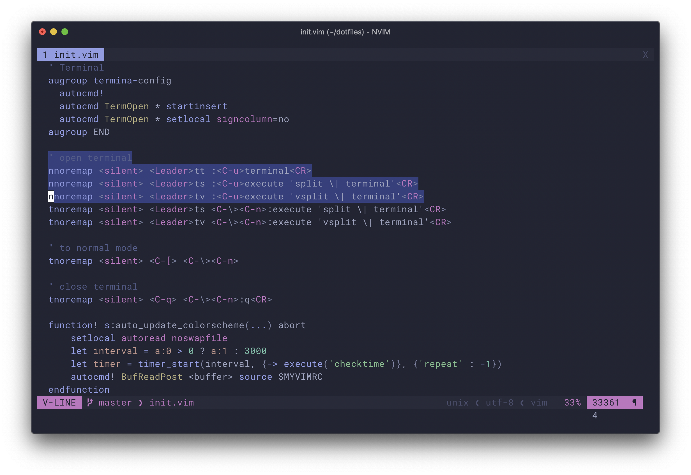
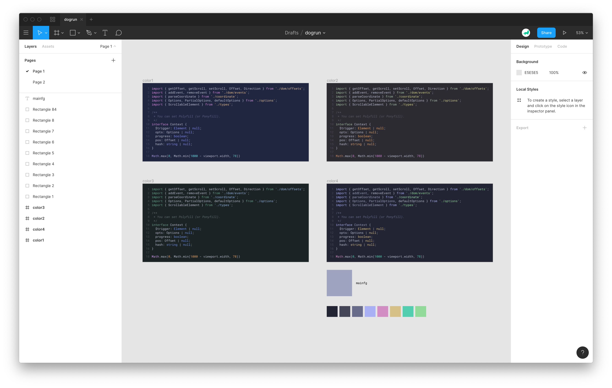
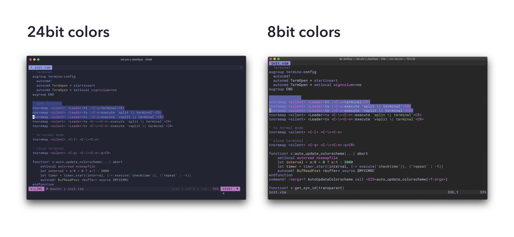

## はじめに

僕は普段エディタに Neovim を使っているのですが、ここ数年は [onedark](https://github.com/joshdick/onedark.vim) という colorscheme を使っていました。特に不便もなく、かっこいいなぁと思っていたのですが、しばらく使っていたため飽きがきてしまい、それならば自分が最高だと思える colorscheme を自作しようと思い、Neovim / Vim 向けの colorscheme を作りました。

この記事では作ったものの紹介、及び実装についての工夫について書いてみたいと思います。

## 作ったもの



> wadackel/vim-dogrun  
> https://github.com/wadackel/vim-dogrun

`dogrun` という名前の colorscheme です。名前はかなり適当です。(愛犬と戯れながら名前を考えている際、ドッグラン行きたいねーと思ったのでこの名前...)

`dogrun` は紫をベースにしたダークテーマで、半透明でもある程度の可読性を担保するような配色設計を心がけました。僕はステータスラインの拡張に [lightline.vim](https://github.com/itchyny/lightline.vim) を使っているため、lightline.vim 向けの theme も提供しています。申し訳程度に iTerm2 の colorscheme も合わせてリポジトリに置いています。

まだ対応している言語 (filetype) 、プラグインは最小限自分がよく使うものに限られますが、これから必要に応じて追加 / 調整していく予定です。

colorscheme を自作するのは初めてだったので、何から手をつけてどのように実装するか、[@Linda_pp](https://twitter.com/Linda_pp) さん、[@cocopon](https://twitter.com/cocopon) さんの記事を参考にしました。配色設計の手始め、実装についてとても参考になりました。

> - [フルスクラッチからさいきょうの Vim カラースキームをつくろう！ - はやくプログラムになりたい](https://rhysd.hatenablog.com/entry/2016/12/17/191158)
> - [自作 Vim カラースキーム「Iceberg」の配色戦略 - ここぽんのーと](https://cocopon.me/blog/2016/02/iceberg/)

## 実装について

以下、`dogrun` における配色に関する検討、実装についてです。

### イメージを固める

当初、参考記事にて紹介のあった Web ブラウザ上で colorscheme を作れる [ThemeCreator](http://mswift42.github.io/themecreator/) というサービスで、幾つか試しにプロトタイプを作ってみました。が、まずイメージを固めるために幾つかパターンを作って比較検討したかったため、少し操作に煩わしさを感じました。(1 タブ 1 パレットになる)



結果としてかなりアナログではあるのですが、Figma 上でテキストを打ち込んで色の調整をして比較検討を進めて、「これがいいかなぁ」というところまでイメージを固めていきました。

### カラーパレットの作成

Figma 上で作ったイメージを元に colorscheme のベースとなるカラーパレットを作ります。


実際には実装を進めつつ調整をすることに決めていたので、最初はあくまでハイライトの調整をしていく中でブレがないようにするためと割り切って、ざっくりと決め打ちすることにしました。(事実、warning 系のオレンジなどは途中で追加したりしています)

背景色、文字色、アクセントカラー (`dogrun` は紫) 辺りが決まっていれば、そこまでブレが出なかったので、あまり神経質にならず進めて正解でした。

### Rust から Vim script を生成

`dogrun` では Rust で実装した Generator を用いて、Precompile した Vim script を `colors` に吐くことで読み込みが高速化されるような実装となっています。ここらへんのアプローチは @Linda_pp さんの実装をかなり参考にさせていただきました。

> vim-color-spring-night  
> https://github.com/rhysd/vim-color-spring-night

Vim script を Precompile させることで、colorscheme のメンテナンス性を担保しながらも、読み込み時に必要となる計算を最小化することができます。具体的には以下の対応を Generator 側に行わせています。

1. ある色を元に、色相 / 彩度 / 明度をプログラマティックに調整した色を生成したい
1. 8bit colors への対応を自動化したい (後述)

1 の色の調整については具体的に以下のようなコードで、色調整が楽にできるような実装としてみました。

```rust:mainfgなどの色を元にして微調整した新しい色を生成する
// まずベースとなる色を定義する
def!(mainfg, "#9ea3c0");
def!(mainbg, "#222433");

// ベースの色を元に、色相 / 彩度 / 明度を微調整して新たな色を生成する
def!(weakfg, extends!(mainbg, 0.0, 0.05, 0.35));
def!(weakbg, extends!(mainbg, 0.0, 0.0, 0.1));
def!(lightfg, extends!(mainfg, 0.0, 0.05, -0.1));
def!(lightbg, extends!(mainbg, 0.0, 0.0, 0.2));
```

`def!` 及び `extends!` マクロは自作のもので、`def!` は色の定義 (指定した名称で値を `HashMap` に詰める)、`extends!` は定義した色を継承して新しい色を生成するものです。`extends!` の第 2 ~ 4 引数はそれぞれ色相 / 彩度 / 明度の変化量を受け取り、前述した 1 の実装を実現しています。

それぞれのマクロの実装例です。

```rust:マクロの実装例
let mut p = HashMap::new();

// カラーパレットの一覧となる `HashMap` に値を詰める
macro_rules! def {
    ($name: ident, $hex: expr) => {
        assert_eq!(
            p.insert(
                stringify!($name),
                Color {
                    gui: String::from($hex),
                    cterm: conv::to_cterm($hex.to_string()).to_string(),
                }
            ),
            None
        );
    };
}

// 指定した色を元に新たな色を生成する
macro_rules! extends {
    ($parent: ident) => {
        match p.get(stringify!($parent)) {
            Some(highlight) => highlight.gui.to_string(),
            None => panic!(format!("\"{}\" does not exists", stringify!($parent))),
        }
    };
    ($parent: ident, $h: expr, $s: expr, $v: expr) => {
        // `conv` に色調整用の実装が入ってる
        // 内部的に RGB -> HSV の変換を一旦入れてから調整してる
        conv::hue(conv::saturate(conv::lighten(extends!($parent), $v), $s), $h)
    };
}
```

### 8bit colors 対応の自動化

前述した通り、Generator 側で 8bit colors の生成を自動化しています。

ベースとなる色の指定は 24bit colors です。これは、自分が普段使う環境であることに加えて (`termguicolors`)、デザインツールなどで比較的容易に得ることができ、何かと親しみのあり、パレットの作成とメンテナンスが楽という考えからです。そのために、決定した色を元に近似した 8bit colors を自動で求めることができるような機構を入れています。

この機構を実装するために、8bit colors の全ての色を `Vector` で定義しています。

```rust:8bit-colorsをゴリゴリ定義
lazy_static! {
    static ref CTERM_COLORS: Vec<(usize, &'static str)> = {
        let mut v = Vec::with_capacity(256);
        v.push((0, "#000000"));
        v.push((1, "#800000"));
        v.push((2, "#008000"));
        v.push((3, "#808000"));
        v.push((4, "#000080"));
        v.push((5, "#800080"));
        // 256 色の定義
        v.push((254, "#e4e4e4"));
        v.push((255, "#eeeeee"));
        v
    };
}
```

色を定義するのに使用した `def!` マクロをもう一度見てみます。

```rust:def!マクロの定義
let mut p = HashMap::new();

macro_rules! def {
    ($name: ident, $hex: expr) => {
        assert_eq!(
            p.insert(
                stringify!($name),
                Color {
                    gui: String::from($hex),
                    cterm: conv::to_cterm($hex.to_string()).to_string(),
                }
            ),
            None
        );
    };
}
```

`Color` という構造体の `gui`, `cterm` それぞれに値を追加しますが、受け取るのは 24bit colors の HEX のみです。`cterm` 用の値は、`conv::to_cterm` という関数で、先程定義した 8bit colors の中から近似した色を採用する実装を行っています。

```rust:to_ctermの実装
// 受け取った HEX を元に最も近いと思われる 8bit colors を算出する
pub fn to_cterm(hex: String) -> usize {
    let color = hex2lab(hex);
    let mut v: Vec<(&usize, f32)> = vec![];

    for (id, value) in CTERM_COLORS.iter() {
        let target = hex2lab(value.to_string());
        let diff = DE2000::new(color, target);
        v.push((id, diff));
    }

    v.sort_by(|(_, a), (_, b)| a.partial_cmp(b).unwrap());

    let (id, _) = v.get(0).unwrap();

    return **id;
}
```

近似色の選定には [CIEDE2000](<https://ja.wikipedia.org/wiki/%E8%89%B2%E5%B7%AE#CIEDE2000_(delta_E00)>) というアルゴリズムを採用しています。他にも様々近似色 (色差) を求めるアルゴリズムは存在しますが、これが最もしっくりとくるため使用しています。(以前に JavaScript で実装したことがあり、[DEMO](http://wadackel.github.io/color-classifier/) を見ていただくと、他の幾つかのアルゴリズムと比較して、人間にとっての **近い** が実現できていることが確認できるかと思います)

CIEDE2000 の実装については Rust では [delta_e](https://github.com/elliotekj/DeltaE) というパッケージで存在します。既存のパッケージがあったので、一から実装する手間が省けますね。



結果として、上図のように 24bit colors と 8bit colors を並べてみると、比較的近い色が自動で採用されていることが確認できます。色の微調整をする度に、`ctermfg`, `ctermbg` などの値を意識しなくても良く気軽なリファクタリングが可能になりました。(その代わり 8bit colors 環境では **最適な** 見た目であることは保証できない気はしています。背景色なんかは結構違う。)

## 所感

初めて colorscheme を実装してみて、かなり楽しいと感じる一方、気になるところが出てくるとかなりの沼だなと感じました。それでも自作した colorscheme を使いながら、大体のハイライトグループに色があたってきて実用的になってくると最高の気分ですね。

また、実装に Rust を採用したことで、colorscheme を作ってみたい気持ち、Rust を使いたい気持ちが満たされたので一石二鳥でした。

https://twitter.com/wadackel/status/1195734952358232065

## 参考

- [iceberg.vim](https://github.com/cocopon/iceberg.vim)
- [vim-color-spring-night](https://github.com/rhysd/vim-color-spring-night)
