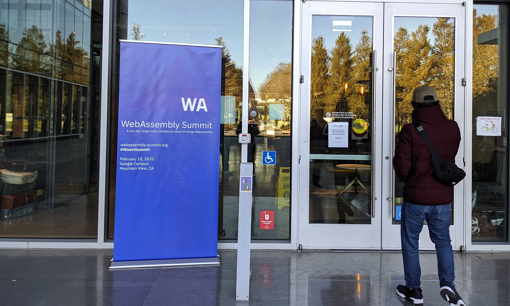

年末らしく今年 1 年を振り返ってみようと思います。

> 去年の振り返り：[2019 年の振り返りと反省、2020 年への抱負](https://blog.wadackel.me/2019/ref/)

## 2020 年の振り返り

### 1〜2 月

2 月に [@wasabeef_jp](https://twitter.com/wasabeef_jp) と [@herablog](https://twitter.com/herablog) とで、SF で開催された WebAssembly Summit 2020 に参加しました。去年の抱負で WebAssembly を導入したい、という思惑もありちょうど良いタイミングでした。COVID-19 の影響も少しずつ始まっていたのでギリギリまで行けるか分からなかったので、滑り込みでの参加でした。

学びのある Summit ではあったのですが、日本に帰ってきて仕事、プライベートの開発に活かす機会を見つけられなかった部分に自分の実力の無さを感じてしまいました。引き続き活用できるタイミングと場所を模索し続けたいと考えています。

### 3〜4 月

[acot](https://github.com/acot-a11y/acot) の開発を 2019 年の末頃から少しずつ進めていたのですが、このタイミングで再開し始めました。4 月に入ると緊急事態宣言が僕の住んでいる東京で発令。以降はかなり自宅にいる時間が増えました。

社内外での登壇が 3 件ほど予定されていたのですが、タイミング的にすべて中止になってしまったのも記憶に新しいです。最近ではリモート開催が当たり前の世の中になり、参加が容易になってきたように感じますね。

また、初めて技術雑誌への寄稿を体験しました。

> [WEB+DB PRESS Vol.117 に TypeScript の特集を寄稿した](https://blog.wadackel.me/2020/wdpress-typescript/)

この特集では TypeScript への実践入門で、 JavaScript 経験者が一歩踏み出せるように、というコンセプトを持って執筆しました。自分自身の評価として TypeScript を仕事でもプライベートでも使っていますが、その道もプロフェッショナルであるとは思っていません。そんな僕でもこれから TypeScript を学んでいきたいという方々のお役に少しでも役に立てれば、という気持ちでした。

比較的仕事が忙しいタイミングと校正のタイミングが重なってしまい、時間的にかなり厳しい期間でしたが、スケジュール通り執筆が進んでよかったです。

### 5〜10 月

5 月になると CyberAgent に入社以降、ほとんどの時間関わってきた [WINTICKET](https://www.winticket.jp) の開発責任者という立場になりました。これまでは Web のリードメンバーだったのですが、役割も変わり開発に関わる全体の事象について考える時間が増えました。開発がスムーズに進むように開発フロー全体の改修を立案、推進。開発体制を変更し、柔軟な施策遂行ができるように、などなど。リモートワークが前提の中でのコミュニケーション不足に起因するリカバリなどの対策をとっていたりしていました。

仕事の中でコードを書く絶対量が減ったのもあり、かなり自分の中で優先度が下がっていた acot の開発をコードを書く場として使うようになったタイミングでした。おかげで歩みの遅かった開発が進んだりもしました。

10 月前後にあった社内での全社表彰会があるのですが、そこでベストエンジニア賞ノミネートをもらった期間でもありました。最優秀賞でなかったものの普段の仕事が評価されたのだな、と嬉しく感じたことを覚えています。

### 11〜12 月

仕事がバタついていたこともあり、仕事をしていたことしか記憶にないです...。

ただ、acot の開発が一旦リリースできるところまできたこともあり一本ブログを書けたタイミングでした。

> [Web アクセシビリティの検証ツール acot を作ってる](https://blog.wadackel.me/2020/acot/)

これは来年以降も少しずつ改善を進めて、まずは社内外での利用事例を作っていければと考えています。

また、以前作った [git-chglog](https://github.com/git-chglog/git-chglog) がずっとメンテナンスできてませんでした。やっと、12 月に入りメンテナーをまずは 1 人迎え入れて、プロダクト自体の存続をかけて動かすことができればという気持ちでいます。

## 2021 年への抱負

さくっと箇条書きで...

- acot の開発と導入やっていき
- 英語学習
  - ゆるゆると勉強は続けていますが、目的をハッキリとして腰を据えて勉強したい気持ちがふつふつと
- 仕事 x プライベートの時間の割き方
  - 妻も犬も家にいる状態で集中できる環境確保が最近難しいと感じる
  - 場所なのか、慣れなのか。来年のチャレンジにしたい
- [作って理解する OS x86 系コンピュータを動かす理論と実装](https://www.amazon.co.jp/%E4%BD%9C%E3%81%A3%E3%81%A6%E7%90%86%E8%A7%A3%E3%81%99%E3%82%8BOS-x86%E7%B3%BB%E3%82%B3%E3%83%B3%E3%83%94%E3%83%A5%E3%83%BC%E3%82%BF%E3%82%92%E5%8B%95%E3%81%8B%E3%81%99%E7%90%86%E8%AB%96%E3%81%A8%E5%AE%9F%E8%A3%85-%E6%9E%97-%E9%AB%98%E5%8B%B2/dp/429710847X/ref=asc_df_429710847X/?tag=jpgo-22&linkCode=df0&hvadid=342438969336&hvpos=1o1&hvnetw=g&hvrand=4177352930308966266&hvpone=&hvptwo=&hvqmt=&hvdev=c&hvdvcmdl=&hvlocint=&hvlocphy=1009308&hvtargid=pla-822246098107&psc=1&th=1&psc=1) 買ったので読む (長い...、引き続き読んでない)

## おわりに

皆様良いお年を！
