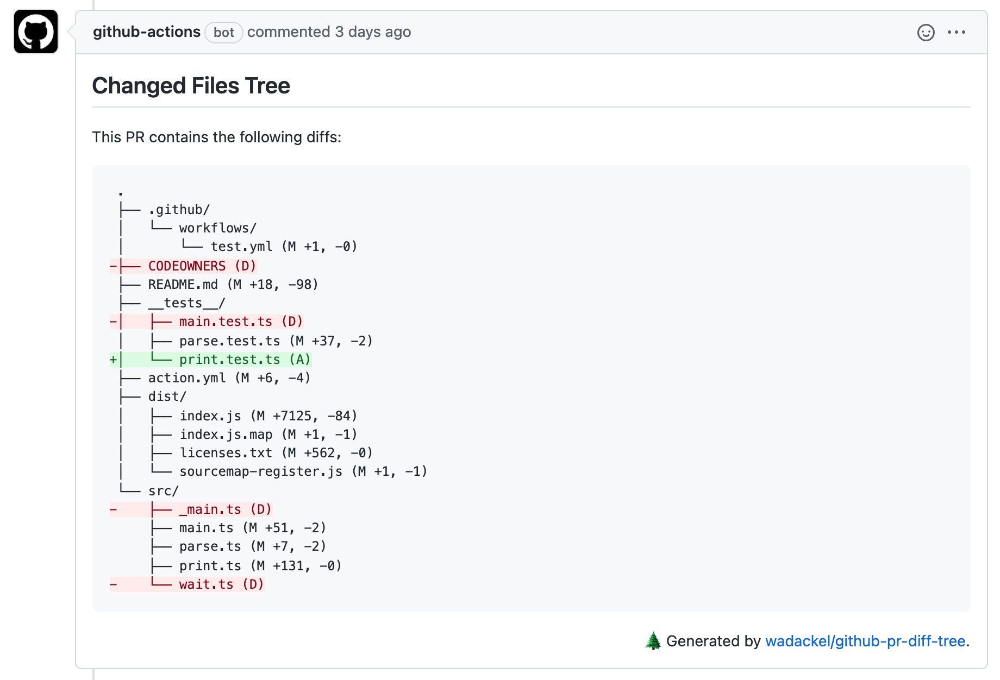

## はじめに

タイトルにある通り、GitHub の Pull Request に含まれる差分ファイルを Tree 形式で可視化するための Action を作りました。

> wadackel/github-pr-diff-tree  
> https://github.com/wadackel/github-pr-diff-tree

この記事では作った Action の振る舞いやモチベーションについてまとめておこうと思います。

## 何をするものか

Pull Request を作成 (または更新) した際に、その差分に含まれるディレクトリ構造をフォーマットした上でコメントとして出力します。以下の画像はコメントの例です。



追加されたファイル、削除されたファイルは diff syntax を用いてハイライトさせ目立つようになっています。

新規作成した Pull Request に対してはコメントの追加、更新された場合はコメント内容も合わせて更新されます。

## モチベーション

プロダクト開発の中で Pull Request を用いたレビューを行う際、コードベースの差分については GitHub の UI 上でどのファイルが、どのように変更されたのか見やすいものになっていると思います。

一方で (あくまで個人的な意見に留まるとは思うのですが) 、追加、編集、削除、リネームされたファイルの場所については見落としてしまうケースがあります。これはコードの差分に焦点の当たった UI であり、ファイルパスがフラットに並べられることが要因の一つかなと思います。

Pull Request で行われる機能追加、修正などの変更に対して、レビュアーはある程度変更範囲の想定をすると思います。例えば機能 A に対する修正なはずなのに、機能 B や共通ロジックのあるファイル群が変更されていた、というケースではレビュー前の想定を逸脱します。この場合、注意深くコードやその影響範囲を見てみよう、といったスタンスでレビューに挑みます。

レビュアーの想定 (想定内の変更範囲か、Pull Request は適切な粒度か、など) と、Pull Request に含まれる変更との差分を認知しやすくするために、ディレクトリ構造を直感的な形式で確認できる手段があると良いのではないか、といった点が今回の Action を作ったモチベーションとなっています。

[Octotree](https://www.octotree.io) などのブラウザエクステンションを利用することで解決できるものではあると思うのですが、メンバー間での環境差異 (例えば僕自身は利用していない) に寄らず実現する手段が欲しかった、というのも背景にあります。この辺は正直チームや関わるプロダクトに依るところが大きいかもしれません。

## 使い方

`.github/workflows` ディレクトリに任意の YAML ファイルを作成し (e.g. `pr-diff-tree.yml`) 以下の記述を行います。

```yaml
name: 'PR Diff Tree'

on:
  pull_request:
    types: [opened, synchronize]

jobs:
  dump:
    runs-on: ubuntu-latest
    steps:
      - uses: wadackel/github-pr-diff-tree@v1
        with:
          token: ${{ secrets.GITHUB_TOKEN }}
```

Action をトリガーするイベントとしては `pull_request` とし、Job の Step に対して `wadackel/github-pr-diff-tree@v1` を指定します。その際 `token` パラメータに `secrets.GITHUB_TOKEN` を渡します。上記の例で Pull Request を新規作成 (opened) と、更新されたタイミング (ヘッドブランチの更新 or ベースブランチ変更) でその差分に対するディレクトリ構造がコメントされます。

内部的に [octokit](https://octokit.github.io/rest.js/) を用いて差分情報を得るため、[actions/checkout](https://github.com/actions/checkout) を用いた repository のチェックアウトは Step に含める必要はありません。

## 実装について

[actions/typescript-action](https://github.com/actions/typescript-action) を利用して Action のベースを作っています。実現したい機能に集中して開発に取り組めるのがとてもありがたいです。

機能の実装もそれほど多くのことをやっている訳ではなく、大まかな実装内容は以下のとおりです。

1. [Pull Request の情報を取得](https://docs.github.com/en/rest/reference/pulls#get-a-pull-request) 。その時 media type を `application/vnd.github.VERSION.diff` とすることでレスポンスを unified 形式 の diff 文字列とする
1. diff の文字列をパースし表示に必要な情報を集める
1. Tree 形式に整形する
1. Pull Request のコメントとして整形した文字列をコメントする

ソースコードは現時点で [4 ファイル程度](https://github.com/wadackel/github-pr-diff-tree/tree/d8fb2dccd8ebe8da59875fb0b5aa0cec9211cbfd/src) に収まっています。

## おわりに

今回作った Action はまだ PoC の域を超えていないかなと感じていますが、実際に業務で書くプロダクトへ導入し「あると便利かも？」といった肌感を得ることができました。レビューの精度を劇的に上げてくれるようなものではないのですが、利用していく中で最適な形は引き続き検討していければと思います。
