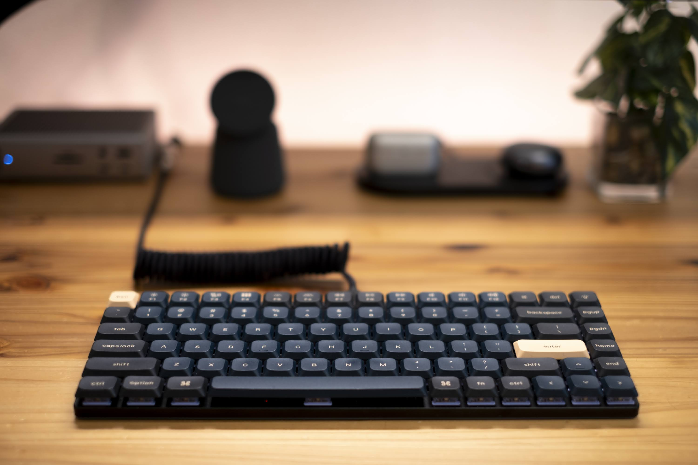

## はじめに

毎年書きたいと思いつつ中々書けていなかった反省と振り返りです。2024年はナレッジワークに転職して迎える初めての年でもあり、自分の中で変化の年でした。ナレッジワークに転職した直後については以下の記事でまとめていました。

> [ナレッジワークに転職して1ヶ月が経った](/2023/join-knowledgework/)

普段 [Obsidian](https://obsidian.md) に Daily Note を書いているので、それを基に一年の振り返りと来年への抱負をまとめます。

## 前半戦（1-6月）

仕事、プライベート共に変化の多い半年でした。

### 仕事

ナレッジワークに転職直後、想定配属部署がまだなかったこともあり Platform Group という部署に配属されていました。年が明けて Learnin Dev Group という部署が発足されたと同時に配属部署の変更がありました。そこからは Learning Dev Group として新規プロダクトの立ち上げを行うこととなりました。

新規プロダクトの開発において、社内で初めて本格的に [ConnectRPC](https://connectrpc.com/) をプロダクト開発に採用していく運びとなったため、機能開発と並行して社内インフラを整える作業も行っていました。ConnectRPC に最適化した API Client の自動生成 protoc plugin を実装したり、[msw](https://github.com/mswjs/msw) を本格導入する上で必要となる共通基盤を構築するなど。この辺で構築した基盤技術に関しては2024年の末である現在も活用されているので、機能開発と並行しつつも腰を据えて取り組んでよかったなと感じています。

新規プロダクトの開発が落ち着いてきたあたりから、元々 Web アプリケーションのホスト環境として利用してきていた Vercel から、Cloud Run への移行を推進することとなりました。この辺の取り組みは前職でもアーキテクトとして推進したりしていたので、なんとなく既視感がありました。

> - [WINTICKET Web の GKE 脱却と Cloud Run の採用](https://developers.cyberagent.co.jp/blog/archives/41382/)
> - [WINTICKET Web をゼロダウンタイムで Cloud Run へ移行する際に行った工夫](https://developers.cyberagent.co.jp/blog/archives/41532/)
> - [WINTICKET Web の Canary / Dark Canary リリースを支える Release Manager の紹介](https://developers.cyberagent.co.jp/blog/archives/41416/)

実際に移行する過程で必要となる改修や、ついでに実現したかった Preview Deployments の基盤などを踏まえて DesignDoc を記述して SRE メンバーとのすり合わせを重ねながら進めていました。移行作業としては6月までにほとんど終えていましたが、実際の移行は8月頃に実施し無事に移行が完了しました。この辺の取り組みについて、今後 Zenn などに記事として公開できればと思います。

また、4月頃には Accessibility の布教を目的に、社内でエンジニア、デザイナーを対象とした勉強会の主催を行っていたりしました。こうした勉強会ですぐにプロダクトの品質が変わるわけではありませんが、主催を行ったこともあって、社内で少し意識される機会も増え、相談してくれる機会が増えたのはポジティブな変化でした。

### OSS

ナレッジワークでは Visual Regression Test を採用しているのですが、入社当時は各 Story が Flaky でした。そこで Storybook の Test Runner 上で稼働させる前提の [storycap-testrun](https://github.com/reg-viz/storycap-tetstrun) というツールを開発したりしました。ツールが意図していること、各種工夫については Zenn で記事にしています。

> [Storybook Test ruuner で安定した Visual Regression Testing を行う](https://zenn.dev/knowledgework/articles/297ccfb866a5b5)

[reg-suit-report-ui](https://github.com/reg-viz/reg-cli-report-ui) を [vanilla-extract](https://vanilla-extract.style/) へ移行したりしました。仕事で vanilla-extract を採用したい欲があり実用性の検証も兼ねて移行へ取り組んでいました。過程として [stylex](https://github.com/facebook/stylex) も検討し、実際に移行を進めてみたのですが、あまりに厳しい縛りが多く結果として vanilla-extract に落ち着くなど色々と試行錯誤をしていました。

また、Rust で対話型インターフェースを構築する [Promptuity](https://github.com/wadackel/promptuity) を publish したりしました。これが crates.io で公開する初めてのライブラリとなりました。[scaffdog](https://github.com/scaffdog/scaffdog) の Rust 化を目論んで開発しているものなのですが、中々本筋の実装が進んでいないのは反省点です。Promptuity の詳細に関しては以下の記事にまとめています。

> [Rust で対話型インターフェースを構築する Promptuity を作った](/2024/promptuity/)

### プライベート

ナレッジワークに転職後、リモートワークの頻度がものすごく上がりました。というのも週一に出社日はあるがそれ以外がリモートワークで働くというスタイルとなったためです。そのため、リモートワークに最適化したデスク環境構築を行っていました。ここ5-6年は外部モニター、キーボードなどは用いずラップトップのみで作業していたのですが、首肩のコリがひどくなったため健康面からも環境の見直しに必要性を感じていました。

外部モニター、キーボード、マウスなど、これまでほぼ使ってこなかった周辺機器を導入しそれぞれの利便性に感動したのですが、特に日々の作業で変化を感じたのはキーボードです。今は [Keychron K3 Max](https://keychron.co.jp/products/keychron-k3-max-qmk-via-wireless-custom-mechanical-keyboard-us-ansi-layout) の本体に [NuPhy Wisteria](https://nuphy.co.jp/products/nuphy-wisteria-t55-low-profile-switches) のキースイッチで運用しています。キーキャップも見た目を好みにするため変更しています。

元々は標準の茶軸キースイッチを利用していたのですが、Wisteria に変えたことでかなり使い心地が変わりました。見た目も打鍵感もお気に入りです。

## 後半戦（7-12月）

アプリ開発に従事している期間の長かった半年でした。

### 仕事

Flutter を採用した新規アプリプロダクトの開発を主に行っていました。前半戦同様に、クライアント（Web/App）は開発リードさせてもらえていたので様々な意思決定を業務の中で行うことができていました。[media_kit](https://github.com/media-kit/media-kit) を採用した動画プレイヤー、バックグラウンド再生、Push 通知、[integration_test](https://github.com/flutter/flutter/tree/main/packages/integration_test#integration_test) を採用した E2E テスト基盤、iPad への最低限対応など、アプリらしさのある開発で新鮮でした。

Web の開発と同様に、ConnectRPC を用いているのですが、Dart は開発着手段階で ConnectRPC の正式な対応がされていなかったため、自前で protoc plugin を拵えて Protobuf の定義から API Client の自動生成を行うなどの対応も行っていました。TypeScript 向けの protoc plugin は前半戦で作成していたのでそこまで苦労せずにいけたのも良かったです。

主要な機能開発においてはほとんどの部分を担当したのですが、アプリの E2E テストに関しては QA メンバーと協業するため、開発に必要な Tips や学習コンテンツなどをハンズオン形式のワークショップで共有する会などを開催しました。ナレッジワークではナレッジシャアリングに対して積極的に行っていきたいという文化があるので、こうした動きを積極的に行っていきたいなと感じています。

アプリ開発以外では、これまで monolith で運用されていた Web アプリケーションを分割する計画に関わっていました。特にインフラ、URL などの側面から具体的にどのように移行を進めていくかの計画を DesignDoc にまとめ、各所円滑に協業できるための準備を行ったりしていました。絶賛進行中ですが、来年作業が完了したら会社から発信ができればと思います。

こうした大きめの仕事の傍ら、コードベース全体の内部品質向上を目論見、mock factory 生成を半自動化する社内向けの TypeScript Language Service Plugin 開発・導入などを行っていました。

### OSS

特段活動できていなかったかなと思います。業務で利用している TanStack Query Like な Dart ライブラリである [fquery](https://github.com/41y08h/fquery) のバグ修正などをいくつかした程度です。

### プライベート

Neovim の設定ファイルを Lua 化したりしました。元々は Vim script で記述したものを利用していたのですが思い切って Lua 化しました。3,000行以上ある Vim script だったので移行するのが億劫になっていたのですが、ChatGPT に食わすことでさくっと Lua 化できたので移行体験が非常によかったです。

その他、同僚からのお誘いで人生初のボルダリングを経験しました。まともに運動していなかったので、久しぶりに体を動かすことができて充足感を味わうことができました。久しぶりに体を動かせたことに感銘を受け、ジムに通い始めました。ただ、12月は風邪が長引いた結果、扁桃腺の調子がよくなく中々ジムに行けていません。健康面には十分注意していかないと。。

それ以外では、愛犬であるキャップが6歳を無事に迎えることができて、家族でお祝いをしました。かわいいぬ。

https://x.com/wadackel/status/1871147446400926080

## 2025 年への抱負

ナレッジワークに転職して2年目となる年です。2024年で様々な開発に携われてもらったり、頼られる領域も少しずつ増えてきた実感があります。2025年は貢献できる領域をさらに広げていくことが大方針です。

プロダクトが分割されていく、という話を前述しましたが、それに伴い今の開発体験はお世辞にも良いといえるものはなくなりつつあります。質の高い開発を、より効率的に行える環境への貢献を一定のテーマに据えつつ日々の開発に取り組んでいければと考えています。

前職ではマネジメントのロールを担って3年ほど経験してきましたが、今はマネジメントのロールを一切剥いでいます。成果の総量を高めていくためには、技術的な側面でこれまで以上に成果に固執していく必要があると感じているため、自己研鑽も怠らずできればと思います。

仕事以外では、今年前半に少し進めていた scaffdog の Rust 化がほぼ手つかずの状態になっているので、ゆるゆると進めていきたいなぁと妄想したりしています。

## おわりに

皆様、良いお年を！

