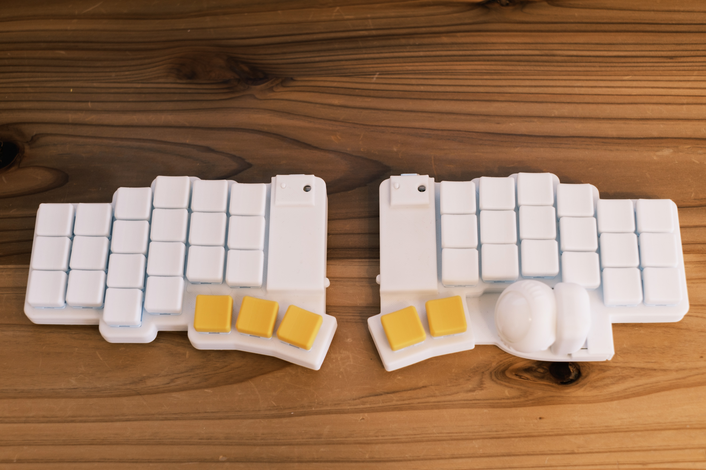
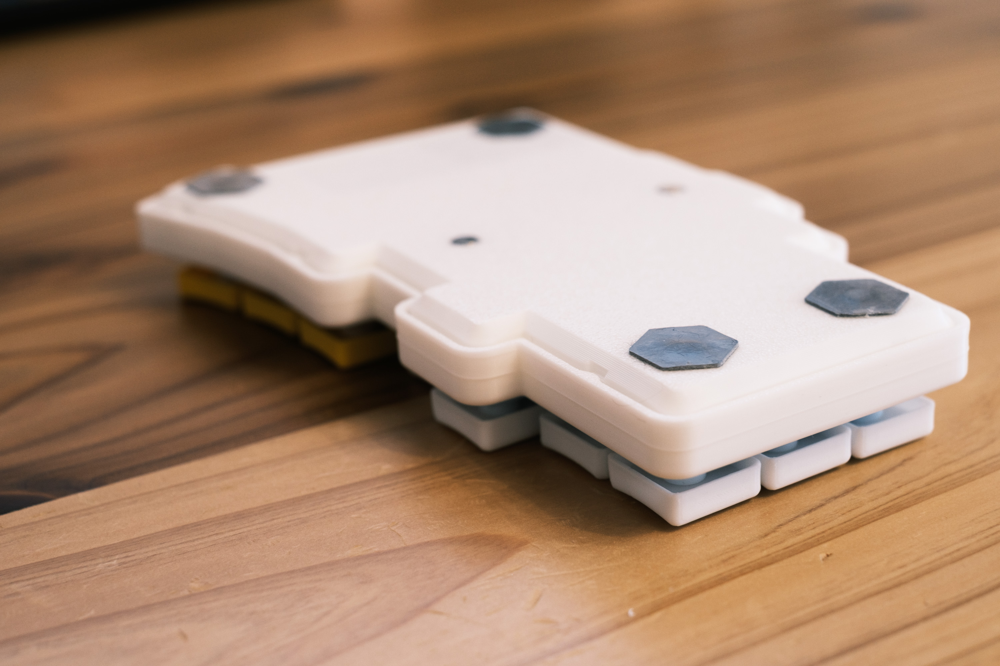
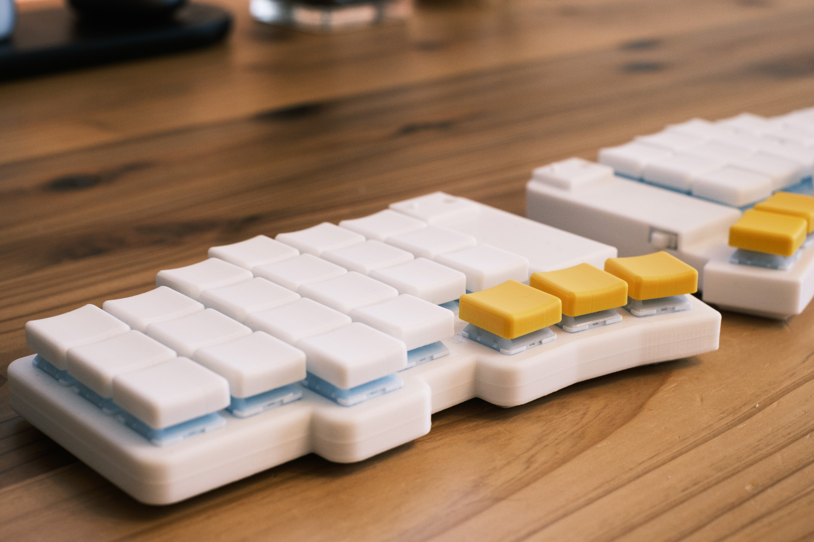

## はじめに

2025/02 頃から制作していたキーボードが一旦完成し、趣味にも業務にも使い始めてしばらく経ったので作ったものと制作過程についてメモがてらまとめておきます。

作ったものは以下。

特に頒布予定もないため名前は不要かなと思っていたのですが、各種データの管理に識別子が欲しかったので名前を「dax」としました。これは「犬が好き、エンジニア、短い名前」な特徴を含めたプロンプトを通じて AI に考えてもらいました。

作ったキーボードは以下の特徴を持ちます。

- 分割無線キーボード、Bluetooth 接続
- ZMK Firmware で動作
- 25mm トラックボール付き
- バッテリー駆動
- 43 キー、挟ピッチ（ChocV1, V2）
- ロープロファイル、カラムスタッガード配列

[Keyball44](https://shirogane-lab.net/items/64b7a006eb6dbe00346cd0c5)、[roBa](https://booth.pm/ja/items/6010869)、[moNa2](https://booth.pm/ja/items/6376654) インスパイアの構成としました。特に roBa に関しては回路図含めた[各種データが GitHub に公開](https://github.com/kumamuk-git/roBa)されているためすごく参考にさせてもらいました。

キースイッチは色々試しましたが、現在は [Kailh Winter MINI](https://ja.aliexpress.com/item/1005007692801268.html?spm=a2g0o.detail.pcDetailTopMoreOtherSeller.1.4aecrp2hrp2heG&gps-id=pcDetailTopMoreOtherSeller&scm=1007.40050.354490.0&scm_id=1007.40050.354490.0&scm-url=1007.40050.354490.0&pvid=5df8dbba-75f1-486e-98f0-85cb929000e5&_t=gps-id:pcDetailTopMoreOtherSeller,scm-url:1007.40050.354490.0,pvid:5df8dbba-75f1-486e-98f0-85cb929000e5,tpp_buckets:668%232846%238111%231996&isseo=y&pdp_ext_f=%7B%22order%22%3A%2258%22%2C%22eval%22%3A%221%22%2C%22sceneId%22%3A%2230050%22%7D&pdp_npi=4%40dis%21JPY%211478%211301%21%21%2174.00%2165.12%21%402140c1c317444264336017185e3668%2112000041869353337%21rec%21JP%216118127931%21X&utparam-url=scene%3ApcDetailTopMoreOtherSeller%7Cquery_from%3A) を利用しています。軽めのタクタイルが好きなので打鍵感が好みなのと、色が淡い水色でかわいいのでお気に入りです。

## きっかけ

ラップトップ単体で作業する期間が長く、去年久しぶりに外部キーボードとして Keychron K3 Max を使い始めて、見た目も使用感も満足していました。しかし、出社する際にキーボードとマウス（MX Ergo）を持ち運ぶのがそれなりの重量と場所を取ってしまうのが手間に感じるようになってきました。

Keyball ならマウスとキーボードが兼用できるなら荷物が減らせるしいいなぁと感じていたのですが、左右キーボード間を TRRS ケーブルで繋ぎ、さらに PC とも USB で繋ぐ必要がある点が気になっていて踏み込めずにいました。

年明けあたりに偶然 [@Pooh_pol0](https://x.com/Pooh_pol0) さん、[@shakupan\_](https://x.com/shakupan_) の制作する moNa2 の存在を知りました。左右間含めて完全無線で利用でき、デザインも可愛らしくぜひ購入したいと思い争奪戦に参加してみました。ただ、参加回が10秒で売り切れてしまう盛況ぶりでした。

https://x.com/shakupan_/status/1883500390928593370

買えないなら作るか、ということで自作キーボードに挑戦したというのがきっかけとなりました。

## 制作過程

キーボードを自作したことがなかったのでうまくいかない箇所も多かったのですが、一旦の完成ができた区切りのメモとして。

### 0. 作りたいキーボードを検討する

前述した特徴を箇条書き程度にまとめていました。

roBa や moNa2 にはロータリーエンコーダが付いていますが、実装難易度を下げたかったことと、あまり利用シーンを想像できなかったので、分割キーボード + トラックボールというシンプルな構成にしようと決めました。Keychron を使っていたこともあり Gateron Low-profile のソケットにするか否かを最後まで悩んでいた記憶があります。

また、配列については Keyball44 に近づける方針としました。長年 Vim を使い続けていることもあり A の横に Ctrl がどうしてもほしい体になってしまっているからです。

### 1. 自作キットを作ってみる

キーボードを自作するというのがどんなものなのか、というイメージが持てていなかったのでまずは自作キットに手を付けました。最終的に作りたいイメージに近く今は入手性がある程度高い Keyball44 を購入しました。組み立てに必要な各種工具が家に何もなかったので [遊舎工房](https://shop.yushakobo.jp/) で入門キットなども合わせて購入しています。

基本的にははんだ付けしていくだけで完成するのですが、その過程でどのような作業で完成していくのか、どのような部品が使われているのか、制作にあたってどのような点に注意するべきなのか、という全体の流れがある程度イメージできました。

組み立ても QMK Firmware のセットアップも終え実際にしばらく使ってみて、作りたいキーボードに対する解像度を上げていきました。

### 2. 自作の流れを知る

[自作キーボード設計ガイド Vol1 設計入門編](https://salicylic-acid3.booth.pm/items/4410329) を購入し、自作キーボードを設計するにあたっての概観を掴みました。ざっと全体を読みつつ、手を動かさないと理解が難しいなと感じたため KiCad を実際に触れつつ何周か読みました。

また、書籍だけだと実際の作業に対するイメージが湧きづらい箇所もあったので、自作キーボード設計ガイドの著者である [@Salicylic_acid3](https://x.com/Salicylic_acid3) さんが YouTube で公開されている動画を視聴しました。

- [自作キーボード設計解説配信 第１回 設計に向けたアレコレ](https://www.youtube.com/live/aE2CZYEBbZY?si=oSkW7TZM2oGgjUuc)
- [自作キーボード設計解説配信 第２回 キーマトリクスと回路図](https://www.youtube.com/live/CV4J_YiC3UM?si=hkp10nm5blRqIfSN)
- [自作キーボード設計解説配信 第３回 回路設計と基板設計](https://www.youtube.com/live/vlaA-S5S_f8?si=pOl3S8CVUyNPDo60)

動画で作業風景や、作業時の工夫ポイントが細かく知ることができたので、書籍と合わせて見ることでキーボード自作の流れがだいぶ湧きました。

### 3. 回路、基盤を設計してみる

基本的な設計については roBa の回路図を参考にさせてもらいました。基盤側の設計については、手元にある Keyball44 を参考にしつつも各指に対するキーの位置などを自分好みに調整していきました。発注をするまではリスクもないため、何度か一から設計を見直しをしたりしました。その過程で KiCad の操作にもある程度慣れました。

### 4. 基盤、部品を発注する

設計が完了した基盤を [JLCPCB](https://jlcpcb.com/jp/) で発注しました。DHL Express を配送業者に選択したのですが、数日で届いて驚きました。ちなみに基盤の設計を何度もやり直したことで、一部のダイオードを配線し忘れ、尚且つエレクトリカルルールチェックが漏れた状態で発注してしまったりしました。大雑把な性格が見事に悪影響を出しました。

基盤以外にも以下のような部品を注文しました。

- Seeed XIAO BLE nRF52840
- PMW3610
- ダイオード
- キーソケット
- ピンヘッダー
- PH コネクタ
- Li-Po バッテリー
- セラミックボール

トラックボール用のブレイクアウト基盤に関しても実装が必要だったため、部品の用意が必要です。キーボードより情報が少ないし知識もないため何を買うべきか分からなかったのですが、ChatGPT の Deep Research で回路情報やフットプリントの情報を与えて、国内から購入しやすいストアで部品を探させることである程度目星をつけることができました。AI がなかったらもっと調査や学習に時間が掛かったなと感じました。

[秋月電子通商](https://akizukidenshi.com) で購入できる部品に関しては積極的にそこで買いつつ、取り扱いのない部品に関しては [マルツ](https://www.marutsu.co.jp/) で購入しました。3,300円以上の注文で送料無料であることと、配送がそれなりに早いことが多いためです。

### 5. 組み立てる

届いた基盤、部品をそれぞれ組み立てていきました。はんだ付けをひたすらして、テスト用に ZMK Firmware を書き込み、各キーが反応するか確認しました。まだテスターが手元にないのですが、テスターがあれば手戻りが減るだろうなと思う場面があったので、次回制作するまでには準備したいと思います。

いざ組み立ててみるとサイズ感や各部品の位置関係などが気になり、前述した配線不備なども見つかったため再設計・再発注をしたりしました。金銭的・時間的な痛みを伴うことで学習が促進されました（つらい）。どこかで読んだのですが、途中で不備を見つけても一応最後まで組み立て作業をしてみると良い、という言葉はその通りだと実感しました。最後まで組み立ててみて、不備を一通り列挙したうえで修正するのが手戻りがすくなく効率的でした。

キーボード側が一通り動くことが確認できたあと、トラックボールが一切反応しない、という事象に悩まされました。Firmware が悪いのか、キーボード側の基盤が悪いのか、ブレイクアウト基盤が悪いのか、原因の切り分けが難しかったです。この辺でブレッドボードを購入し、トラックボールのみを検証できる環境をつくり再実装を進めました。基盤発注の一発本番勝負をしてしまったため、思わぬ手戻りが発生したりしたので最初からブレッドボードで細かく各モジュールの検証をしていけばよかったと後悔しました。この辺も次回の制作機会では活かしたいポイントです。最終的にトラックボールが動作しなかったのは、ブレイクアウト基盤につけた部品の仕様が一部誤っていたことが原因でした。

### 6. ケースづくり

一通りキーボード + トラックボールが動作することが確認できたあと、ケースづくりを始めました。

ケースは 3D プリンターで制作しようと決めていたため、[Autodesk Fusion](https://www.autodesk.com/jp/products/fusion-360/overview?term=1-YEAR&tab=subscription) でモデリングをしました。個人用であれば一定の制限はありますが、キーボードのケース作成においては必要十分でした。これはあとあと同僚から教えてもらったのですが、[Plasticity](https://www.plasticity.xyz/) もモデリングツールとして良さそうでした。

roBa のケースで取り入れられているようなスナップフィット的な機構を取り入れることで、ほとんど工具を使わずにバラすことができるように工夫しました。

moNa2 の背面にあるマグネットも素晴らしいアイデアだと思い取り入れさせてもらいました。持ち運びの際にまとまりが良くて最高です。

3D モデリング自体も初めての作業だったので、何度もやり直しが必要でした。キーボードが動くようになってから実際ケースに収まるまで、想像より多くの時間が掛かってしまいもどかしく感じたことが印象に残っています。ただ、基盤や部品の発注と違い自宅に 3D プリンターがありさえすれば、試行錯誤は気軽にできるのでその点は気持ち的に楽でした。

ケースのモデリングについては、以下の記事が参考になりました。

> [自作キーボードのケースの作り方｜蓮乃 紫\_Murasaki](https://note.com/akasha_min/n/nda87ef1673ec)

### 7. キーキャップづくり

18x17 の挟ピッチなフットプリントであるため、既製品のキーキャップにほとんど選択肢がありません。そのため、キーキャップも 3D プリンターで制作しました。

最初は moNa2 のキーキャップとして採用される [sayu-hub/zmk-config-moNa2](https://github.com/sayu-hub/zmk-config-moNa2) にあるモデルからプリントして使ってみたのですが、窪み具合が指に合わなかったため形状は参考にしつつも微調整したものを自作しました。キーキャップは自作しようと思った際に情報が多くて非常に入門しやすく感じました。

3D プリンターは Bambu Lab A1 を使っているのですが、プリントする際に 0.2mm ノズルを使うことで積層痕もあまり目立たず、肌さわりも良いため使用感が非常に良いです。

### 8. キーマップを詰める

ZMK の Keymap Editor を使ってキーマップを詰めました。個人的には QMK より使い勝手が良く感じています。ZMK Studio にもいずれ対応したいのですが、ほぼキーマップが固まってしまうとあまり変更しないのでモチベーションは高くないです。

キーマップの中身としては Keyball44 で使っていたキーマップをほぼそのまま取り入れています。詳細についてはここでは割愛。

## 今後の展望

作ったもの、その制作の過程をざっと書きました。狙い通り出社時に荷物は最小限にしつつも自宅と変わりない作業ができたり、トラックボール付きであるためホームポジションから離れることなく作業ができてとても快適になりました。

ただ、使い始めて2週間くらい経ってみて、色々と改善したい点も見えてきました。

- トラックボールをあと数mm下げたい
- ケースの見た目を改善したい
- やっぱり Gateron Low-profile キースイッチを使いたい
- その他、細かい点でミスったところを直したい

そのため、改良版の設計に着手しているところです。キーボードづくり楽しい。

## おわりに

日々業務でコードを書く際に、AI Assistant x Agent の活用によって以前よりもキーボードを打鍵する機会は減ったように感じます。とはいえ、キーボードがコンピュータとのインタフェースである点にまだ変わりなく、キーボードに触れている間の楽しみやこだわりを持つのも一興なのかなと感じました（_キーボードを作るにあたって掛かったお金と労力を正当化する言い訳_）。
